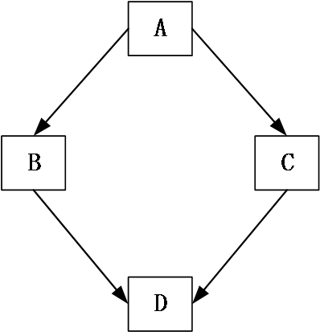
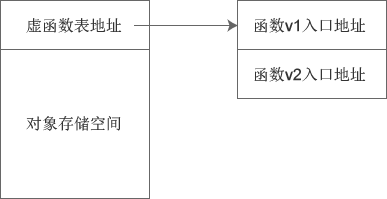
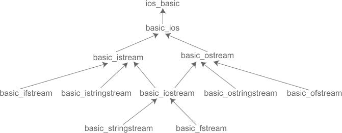
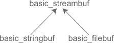
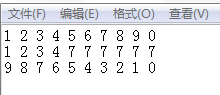
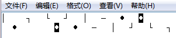

# 				 C++ 学习笔记

<center>author ln3</center>


## 前言：

本教程适用于有 C 语言编程基础的学习者，内容框架来源于网站教程[微学苑][https://www.weixueyuan.net/cpp/rumen/]，部分内容有修改。仅供学习使用。

<div style="page-break-after:always;">
</div>

## 目录：

[TOC]

<div style="page-break-after:always;">
</div>

## 一、从 C 到 C++

C++ 是由 C语言发展而来，保留了 C语言的所有语法，增加了面向对象的机制，并且与 C语言兼容，用 C语言编写的程序可以不加修改地用于 C++。因此本教程针对有 C语言基础的读者编写，不再赘述 C语言的语法，直接讲解 C++ 的新增内容。

### 1.1 布尔类型

bool 类型是 C++ 语言基本数据结构之一，一般给 bool 类型变量分配 1 个字节长度。bool 类型取值范围仅有两个值：true 和 false。在做逻辑运算时，默认非零即为 ture。

定义 bool 类型变量也与其他基本数据类型变量的定义类似，如下所示：

```Cpp
bool flag = true;
```

### 1.2 命名空间

C++语言引入命名空间（Namespace）这一概念主要是为了避免命名冲突，其关键字为 namespace。

科技发展到如今，一个系统通常都不会仅由一个人来开发完成，不同的人开发同一个系统，不可避免地会出现变量或函数的命名冲突，当所有人的代码测试通过，没有问题时，将所有人的代码结合到一起，因为变量或函数重名而导致的问题将会造成一定的混乱，例如：

```cpp
int  flag = 1;      //小李声明的变量
// ……             //中间间隔若干行代码
bool flag = true;   //小韩声明的变量
```

注意：此例仅为解释命名空间所用，在公司的系统开发中并非如此中所述，完全仅靠命名空间来解决命名冲突的，具体编程规范可以参考林锐的《高质量程序设计指南》一书。

如上所示，因为个人习惯不同，小李喜欢声明 int 型变量用于逻辑判断，而小韩则更喜欢采用 bool 类型变量。但两个声明放到同一个函数中的时候，很明显编译器会提示出 flag 变量重新定义的错误。这种问题若不加以处理是无法编译通过的。

可以使用命名空间解决类似上面的命名冲突问题，例如：

```cpp
namespace Li{   //小李的变量声明    
	int flag = 1;
}
namespace Han{   //小韩的变量声明    
	bool flag = true;
}
```

小李与小韩各自定义了以自己姓氏为名的命名空间，此时将小李与小韩的 flag 变量定义再置于同一个函数体中，则不会有任何问题，当然在使用这两个变量的时候需要指明所采用的是哪一个命名空间中的 flag 变量。

指定所使用的变量时需要用到`::`操作符，`::`操作符是域解析操作符。例如：

```cpp
Li::flag = 0;        //使用小李定义的变量
Han::flag = false;   //使用小韩定义的变量
```

我们已经定义了两个命名空间 Li 和 Han，并在其中各自声明 flag 变量，使用的时候则需要分别用域解析操作符指明此时用的 flag 变量是谁定义出来的 flag 变量，是小韩还是小李定义的。

除了直接使用域解析操作符，还可以采用 using 声明（using declaration），例如：

```cpp
using Li::flag;
flag = 0;  //使用小李定义的变量flag
Han::flag = false;  //使用小韩定义的变量flag
```

在代码的开头用 using 声明了 Li::flag，其含义是 using 声明以后的程序中如果出现未指明的 flag 时，则使用 Li::flag，但是若要使用小韩定义的 flag，则仍需要 Han::flag。

using 声明不仅仅可以针对命名空间中的一个变量，也可以用于声明整个命名空间，例如：

```cpp
using namespace Li;
flag = 0;     //使用小李定义的变量flag
Han::flag = false;   //使用小韩定义的变量flag
```

如果命名空间 Li 中还定义了其他的变量，则同样具有 flag 变量的效果，在 using 声明后，若出现未具体指定命名空间的命名冲突变量，则默认采用 Li 命名空间中的变量。

命名空间内部不仅可以声明或定义变量，对于其它能在命名空间以外声明或定义的实体，同样也都能在命名空间内部进行声明或定义，例如变量的声明或定义、函数的声明或定义、typedef 等都可以出现在命名空间中。

下面我们来看一个简单的 C++ 程序的示例：

```cpp
#include<iostream>
using namespace std;
int main(){    
	cout<<"hello world!"<<endl;    
	return 0;
}
```

程序中采用了 using 声明命名空间 std，`using namespace std;`这一语句涵盖了 std 命名空间中的所有标识符，而该命名空间包含 C++ 所有标准库。头文件 iostream 文件中定义的所有变量、函数等都位于 std 命名空间中，每次使用 iostream 中的变量或函数都需要在前面加上`std::`是非常麻烦的一件事，为此可直接用 using 声明将 std 中的所有变量或函数等都声明出来。

如果不用`using namespace std;`这一语句，则程序应该像下面这样：

```cpp
#include<iostream>
int main(){    
	std::cout<<"hello world!"<<std::endl;    
	return 0;
}
```

这样看起来是相当麻烦的，如果在某次使用 iostream 中变量或函数时漏掉 std 则会导致为定义标识符错误。

C++语言是以 C语言为基础的，它继承了所有的 C语言函数库，但 C++ 对这些标准库都重新命名了。标准 C头文件（如 math.h）重命名为 cmath，去掉头文件的`.h`，并在前面加上`c`。因此在 C++ 中如需使用 math.h 头文件则可以按照如下方式使用。

```cpp
#include<cmath>
using namespace std;
```

### 1.3 输入输出

在 C++程序中，输入与输出可以看做是一连串的数据流，输入即可视为从文件或键盘中输入程序中的一串数据流，而输出则可以视为从程序中输出一连串的数据流到显示屏或文件中。

在编写 C++程序时，如果需要使用输入输出时，则需要包含头文件`<iostream>`。其中定义了用于输入输出的对象，例如常见的 cin 表示标准输入、cout 表示标准输出、cerr 表示标准错误。

需要特别强调的是，cin、cout、cerr 不是 C++ 中的关键字，其本质是函数调用，它们的实现采用的是 C++ 的运算符重载，这些知识点将会在后续逐一介绍。其中 cout 和 cerr 的输出目的地都是显示器，但不同的是 cout 是带有缓冲的，而 cerr 则不带缓冲。

在我们使用 cout 进行输出时需要紧接着使用“<<”操作符，使用 cin 进行输入时需要紧接着使用“>>”操作符，这两个操作符可以自行分析所处理的数据类型，因此无需我们像使用 scanf() 和 printf() 那样设置输入输出格式化语句。

【例 1】C++ 简单的输入输出代码示例：

```cpp
#include<iostream>
using namespace std;
int main(){    
	int x;    
	float y;    
	cout<<"Please input an int number:"<<endl;    
	cin>>x;    
	cout<<"The int number is x= "<<x<<endl;    
	cout<<"Please input a float number:"<<endl;    
	cin>>y;    
	cout<<"The float number is y= "<<y<<endl;       
	return 0;
}
```

这段程序的功能是提示用户输入一个整型和一个浮点型数字，然后将其显示在显示器上，这段代码的运行结果如下所示：

> Please input an int number:
> 8
> The int number is x= 8
> Please input a float number:
> 7.4
> The float number is y= 7.4

语句`cout<<"Please input a int number:"<<endl;`表示输出“Please input a int number:”这样的一段提示话语，让用户知道该输入一个整型数据，其中 endl 表示换行输出，其功能与 C 语言里的`'\n'`相同，在这个程序中我们也可以用`'\n'`来替代 endl。需要注意的是，endl 最后一个字母是字母“l”，而非阿拉伯数字“1”，其英文全称为“end of line”。

语句`cin>>x;`表示从标准输入中读入一个 int 型的数据并存入到 x 变量中。如果此时用户输入的不是 int 型数据，则会被强制转化为 int 型数据。

语句`cout<<"The int number is x= "<<x<<endl;`则是将输入的整型数据输出，从这句中我们可以看出 cout 可以连续的输出。同样 cin 也是支持对多个变量连续输入的，如下所示。

【例 2】cin 连续输入示例：

```cpp
#include<iostream>
using namespace std;
int main(){    
	int x;    
	float y;    
	cout<<"Please input an int number and a float number:"<<endl;    
	cin>>x>>y;    
	cout<<"The int number is x= "<<x<<endl;    
	cout<<"The float number is y= "<<y<<endl;       
	return 0;
}
```

运行结果：

> Please input an int number and a float number:
> 8 7.4
> The int number is x= 8
> The float number is y= 7.4 

在例 2 中，我们用`cin>>x>>y;`连续从标准输入中读取一个整型和一个浮点型数字，然后分别存入到 x 和 y 中。输入操作符 >> 在读入下一个输入项前会忽略前一项后面的空格，如例 2 中，数字 8 和 7.4 之间有一个空格，当 cin 读入 8 后忽略空格，接着读取 7.4。

当使用`cin>>val;`输入变量时，如果输入一个变量到 val 中，则该表达式返回 true，否则（输入的为eof，即文件结束符）返回 false。利用这一特性，我们可以连续输入数据，如例 3 所示。

【例 3】使用 cin 连续输入数据：

```cpp
#include<iostream>
using namespace std;
int main(){    
	int sum = 0;    
	int val = 0;    
	cout<<"Please input a number :"<<endl;    
	while(cin>>val){        
		sum += val;        
		cout<<"Please input next number :"<<endl;    
	}    
	cout<<"The sum of all number is sum = "<<sum<<endl;    
	return 0;
}
```

这个程序从标准输入中不断地读取数据并存入到 val 变量中，每读入一个数据就求一次和，直至用户输入文件结束符标识时，程序才会输出之前用户输入所有数据之和。

### 1.4 引用

#### 1.4.1 概念

引用（Reference）是 C++语言相对于 C语言的又一个扩充，类似于指针，只是在声明的时候用`&`取代了`*`。引用可以看做是被引用对象的一个别名，在声明引用时，必须同时对其进行初始化。引用的声明方法为：类型标识符 &引用名 = 被引用对象

【例 1】C++引用示例：

```cpp
int a = 10;
int &b = a;
cout<<a<<" "<<b<<endl;
cout<<&a<<" "<<&b<<endl;
```

在本例中，变量 b 就是变量 a 的引用，程序运行结果如下：

> 10 10
> 0018FDB4 0018FDB4

从这段程序中我们可以看出，变量 a 和变量 b 都是指向同一地址的，也即变量 b 是变量 a 的另一个名字，也可以理解为 0018FDB4 空间拥有两个名字：a 和 b。

由于引用和原始变量都是指向同一地址的，因此通过引用也可以修改原始变量中所存储的变量值，如例 2 所示。

【例 2】通过引用修改原始变量中的值：

```cpp
int a = 10;
int &b = a;
b = 20;
cout<<a<<" "<<b<<endl;
```

程序运行结果是输出两个 20，可见原始变量 a 的值已经被引用变量 b 修改。如果我们不希望通过引用来改变原始变量的值时，我们可以按照如下的方式声明引用：const 类型标识符 & 引用名 = 被引用的变量名

这种引用方式成为常引用。如例 3 所示。

【例 3】不能通过常引用来修改原始值：

```cpp
int a = 10;
const int &b = a;
b = 20;   //compile error
a = 20;
```

我们声明 b 为 a 的常引用，之后尝试通过 b 来修改 a 变量的值，结果编译报错。虽然常引用无法修改原始变量的值，但是我们仍然可以通过原始变量自身来修改原始变量的值，如例 3 中，我们用`a=20;`语句将 a 变量的值由 10 修改为 20，这是没有语法问题的。

通过例 2 我们可以知道，通过引用我们可以修改原始变量的值，引用的这一特性使得它用于函数传递参数或函数返回值时非常有用。

#### 1.4.2 函数引用参数

如果我们在声明或定义函数的时候将函数的形参指定为引用，则在调用该函数时会将实参直接传递给形参，而不是将实参的拷贝传递给形参。如此一来，如果在函数体中修改了该参数，则实参的值也会被修改。这跟函数的普通传值调用还是有区别的。

【例 4】函数的引用传值：

```cpp
#include<iostream>
using namespace std;
void swap(int &a, int &b);
int main(){    
	int num1 = 10;    
	int num2 = 20;    
	cout<<num1<<" "<<num2<<endl;    
	swap(num1, num2);    
	cout<<num1<<" "<<num2<<endl;    
	return 0;
}
void swap(int &a, int &b){    
	int temp = a;    
	a = b;    
	b = temp;
}
```

运行结果：

> 10 20
> 20 10

在本例中，我们将 swap() 函数的形参声明为引用，在调用 swap() 函数的时候程序是将变量 num1 和 num2 直接传递给形参的，其中 a 是 num1 的别名，b 是 num2 的别名。在 swap() 函数体中交换变量 a 和变量 b 的值，也就相当于直接交换变量 num1 和变量 num2 的值了，因此程序最后 num1=20，num2=10。

#### 1.4.3 函数引用返回值

在 C++ 中，非 void 型函数需要返回一个返回值，类似函数形参，我们同样可以将函数的返回值声明为引用。普通的函数返回值是通过传值返回，即将关键字 return 后面紧接的表达式运算结果或变量拷贝到一个临时存储空间中，然后函数调用者从临时存储空间中取到函数返回值，如例 5 所示。

【例 5】函数的普通返回值：

```cpp
#include<iostream>
using namespace std;
int valplus(int &a);
int main(){    
	int num1 = 10;    
	int num2;    
	num2 = valplus(num1);    
	cout<<num1<<" "<<num2<<endl;    
	return 0;
}
int valplus(int &a){    
	a = a + 5;    
	return a;
}
```

在例 5 中，valplus() 函数采用的是普通的传值返回，也即将变量 a 的结果加上 5 之后，将结果拷贝到一个临时存储空间，然后再从临时存储空间拷贝给 num2 变量。

当我们将函数返回值声明为引用的形式时，如例 6 所示。虽然例 6 运行结果和例 5 是相同的，但例 6 中的 valplus() 函数在将 a 变量加上 5 之后，其运算结果是直接拷贝给 num2 的，中间没有经过拷贝给临时空间，再从临时存储空间中拷贝出来的这么一个过程。这就是普通的传值返回和引用返回的区别。

【例 6】函数的引用返回值：

```cpp
#include<iostream>
using namespace std;
int & valplus(int &a);
int main(){    
	int num1 = 10;    
	int num2;    
	num2 = valplus(num1);    
	cout<<num1<<" "<<num2<<endl;    
	return 0;
}
int & valplus(int &a){    
	a = a + 5;    
	return a;
}
```

此外，我们还需要注意一个小问题。如果我们将例 6 中的 valplus() 函数定义成例 7 中所示的形式，那么这段程序就会产生一个问题，变量 b 的作用域仅在这个 valplus() 函数体内部，当函数调用完成，b 变量就会被销毁。而此时我们若将 b 变量的值通过引用返回拷贝给变量 num2 的时候，有可能会出现在拷贝之前 b 变量已经被销毁，从而导致 num2 变量获取不到返回值。虽然这种情况在一些编译器中并没有发生，但是我们在设计程序的时候也是应该尽量避免这一点的。

在例 5 和例 6 中，我们就是为了避免这一点才采用的引用传递参数。普通的传值返回则不存在这样的问题，因为编译器会将返回值拷贝到临时存储空间后再去销毁 b 变量的。

【例 7】一个可能获取不到返回值的例子：

```cpp
int & valplus(int a){   
	int b = a+5;    
	return b;
}
```

### 1.5 强制类型转换

在 C++语言中新增了四个关键字 static_cast、const_cast、reinterpret_cast 和 dynamic_cast。这四个关键字都是用于强制类型转换的。我们逐一来介绍这四个关键字。

#### 1.5.1 static_cast

在 C++语言中，static_cast 用于数据类型的强制转换，强制将一种数据类型转换为另一种数据类型。例如将整型数据转换为浮点型数据。

【例 1】C语言所采用的类型转换方式：

```cpp
int a = 10;
int b = 3;
double result = (double)a / (double)b;
```

例 1 中将整型变量 a 和 b 转换为双精度浮点型，然后相除。在 C++语言中，我们可以采用 static_cast 关键字来进行强制类型转换，如下所示。

【例 2】static_cast关键字的使用：

```cpp
int a = 10;
int b = 3;
double result = static_cast<double>(a) / static_cast<double>(b);
```

在本例中同样是将整型变量 a 转换为双精度浮点型。采用 static_cast 进行强制数据类型转换时，将想要转换成的数据类型放到尖括号中，将待转换的变量或表达式放在元括号中，其格式可以概括为如下形式：

> static_cast<类型说明符>(变量或表达式)

#### 1.5.2 const_cast

在 C语言中，const 限定符通常被用来限定变量，用于表示该变量的值不能被修改。而 const_cast 则正是用于强制去掉这种不能被修改的常数特性，但需要特别注意的是，const_cast 不是用于去除变量的常量性，而是去除指向常数对象的指针或引用的常量性，其去除常量性的对象必须为指针或引用。

【例 3】一个错误的例子：

```cpp
const int a = 10;
const int * p = &a;
*p = 20;                  //compile error
int b = const_cast<int>(a);  //compile error
```

在本例中出现了两个编译错误，第一个编译错误是 *p 因为具有常量性，其值是不能被修改的；另一处错误是 const_cast 强制转换对象必须为指针或引用，而例 3 中为一个变量，这是不允许的。

【例 4】const_cast 关键字的使用

```cpp
#include<iostream>
using namespace std;
int main(){    
	const int a = 10;    
	const int * p = &a;    
	int *q;    
	q = const_cast<int *>(p);    
	*q = 20;    //fine    
	cout <<a<<" "<<*p<<" "<<*q<<endl;    
	cout <<&a<<" "<<p<<" "<<q<<endl;    
	return 0;
}
```

在本例中，我们将变量 a 声明为常量变量，同时声明了一个 const 指针指向该变量（此时如果声明一个普通指针指向该常量变量的话是不允许的），之后我们定义了一个普通的指针 *q。将 p 指针通过 const_cast 去掉其常量性，并赋给 q 指针。之后我再修改 q 指针所指地址的值时，这是不会有问题的。

最后将结果打印出来，运行结果如下：

> 10 20 20
> 002CFAF4 002CFAF4 002CFAF4

查看运行结果，问题来了，指针 p 和指针 q 都是指向 a 变量的，指向地址相同，而且经过调试发现 002CFAF4 地址内的值确实由 10 被修改成了 20，这是怎么一回事呢？为什么 a 的值打印出来还是 10 呢？

其实这是一件好事，我们要庆幸 a 变量最终的值没有变成 20！变量 a 一开始就被声明为一个常量变量，不管后面的程序怎么处理，它就是一个常量，就是不会变化的。

在例 4 中，我们称`*q=20;`语句为未定义行为语句，所谓的未定义行为是指在标准的 C++ 规范中并没有明确规定这种语句的具体行为，该语句的具体行为由编译器来自行决定如何处理。对于这种未定义行为的语句我们应该尽量予以避免。

从例 4 中我们可以看出，我们是不想修改变量 a 的值的，既然如此，定义一个 const_cast 关键字强制去掉指针的常量性到底有什么用呢？我们接着来看下面的例子。

【例 5】

```cpp
#include<iostream>
using namespace std;
const int * Search(const int * a, int n, int val);
int main(){    
	int a[10] = {0,1,2,3,4,5,6,7,8,9};    
	int val = 5;    
	int *p = const_cast<int *>(Search(a, 10, val));    
	if(p == NULL)       
		cout<<"Not found the val in array a"<<endl;    
	else        
		cout<<"hvae found the val in array a and the val = "<<*p<<endl;    
	return 0;
}
const int * Search(const int * a, int n, int val){    
	int i;    
	for(i=0; i<n; i++){        
		if(a[i] == val)            
		return &a[i];    
	}    
	return  NULL;
}
```

Search() 函数用于在 a 数组中寻找 val 值，如果找到了就返回该值的地址，如果没有找到则返回 NULL。Search() 函数的返回值是 const 指针，当我们在 a 数组中找到了 val 值的时候，我们会返回 val 的地址，最关键的是 a 数组在 main() 函数中并不是 const，因此即使我们去掉返回值的常量性有可能会造成 a 数组被修改，但是这也依然是安全的。

对于引用，我们同样能使用 const_cast 来强制去掉常量性，如例 6 所示。

【例 6】

```cpp
#include<iostream>
using namespace std;
const int & Search(const int * a, int n, int val);
int main(){    
	int a[10] = {0,1,2,3,4,5,6,7,8,9};    
	int val = 5;    
	int &p = const_cast<int &>(Search(a, 10, val));    
	if(p == NULL)        
		cout<<"Not found the val in array a"<<endl;    
	else        
		cout<<"hvae found the val in array a and the val = "<<p<<endl;    
	return 0;
}
const int & Search(const int * a, int n, int val){    
	int i;    
	for(i=0; i<n; i++){        
		if(a[i] == val)            
		return a[i];    
	}    
	return  NULL;
}
```

了解了 const_cast 的使用场景后，可以知道使用 const_cast 通常是一种无奈之举，同时也建议大家在今后的 C++ 程序设计过程中一定不要利用 const_cast 去掉指针或引用的常量性并且去修改原始变量的数值，这是一种非常不好的行为。

#### 1.5.3 reinterpret_cast

在 C++语言中，reinterpret_cast 主要有三种强制转换用途：改变指针或引用的类型、将指针或引用转换为一个足够长度的整形、将整型转换为指针或引用类型。在使用 reinterpret_cast 强制转换过程仅仅只是比特位的拷贝，因此在使用过程中需要特别谨慎！

【例 7】

```cpp
int *a = new int;
double *d = reinterpret_cast<double *>(a);
```

在例 7 中，将整型指针通过 reinterpret_cast 强制转换成了双精度浮点型指针。

reinterpret_cast 可以将指针或引用转换为一个足够长度的整形，此中的足够长度具体长度需要多少则取决于操作系统，如果是 32 位的操作系统，就需要 4 个字节及以上的整型，如果是 64 位的操作系统，则需要 8 个字节及以上的整型。  

#### 1.5.4 dynamic_cast

dynamic_cast 用于类的继承层次之间的强制类型转换，我们将在讲到类的继承的时候再来介绍 dynamic_cast。

### 1.6 内联函数

C++语言新增关键字 inline，用于将一个函数声明为内联函数。在程序编译时，编译器会将内联函数调用处用函数体替换，这一点类似于 C语言中的宏扩展。

采用内联函数可以有效避免函数调用的开销，程序执行效率更高。使用内联函数的缺点就是，如果被声明为内联函数的函数体非常大，则编译器编译后程序的可执行码将会变得很大。另外，如果函数体内出现循环或者其它复杂的控制结构的时候，这个时候处理这些复杂控制结构所花费的时间远大于函数调用所花的时间，因此将这类函数声明为内联函数的意义不大，反而会使得编译后可执行代码变长。

在程序设计过程中，我们通常会将一些频繁被调用的短小函数声明为内联函数。

为了使得 inline 声明内联函数有效，我们必须将 inline 关键字与函数体放在一起才行，否则 inline 关键字是不能成功将函数声明内联函数的。如例 2 中所示：

【例 2】inline 关键字应该与函数体放在一起：

```cpp
void swap(int &a, int &b);
inline void swap(int &a, int &b){    
	int temp = a;    
	a = b;   
    b = temp;
}
```

### 1.7 new 与 delete 操作符

在 C语言中，动态分配和释放内存的函数是 malloc、calloc 和 free，而在 C++语言中，new、new[]、delete 和 delete[] 操作符通常会被用来动态地分配内存和释放内存。

需要注意的是，new、new[]、delete 和 delete[] 是操作符，而非函数。new 和 delete 是 C++ 的关键字。

操作符 new 用于动态分配单个空间，而 new[] 则是用于动态分配一个数组，操作符 delete 用于释放由 new 分配的空间，delete[] 则用于释放 new[] 分配的一个数组。

`new 数据类型`即为 new 关键字的基本语法，可以动态的分配一个数据类型大小的空间。例如：

```cpp
int *p = new int;
```

为 p 指针分配了一个 int 型的空间。new 操作符根据请求分配的数据类型来推断所需的空间大小。

new[] 则是为了分配一个数组的空间。具体语法如：

```cpp
int *A = new int[10];
```

该语句为 A 指针分配了一个数组的空间，该数组有 10 个 int 数组成员，如果分配成功，则 p 指针指向首地址，并且数组 10 个成员的地址是连续的，其地址分别为 A、A+1、A+2、……、A+9。

delete 操作符则专门用于释放由 new 分配的动态存储空间，在前面我们为 p 分配了一个 int 型的空间，我们可以按照如下的方式释放它：

```cpp
delete p;
```

delete[] 则用于释放掉由 new[] 分配的数组空间，在前面我们为 A 指针分配了十个 int 单元，构成了一个数组，可以按照如下方式释放掉该空间：

```cpp
delete[] p;
```

为了避免内存泄露，通常 new 和 delete、new[] 和 delete[] 操作符应该成对出现，并且不要将这些操作符与 C语言中动态分配内存和释放内存的几个函数一起混用。

编写 C++ 程序时，应尽量使用 new、new[]、delete 和 delete[] 操作符进行动态内存分配和释放，而不要使用 C语言中内存分配和释放的函数，因为 new、new[]、delete 和 delete[] 操作符可以使用 C++ 的一些特性，如类的构造函数和析构函数，能够更好地管理 C++ 程序的内存。

### 1.8 异常处理

在程序设计过程中，我们总是希望自己设计的程序是天衣无缝的，但这几乎又是不可能的。即使程序编译通过，同时也实现了所需要的功能，也并不代表程序就已经完美无缺了，因为运行程序时还可能会遇到异常。

例如，当我们设计一个为用户计算除法的程序时，用户很有可能会将除数输入为零，又例如当我们需要打开一个文件的时候确发现该文件已经被删除了……类似的这种情况很有很多，针对这些特殊的情况，不加以防范是不行的。

我们通常希望自己编写的程序能够在异常的情况下也能作出相应的处理，而不至于程序莫名其妙地中断或者中止运行了。在设计程序时应充分考虑各种异常情况，并加以处理。

在 C++ 中，一个函数能够检测出异常并且将异常返回，这种机制称为抛出异常。当抛出异常后，函数调用者捕获到该异常，并对该异常进行处理，我们称之为异常捕获。

C++ 新增 throw 关键字用于抛出异常，新增 catch 关键字用于捕获异常，新增 try 关键字尝试捕获异常。通常将尝试捕获的语句放在`try{ }`程序块中，而将异常处理语句置于`catch{ }`语句块中。

异常处理的基本语法如下所述。首先说一下抛出异常的基本语法：

> throw 表达式;

抛出异常由 throw 关键字加上一个表达式构成。抛出异常后需要捕获异常以及异常处理程序，其基本语法如下：

```cpp
try
{
    //可能抛出异常的语句
}
catch (异常类型1)
{
    //异常类型1的处理程序
}
catch (异常类型2)
{
    //异常类型2的处理程序
}
// ……
catch (异常类型n)
{
    //异常类型n的处理程序
}
```

由 try 程序块捕获 throw 抛出的异常，然后依据异常类型运行 catch 程序块中的异常处理程。catch 程序块顺序可以是任意的，不过均需要放在 try 程序块之后。

【例 1】C++异常处理示例：

```cpp
#include<iostream>
using namespace std;
enum index{underflow, overflow};
int array_index(int *A, int n, int index);
int main(){    
	int *A = new int[10];    
	for(int i=0; i<10; i++)        
		A[i] = i;    
	try{        
		cout<<array_index(A,10,5)<<endl;        
		cout<<array_index(A,10,-1)<<endl;        
		cout<<array_index(A,10,15)<<endl;    
	}    
	catch(index e){        
		if(e == underflow){            
			cout<<"index underflow!"<<endl;            
			exit(-1);        
		}        
		if(e == overflow){            
			cout<<"index overflow!"<<endl;            
			exit(-1);        
		}    
	}    
	return 0;
}
int array_index(int *A, int n, int index){    
	if(index < 0) 
		throw underflow;    
	if(index > n-1) 
		throw overflow;    
	return A[index];
}
```

本例展示了一个数组越界的异常捕获程序。array_index() 函数用于返回数组 index 下标的数值，如果出现异常则抛出异常。try 程序块中的程序语句为可能出现异常情况的语句，catch 则为针对异常的处理语句。在程序一开始我们定义了一个全局的枚举类型变量 index，并且定义了两个值，分别为 underflow 和 overflow，这两个值作为抛出异常的返回值。当在主函数要求输出越界的数组值时，调用 array_index() 函数，一旦有预定异常抛出，则通过 try 捕获并根据 catch 语句针对异常情况作出处理。

在前面我们介绍了 new 和 delete 动态分配内存操作符，如果 new 或 new[] 不能成功分配所请求的，将会抛出一个 bad_alloc 异常。在使用 new 或 new[] 操作符分配动态内存，可以通过如下方式检测并捕获存储空间分配失败的异常。

【例 2】捕获 new、new[] 抛出的异常：

```cpp
int * p;
try{    
	p = new int[10];
}
catch(bad_alloc){    
	cerr<<"allocate failure!"<<endl;    
	exit(-1);
}
```

在 C语言中，异常通常是通过函数返回值获得，但这样一来，函数是否产生异常则需要通过检测函数的返回值才能得知。而在 C++中，当函数抛出一个返回值时，即使不用 try 和 catch 语句，异常还是会被处理的，系统会自动调用默认处理函数 unexpected() 来执行。

<div style="page-break-after:always;">
</div>

## 二、类和对象

C++中的类，可以看做是C语言结构体的升级版，它既可以包含变量，也可以包含函数。C++中的对象，可以理解为通过类定义出来的变量。和结构体一样，类是我们自定义的一种数据类型，而对象就是类这种数据类型的一个变量。一个类可以创建多个对象，每个对象都是类的一个具体实例，拥有类中的变量和函数。

### 2.1 类的声明和定义

首先我们来了解一下类的声明，先来看一个例子。

【例 1】一个最简单的类声明：

```cpp
class student{    
    //可以在此处声明类成员变量和成员函数
};
```

在例 1 中创建了一个 student 类，可以在该类中声明 student 类的成员变量和成员函数，用于描述 student 的各方面特性，例如姓名、学号、年龄等信息。

在例 1 中，class 是 C++ 关键字，也是用于类声明的关键字。紧接 class 关键字之后的是我们自定义的类名 student。例 1 中的类定义我们可以理解为我们定义了一种新的数据类型，该数据类型的标识符为 student。

特别要注意的一点是，在类声明结束处右括号“}”后面右一个分号“;”，这个分号一定不能忘记，它是类声明的一部分。如果漏掉则会在程序编译不通过。

声明了 student 数据类型之后，我们就可以用其定义变量了，如：

```cpp
student LiLei;  //创建对象
```

而 LiLei 这个变量我们称之为 student 类的对象。

在用类定义对象的时候，一定要先给出类声明，这就好比用某种自定义数据类型来定义变量的时候，我们必须要先给出该数据类型的声明一样。由于 C++ 里面本身集成一些常用数据类型，如 int、bool、double 等，所以在用这些数据类型声明变量时不需要再由我们自己给出类型声明了。

在定义类的对象时，class 关键字可要可不要，如例 2 所示，但通常出于习惯我们通常都会省略掉 class 关键字。

【例 2】class 关键字可要可不要：

```cpp
class student LiLei; //正确
student LiLei;     //同样正确
```

定义类对象时，除了能定义单个变量以外，用类定义一个数组或者指针都是可行的。

【例3】定义对象数组或指针：

```cpp
student all_student[1000];
student * pointer;
```

在例 3 中，我们定义了一个 all_student 数组，该数据拥有 1000 个元素，每一个元素都是 student 类型。此外，我们定义了一个 student 类型的指针 pointer，该指针可以指向 student 类型的变量，其用法跟普通指针是一样的。

### 2.2 成员变量和成员函数

类是一种数据类型，该类型类似于普通的数据类型，但是又有别于普通的数据类型。类这种数据类型是一个包含成员变量和成员函数的一个集合。下面是 student 类的定义。

【例 1】类可以包含成员变量和成员函数：

```cpp
class student{    
	char name[20];  //姓名    
	int id_num;     //学号    
	int age;        //年龄    
	char sex;       //性别    
	void set_age(int a);    
	int get_age();
};
```

本例声明了类 student，并且在 student 类中声明了四个成员变量：name、id_num、age 和 sex。这四个成员变量用于描述 student 特性。除此之外我们还在类中定声明了两个函数 set_age() 和 get_age()，这两个函数是 student 类的成员函数，这两个函数只给出了声明，未给出定义。

有两种方法可以给出成员函数的定义：

- 在类内部进行函数的声明和定义，此种方式我们成为 inline，也即内联定义。inline 是C++关键字，专门用于表示内联；
- 在类内进行函数声明，在类外部进行函数定义。

下面我们分别给出两种情况的示例。

【例 2】在类内部进行函数的声明和定义：

```cpp
class student{    
	char name[20];  //姓名    
	int id_num;     //学号    
	int age;        //年龄    
	char sex;       //性别    
	void set_age(int a){
		age = a;
	}    
	int get_age(){
		return age;
	}
};
```

在本例中，两个成员函数均是在类声明内部进行声明和定义的，因此这两个函数是 inline 类型的。

内联函数可以通知编译器在编译阶段用成员函数 set_age() 和 get_age() 的函数体替换掉所有调用该函数的代码，这样替换后的代码将不会再出现对这个函数的调用的代码。通过直接的替换可以在一定程度上提高程序运行效率，通常只是用于一些简短函数。

【例 3】在类内部声明函数，在类外部定义函数：

```cpp
class student{    
	char name[20];  //姓名    
	int id_num;     //学号    
	int age;        //年龄    
	char sex;       //性别    
	void set_age(int a);    
	int get_age()const;
};
//在类外部定义set_age函数
void student::set_age(int a){    
	age = a;
}
//在类外部定义get_age函数
int student::get_age()const{    
	return age;
}
```

本例中 set_age() 和 get_age() 函数在类声明内部仅有声明部分，而无定义部分，其函数体在类声明之外定义。本例中定义函数采用了域解析符`::`。

在类内声明函数，如果在函数声明时使用 inline 关键字，如例 4 所示，则可以将类内声明类外定义的函数强制转换为内联函数。

【例 4】强制转换为内联函数：

```cpp
class student{    
	char name[20];  //姓名    
	int id_num;     //学号    
	int age;        //年龄    
	char sex;       //性别    
	inline void set_age(int a);    
	inline int get_age();
};
//在类外部定义set_age函数
void student::set_age(int a){    
	age = a;
}
//在类外部定义get_age函数
int student::get_age(){    
	return age;
}
```

在例 4 中，student 类中声明函数 set_age() 和 get_age() 时都使用了 inline 关键字，这就使得这两个函数也成为了内联函数，尽管它们是在类外进行定义函数体的。

### 2.3 信息隐藏机制

类中可以声明变量和函数，为了将类对象的内部实现与外部行为分离开来，C++语言为类提供了封装机制，与之相关的三个关键字分别是：private、protected 和 public，这三个关键字所代表的含义分别为私有、受保护和公用。三个关键字的作用就是限制类中声明的变量和函数在外部的访问权限。

C++ 的这一机制可以使得类对象的使用者只需要关心类是如何使用的，而不需要去关心类内部的实现问题。

访问权限需要分两部分说明：类内和类外。

- 在类内部，无论成员变量或成员函数被声明为 private、public 或者 protected 属性，均是可以互相访问的，无访问权限限制；
- 在类外，通过对象无法访问 private 和 protected 属性的成员变量和成员函数，而仅可以访问 public 属性的成员变量和成员函数。

【例 1】定义一个 book 类来说明访问权限：

```cpp
#include<iostream>
using namespace std;
class book{
    public:    
    	void setprice(double a);    
    	double getprice();
    private:    
    	double price;
};
void book::setprice(double a){    
    price = a;
}
double book::getprice(){    
    return price;
}
int main(){    
    book Alice;    
    Alice.setprice(29.9);    
    cout<<"The price of Alice is $"<<Alice.getprice()<<endl;       
    return 0;
}
```

在例 1 中，声明了一个 book 类，该类中有一个成员变量 price，表示书本的价格属性，另外有两个成员函数，分别是用于设置价格的 setprice() 函数和获取书本价格的 getprice() 函数。

类中成员变量 price 被设置成了 private 属性，而两个成员函数则设置成了 public 属性。声明为 private 属性的成员变量或函数，在类外是不可访问的，而声明为 public 属性的成员变量或函数，在类外可以访问。

另外还有一个关键字 protected，声明为 protected 属性的成员变量或成员函数，在类外也是不可以访问的，但是其派生类内部确实可以访问的，这在后面将会重新介绍，在此处，我们只需要知道 protected 在类外无法访问即可。

回到例 1，在主函数中，声明 book 的对象 Alice，调用 book 类中的 setprice() 函数为 Alice 这本书设置价格，其价格被设置为 29.9 元。之后再调用 book 类中的 getprice() 函数，将其价格打印出来。

在例 1 中，我们不能直接访问 price 这个成员变量，因为其属性被设置为 private 了，但是类中提供了两个 public 属性的成员函数可以供我们操作 price 这个变量。

除了像例 1 那样声明 book 类以外，按照例 2 及例 3 那样声明变量也都是可以的，类内部成员变量及函数声明变量顺序可以是任意的。

【例 2】成员变量和成员函数无声明顺序要求：

```cpp
class book{
    private:    
    	double price;public:    
    void setprice(double a);    
    double getprice();
};
```


【例 3】访问权限相同的成员也可以分开声明：

```cpp
class book{
    public:    
    	double getprice();
    private:    
    	double price;
    public:    
    	void setprice(double a);
};
```

### 2.4 成员选择符

通过对象可以访问 public 属性的成员变量或成员函数。访问可以通过成员选择符`.`或指针操作符`->`来完成。

【例 1】访问类的成员变量和成员函数：

```cpp
#include<iostream>
using namespace std;
class book{
    public:    
    	void setprice(double a);    
    	double getprice();
    private:    
    	double price;
};
void book::setprice(double a){    
    price = a;
}
double book::getprice(){    
    return price;
}
int main(){    
    book Alice;    
    Alice.setprice(29.9);    
    cout<<"The price of Alice is $"<<Alice.getprice()<<endl;       
    book *Harry = new book;    
    Harry->setprice(49.9);    
    cout<<"The price of Harry is $"<<Harry->getprice()<<endl;    
    return 0;
}
```

本例继续沿用上节中的 book 类的定义，在主函数中定义了该类的一个对象 Alice，该对象通过成员选择符调用类中的 setprice() 和 getprice() 函数。之后又定义了一个对象指针 Harry，并且进行初始化，既然是指针，当然得采用指针操作符进行函数调用了，如例中所示，Harry 指针同样访问了 setprice() 和 getprice() 两个函数。

需要注意的是，无论是成员选择符`.`还是指针操作符`->`，在类外都只能访问类中定义的 public 属性的成员变量或成员函数。例如在例 1 中，我们写出`Alice.price = 29.9;`或者`Harry->price = 49.9;`这样的语句，编译都是无法通过的，其原因就是上一节所说的类的信息隐藏机制。

### 2.5 class 和 struct 区别

C++语言继承了 C语言的 struct，并且加以扩充。在 C语言中，struct 是只能定义数据成员，而不能定义成员函数的。而在 C++ 中，struct 类似于 class，既可以定义数据成员，又可以定义成员函数。

在 C++ 中，struct 与 class 基本是通用的，唯一不同的是如果使用 class 关键字，类中定义的成员变量或成员函数默认都是 private 属性的，而采用 struct 关键字，结构体中定义的成员变量或成员函数默认都是 public 属性的。

在 C++ 中，没有抛弃 C语言中的 struct 关键字，其意义就在于给 C 语言程序开发人员有一个归属感，并且能让 C++ 编译器兼容以前用 C 语言开发出来的项目。

【例 1】C++ struct 示例：

```cpp
#include<iostream>
using namespace std;
struct book{    
    double price;    
    char * title;    
    void display();
};
void book::display(){    
    cout<<title<<", price: "<<price<<endl;
}
int main(){    
    book Alice;    
    Alice.price = 29.9;     //It’s OK    
    Alice.title = "Alice in wonderland";  //It’s OK    
    Alice.display();        //It’s OK    
    return 0;
}
```

在本例中，定义了一个名为 book 的 struct，在其中定义有成员变量 title 和 price，此外还声明了一个函数，该函数在 struct 内部声明，在结构体外部定义。

程序看到这里，不难发现，struct 和 class 关键字在 C++ 中其基本语法是完全一样的。接着，我们来看一下主函数。首先通过 book 结构体定义了一个对象 Alice。通过成员选择符，Alice 对象在接下来的三行代码中分别调用了 book 结构体中定义的变量及函数！

由此可见，struct 声明中默认的属性为 public 属性，在 struct 外部可以随意访问。

【例 2】C++ class 示例：

```cpp
#include<iostream>
using namespace std;
class book{    
    double price;    
    char * title;    
    void display();
};
void book::display(){    
    cout<<title<<", price: "<<price<<endl;
}
int main(){   
    book Alice;    
    Alice.price = 29.9;     //compile error    
    Alice.title = "Alice in wonderland";  // compile error    
    Alice.display();        // compile error    
    return 0;
}
```

再来看例 2，例 2 程序相对于例 1，只改动了一处：将 struct 关键字替换为 class 关键字。结果，在主函数中定义 Alice 对象之后，我们再企图通过 Alice 对象访问其内部的 price、title 变量及 display() 函数，此时编译器便会提示编译错误，错误提示为这三者是不可访问的。

正如我们所预料的那样，class 中定义的成员变量或成员函数默认的属性是 private。

【例 3】

```cpp
class book{
    public:    
    	void setprice(double a);    
    	double getprice();
    private:    
    	double price;
};
```

【例 4】

```cpp
struct book{    
    void setprice(double a);    
    double getprice();
    private:    
    	double price;
};
```

【例 5】

```cpp
struct book{
    public:    
    	void setprice(double a);    
    	double getprice();
    private:    
    	double price;
};
```

在前面小节中，我们定义了如例 3 所示的一个名为 book 的类，而与其相等价的 struct 定义则可以如例 4 所示，如果我们显式的在 struct 中将 setprice() 和 getprice() 成员函数声明为 public 属性，这也是可以的，如例 5 所示。 

### 2.6 通过引用传递和返回类对象

类是 C++ 语言面向对象编程的载体，我们也可以将类视为一种特殊的数据类型。在 C++ 语言中，由类声明的对象，和其它类型声明的变量一样，同样可以通过传值、引用和指针的方式作为函数的参数或函数返回值。

除非迫不得已，最好不要采用传值的方式传递和返回对象，因为采用传值的方式传递和返回对象的过程中需要经历对象间的拷贝操作，一定程度上会降低程序运行的效率，从而使得待处理数据量增大，增加内存的使用，而采用引用或指针的方式则不会有这样的问题。实际上，因为引用表达更加简练直观，因此也较少使用指针来传递对象或作为函数返回值。

【例 1】对象引用举例：

```cpp
class book{
    ... ...
};
book Alice;
book &Alice_reference = Alice;
```

对象的引用和普通的变量引用基本语法是一样的。如例 1 所示，先定义了 book 类，之后定义了 book 类对象 Alice，最后一句定义了 Alice_reference 是 Alice 对象的引用。

【例 2】通过引用的方式来传递和返回对象：

```cpp
#include<iostream>
using namespace std;
class book{
    public:    
    	void setprice(double a);    
    	double getprice();    
    	void settitle(char* a);    
    	char * gettitle();
    private:    
    	double price;    
    	char * title;
};
void book::setprice(double a){    
    price = a;
}
double book::getprice(){    
    return price;
}
void book::settitle(char* a){    
    title = a;
}
char * book::gettitle(){    
    return title;
}
void display(book & b){    
    cout<<"The price of "<<b.gettitle()<<" is $"<<b.getprice()<<endl;
}
book & init(char *t, double p){    
    static book b;   
    b.settitle(t);    
    b.setprice(p);    
    return b;
}
int main(){    
    book Alice;    
    Alice.settitle("Alice in Wonderland");    
    Alice.setprice(29.9);    
    display(Alice);    
    book Harry;    
    Harry = init("Harry Potter", 49.9);    
    display(Harry);    
    return 0;
}
```

在本例中，我们继续沿用之前定义的 book 类，只不过类中新增添了title这个成员变量，为了能够操控 title 变量，我们与之相对应地新增了两个 public 属性的成员函数 settitle() 和 gettitle()，这两个函数都是在类内部声明，类外部定义的。

之所以将成员函数都放到类外定义主要是为了使得类定义看起来简洁明了，类中定义了哪些成员变量，哪些成员函数，一目了然。

除了定义 book 类以外，我们还定义了两个函数，一个是 display() 函数，其参数为 book 类对象的引用；另一个函数是 init() 函数，其返回值是 book 类对象的引用。这两个函数前者是为了打印图书的书名及价格信息，后者则是为了初始化对象。

我们来看一下主函数，首先用 book 类定义了一个 Alice 对象，并且调用 settitle() 和 setprice() 函数分别设置 Alice 对象的相关成员变量，之后调用顶层函数 display()，打印 Alice 对象的相关信息。

在此之后，我们又定义了一个 Harry 对象，该对象直接调用顶层函数 init() 来进行初始化。经过 init() 函数内部初始化后，将对象的引用返回给 Harry 对象，最终同样调用 display() 函数打印 Harry 对象的相关信息。

程序最终运行结果如下：

> The price of Alice in Wonderland is \$29.9
> The price of Harry Potter is \$49.9

这个例子向我们展示了通过引用的方式来传递和返回对象，需要注意的是函数返回一个对象的引用的时候，最好该对象不是局部变量或临时变量（如果是局部变量或临时变量，一旦该函数运行结束，该局部变量或临时变量很有可能会被系统销毁），如本例中 init() 函数在定义 b 对象时前面加上了一个 static 关键字，将 b 对象声明为一个静态对象。

### 2.7 构造函数

构造函数是类中一种特殊的成员函数，其特殊之处有三点：

- 构造函数的函数名必须与类名相同；
- 构造函数无返回值；
- 当我们创建类对象的时候，构造函数会被自动调用，而无需我们主动调用。

一个类中可以有多个构造函数，构造函数之间构成函数重载的关系。

【例 1】构造函数举例：

```cpp
#include<iostream>
using namespace std;
class book{
    public:    
    	book(){}    
    	book(char* a, double p);    
        void setprice(double a);    
        double getprice();    
        void settitle(char* a);    
        char * gettitle();    
        void display();
    private:    
        double price;    
        char * title;
};
book::book(char* a, double p){    
    title = a;    
    price = p;
}
void book::display(){    
    cout<<"The price of "<<title<<" is $"<<price<<endl;
}
void book::setprice(double a){    
    price = a;
}
double book::getprice(){    
    return price;
}
void book::settitle(char* a){    
    title = a;
}
char * book::gettitle(){    
    return title;
}
int main(){    
    book Alice;    
    Alice.settitle("Alice in Wonderland");    
    Alice.setprice(29.9);   
    Alice.display();   
    book Harry("Harry Potter", 49.9);
    Harry.display();   
    return 0;
}
```

本例中定义了一个 book 类，在该类中定义了两个 private 属性的成员变量 price 和 title，定义的成员函数有 6 个，后面四个在前几节中已经介绍过了，两个函数 book() 和 book(char * a, double p) 即为需要介绍的构造函数。这两个函数无返回值，函数名与类名相同，这是构造函数最明显的特征。

构造函数与普通成员函数类似，可以在类内部定义，也可以在类外部定义。第一个没有参数的构造函数 book()，其定义就在类内部；第二个构造函数 book(char * a, double p) 在类内部声明，类外部定义。

通常如果在定义类的时候，程序设计人员没有主动声明任何一个构造函数的时候，系统会自动生成一个默认构造函数，默认构造函数就是不带任何参数的构造函数。其它带参数的构造函数统称为带参构造函数。

如果在类中声明了任何一个构造函数，则系统不会自动生成默认构造函数。构造函数同样能够使用类中的成员变量。

构造函数的作用在本例中也可以很清楚的看出来。构造函数就是用于初始化对象的，并且负责处理对象创建时需要处理的其它事务，在创建对象时会被自动调用。

本例中的主函数中，先定义了一个 Alice 对象，该对象其实在创建的时候已经自动调用了默认的构造函数的。若我们在类定义的时候不定义默认构造函数，则`book Alice;`这一句创建对象的语句则会出现编译错误，因为我们创建了带参构造函数，故默认构造函数不会被自动创建，因此在用`book Alice;`语句创建对象的时候无相应的构造函数能够调用，因此会初始化对象出错。

在主函数中，当我们创建 Harry 对象时，其后还跟有一个括号，里面还有两个参数，这一句创建对象会自动调用`book(char * a, double p)`构造函数进行对象的初始化，初始化之后，Harry.price = 49.9，而 Harry.title = "Harry Potter"，因此在调用 Harry.display() 函数的时候，能够打印出“The price of Harry Potter is $49.9”也是不足为奇的。

构造函数除了自身独有的三个特性以外，其它与普通成员函数类似，可以完成普通函数能完成的所有功能，如函数调用、条件判断、循环、赋值等，如下例所示。

【例 2】在构造函数中调用函数：

```cpp
class book{
    public:    
    book(){
    }    
    book(char* a, double p){
        init(a,p);
    }
    void setprice(double a);    
    double getprice();    
    void settitle(char* a);    
    char * gettitle();   
    void display();    
    void init(char* a, double p);
    private:    
        double price;    
        char * title;
};
void book::init(char* a, double p){    
    title = a;  
    price = p;
}
```

### 2.8 参数初始化表

通过上一节，我们知道构造函数的主要用途就是初始化对象的，除了采用上节所讲述的那种在函数体中一一赋值的方法外，通过参数初始化表同样可以对对象进行初始化，请看下面的代码（例 1）：

```cpp
class book{
    public:    
        book(){}   
        book(char* a, double p);   
        void setprice(double a);  
        double getprice();   
        void settitle(char* a); 
        char * gettitle();   
        void display();
    private:   
        double price;    
        char * title;
};
book::book(char *a, double p):title(a),price(p){
}
```

本例在定义带参构造函数 book(char *a, double p) 时，不再是在函数体中一一赋值进行初始化，其函数体为空。在函数首部与函数体之间增添了一个`:`冒号并加上`title(a),price(p)`语句，等同于在函数体内部写`title = a; price = p;`语句，这种初始化对象的方式就称为参数初始化表。

对于两个成员变量的类来说，参数初始化表看不出什么优势，但是一旦当成员变量非常多的时候，通过参数初始化表进行初始化的优势就显现出来了，如此写法简洁明了。

参数初始化表还有一个很重要的作用，那就是为 const 成员变量初始化。

【例 2】不能在函数体内部初始化 const 变量：

```cpp
class Array{
    public:    
        Array(){       
            length = 0; //compile error  
            num = NULL;    
        };
    private:    
        const int length;   
        int * num;
};
```

在本例中，Array 类声明了两个成员变量，length 和 num 指针，需要注意的是 length 加了 const 关键字修饰。此时默认构造函数再为 length 赋值为 0，这是无法通过编译的。

初始化 const 成员变量的唯一方法只有利用参数初始化表。

【例 3】通过参数初始化表初始化 const 变量：

```cpp
class Array{
    public:    
        Array():length(0){  
            num = NULL;   
        };
    private:  
        const int length;  
        int * num;
};
```

如例 3 所示，利用参数初始化表为 const 成员变量进行初始化。参数初始化表可以为任何数据成员进行初始化，如下所示，参数初始化表同样可以为 num 初始化。

```cpp
class Array{
    public:   
        Array():length(0){
            num = NULL;
        }   
        Array(int * a):num(a), length(5){}
    private:    
        const int length;  
        int * num;
};
```

还需要注意的是，参数初始化顺序与初始化表列出表量的顺序无关，参数初始化顺序只与成员变量在类中声明的顺序有关。

### 2.9 默认参数的构造函数

我们可以想象一个这样的场景：某一天书店整理库存，发现了一些非常老的书，为了尽快清空库存，店主想了一下，决定开展一个大甩卖活动，所有的这些书全部以五美元的价格出售。此时如果需要尽快将这些书的信息录入到书店的书单中，为了方便，我们可以在 book 类中添加一个带默认参数的构造函数。

【例 1】默认带参构造函数示例：

```cpp
#include<iostream>
using namespace std;
class book{
    public:    
        book(){}    
        book(char* a, double p = 5.0);  
        void display();
    private:   
        double price;  
        char * title;
};
book::book(char* a, double p){  //在定义函数的时候可以不指定默认参数  
    title = a;    
    price = p;
}
void book::display(){    
    cout<<"The price of "<<title<<" is $"<<price<<endl;
}
int main(){    
    book Harry("Harry Potter", 49.9);  
    Harry.display();  
    book Gone("Gone with the Wind");  
    Gone.display(); 
    return 0;
}
```

在本例中，book 类中的带参构造函数`book(char* a, double p = 5.0);`将价格设置为 5.0，如此一来 p 就被设置成为一个默认参数，如果在创建对象的时候，没有传递实参给该参数 p，则该参数会被默认设置为 5.0。

在例 1 的主函数中我们可以看到，Harry 对象创建时传递了两个实参 "Harry potter" 和 49.9，而 Gone 对象则只是传递了一个实参 "Gone with the Wind" 用于初始化 title，此时 price 就会被用默认参数初始化为 5.0。

程序运行结果如下：

> The price of Harry Potter is \$49.9
> The price of Gone with the Wind is \$5.0

需要说明的是带默认参数的构造函数，其默认参数必须置于参数列表的结尾。如果例 1 中带参构造函数`book(char* a, double p = 5.0);`被声明成`book(double p = 5.0, char* a);`则是无法通过编译的，因为默认参数不在参数列表的结尾。

虽然带参数的构造函数会给我们初始化带来一定便利，但糟糕的是它也会给构造函数的调用带来歧义。

【例 2】默认带参构造函数所带来的歧义：

```cpp
#include<iostream>
using namespace std;  
class book{
    public:   
        book(){} 
        book(char* a, double p = 5.0);  
        book(char *a);    
        void setprice(double a);    
        double getprice();   
        void settitle(char* a);   
        char * gettitle();   
        void display();
    private:   
        double price;   
        char * title;
};
book::book(char* a, double p){ //在定义函数的时候可以不指定默认参数  
    title = a;   
    price = p;
}
book::book(char *a){   
    title = a;
}
void book::display(){  
    cout<<"The price of "<<title<<" is $"<<price<<endl;
}    
int main(){  
    book Harry("Harry potter", 49.9);    
    Harry.display();    
    book Gone("Gone with the Wind"); //compile error 
    Gone.display();    
    return 0;
}
```

在本例中有三个构造函数，一个是默认构造函数，两个带参构造函数，其中一个为带有默认参数的构造函数。

在主函数中，通过 book 类创建 Harry 对象没有问题，此时创建对象只能调用`book(char* a, double p = 5.0);`构造函数。创建 Gone 对象时则有问题了，此时我们创建对象有两个与之匹配的构造函数可以调用，分别是`book(char *a);`和`book(char* a, double p = 5.0);`，此时该调用哪一个呢？无法得知，编译器只能报错了。

出现这种情况我们只能极力去避免了，通常而言，在设计类的构造函数的时候最好不要同时是用构造函数的重载和带参数的构造函数，以避免上述问题。

### 2.10 构造函数限制对象创建

在上一节构造函数的例 1 中，我们提到，如果不声明默认构造函数 book()，而只声明带参构造函数 book(char *a, double p) 的时候，语句`book Alice;`是无法创建对象的。无法创建的原因在上一节已经讲明，这节就不再赘述了。

不过类的构造函数的这一特性却可以用来限制对象的创建。

【例 1】还是用 book 类来说明这节的内容：

```cpp
class book{
    public:  
        void setprice(double a);  
        double getprice();   
        void settitle(char* a); 
        char * gettitle();    
        void display();
    private:   
        double price; 
        char * title;
};
```

首先需要知道的是，在什么样的情况下才需要限制对象的创建？限制对象的创建不代表我们想禁止创建对象，只是加以限制而已，限制创建对象时能够按照我们需要的那样创建，而不能随意的创建对象。

比如例 1 中，我们定义了一个 book 类，声明对象的时候自然是为了描述某一本具体的书，这个时候如果我们直接采用`book a;`这样的方式创建一个对象 a，编译当然是不会有问题的，毕竟系统会自动生成默认构造函数的。但是这样创建的对象 a 能代表什么呢？指的又是哪一本书？完全不清楚！

如果这个时候我们直接调用 a.display() 函数，那会发生什么就不好说了，毕竟 a.price 和 a.title 都没有初始化。这就是一个比较危险的程序了。不过肯定有人会说，不是可以通过 a.setprice() 和 a.settitle() 函数对两个成员变量进行赋值么？不错，确实可以这么做，但是万一给忘掉了呢？

对于这样的一个类，类的设计人员如果让`book a;`这样的创建对象的方式不成立，并且每次创建对象的时候就必须给书本的 price 和 title 赋值，这样问题不就解决了么？

这样的想法能实现么？回答是肯定的。我们可以通过构造函数来实现这一功能。看下面的几个类的示例。

【例 2】不声明默认构造函数：

```cpp
class book{
    public:   
        book(char *a, double p); 
        void setprice(double a);  
        double getprice();   
        void settitle(char* a);   
        char * gettitle();   
        void display();
    private:  
        double price;  
        char * title;
};
```


【例 3】将默认构造函数声明为 private：

```cpp
class book{
    public:    
        book(char *a, double p);   
        void setprice(double a);  
        double getprice(); 
        void settitle(char* a);  
        char * gettitle();   
        void display();
    private:
        book(){} 
        double price;  
        char * title;
};
```

在例 2 中，我们在类中声明了一个带参构造函数`book(char *a, double p);`，如此一来默认构造函数就不会被系统自动生成了，也即不会生成 book(){} 这个构造函数，如此一来创建对象`book a;`则会出现编译错误。要想正确创建对象则必须进行初始化，如`book Alice("Alice in Wonderland", 29.9);`。

除了此种手段之外，例 3 的做法也是可行的，我们将默认构造函数主动声明并定义，最关键的是将其设置为 private 属性，也就是说无法在类外进行访问，如此一来`book a;`同样会报出编译错误，只不过这一次的错误是因为访问权限的问题，此时如果想要声明对象，则还是必须通过 public 属性的带参构造函数`book(char *a, double p);`来声明对象。

根据上面的几个例子，我们将系统不会自动生成默认构造函数的情况总结如下：

- 类中显式地声明了默认构造函数，无论其属性被设置为 public、private 还是 protected，系统都不会再自动生成默认构造函数了；
- 类中显式地声明了其它任意一个不是默认构造函数的构造函数，系统均不会再自动生成默认构造函数。

其实这两点可以总结为一点，那就是当类中显示地声明了任意一个构造函数，系统均不会再自动生成构造函数。在例 2 中我们是采用第二种情况避免默认构造函数的产生，从而限制了类对象的随意创建。

在 C++ 中，之所以利用构造函数限制类对象的创建，意图已经很明显了，那就是要求程序设计人员在使用类创建对象的时候能够正确地进行初始化。

声明为 private 属性的构造函数，与声明为 private 属性的成员变量或普通成员函数一样，在类外同样是不能访问的，我们可以巧妙地使用这一点，限制类对象的随意创建。

### 2.11 转型构造函数

在前面，我们已经将构造函数划分为两类：默认构造函数（不带参数的构造函数）和带参构造函数。其中带参数的构造函数中有两种比较常见的构造函数：拷贝构造函数和转型构造函数。我们先来了解一下转型构造函数。

转型构造函数用于类型间的转换，将其它数据类型转变为类的对象类型。转型构造函数只有一个参数，如果该参数是 int 型，则我们是将 int 型对象转换为类对象，如果该参数类型为 char * 类型，我们则是将字符串常量转换为类对象。

【例 1】

```cpp
class Age{
    public:   
        Age(int a){
            age = a;
        }
    private:   
    	int age;
}
```

本例中，Age(int a) 即为一个转型构造函数，该构造函数仅有一个参数，该构造函数是将 int 型转换为类对象类型的。

【例 2】

```cpp
class student{
    public:   
        student(){}    
        student(char * n){
            name = n;
        }
    private :  
        char * name;
}
```

在本例中，student 类中有两个构造函数，一个是默认构造函数，另一个是转型构造函数，该构造函数将字符串常量转换为类对象类型。

假设我们在程序设计过程中有一个以类对象作为函数参数的函数，函数声明如下：

```cpp
void fun(student s); //函数声明
```

如果我们设计了如下程序以调用该函数：

```cpp
char * name = “Harry Potter”;
fun(name);
```

在例 2 中，我们恰好在 student 类中定义了`student(char * n);`这样一个转型构造函数 ，该函数可以将字符串常量转换为 student 类的对象。在我们运行`fun(name);`语句时，编译器会自动调用转型构造函数将 name 转换为 student 类的对象，然后调用`void fun(student s);`函数。这一系列的过程都是编译器自动完成的，我们称此时的 student 类的转型构造函数`student(char * n);`支持隐式类型转换。

> 之所以说是隐式的，是因为这个转型过程完全由编译器完成，无需程序设计人员显示转换类型。

隐式类型转换给程序设计人员带来了一定的便利，但是隐式类型转换可能会给我们设计的程序带来一些难以觉察的细微错误。有时候我们为了避免这种错误，我们希望直接强制关闭掉这种隐式类型转换，在 C++ 中，通过关键字 explicit 可以实现该功能。

【例3】

```cpp
class student{
    public:  
        student(){}   
        explicit student(char * n){
            name = n;
        }
    private:   
        char * name;
};
```

如例 3 所示，我们在转型构造函数前加上了 explicit 关键字，如此一来，我们再想通过以下语句：

```cpp
char * name = “Harry Potter”;
fun(name);
```

调用`void fun(student s);`函数则是无法通过编译的，因为 fun() 函数的参数是 student 类的对象而非字符串常量，并且 student 类的转型构造函数被标记为 explicit，因此无法隐式地将字符串常量转换为 student 类对象。使用 explicit 关键字的好处就在于将难以察觉的后期运行时可能会出现的错误提前到了编译期，如此一来改正错误就比较容易了。

### 2.12 拷贝构造函数

顾名思义，拷贝构造函数就是通过拷贝对象的方式创建一个新对象。拷贝构造函数有两种原型（我们继续以 book 类来说明拷贝构造函数原型）：

```cpp
book(book &b);
book(const book &b);
```

这两种原型都是 book 类对象的引用。下面一种原型则规定在创建新对象的时候不得修改被拷贝的对象。如果拷贝构造函数的参数不是对象的引用，则是不允许的。如下面这种构造函数形式则是无法编译通过的。

```cpp
book(book b);
```

为什么拷贝构造函数的参数一定要是对象的引用呢？我们可以想一下，如果不是引用，而是通过传值的方式将实参传递给形参，这中间本身就要经历一次对象的拷贝的过程，而对象拷贝则必须调用拷贝构造函数，如此一来则会形成一个死循环，无解。所以拷贝构造函数的参数必须是对象的引用。

拷贝构造函数除了能有对象引用这样的参数之外，同样也能有其它参数。但是其它参数必须给出默认值。例如下面这种拷贝构造函数声明方式。

```cpp
book(const book &b, price = 5.0);
```

如果类的设计人员不在类中显示的声明一个拷贝构造函数，则系统会自动地为类生成一个拷贝构造函数，自动生成的拷贝构造函数功能简单，只能将源对象的所有成员变量一一复制给当前创建的对象。

【例 1】

```cpp
class book{
    public:   
        book(){}   
        book(book &b);  
        book(char* a, double p = 5.0);  
        void display();
    private:   
        double price;  
        char * title;
};
book::book(book &b){  
    price = b.price;  
    title = b.title;
}
book::book(char* a, double p){  
    title = a;   
    price = p;
}
void book::display(){ 
    cout<<"The price of "<<title<<" is $"<<price<<endl;
}
```

在本例中的 book 类中就声明了`book(book &b);`拷贝构造函数，当然这个拷贝构造函数跟系统默认生成的拷贝构造函数功能是一样的，也就只是实现了数据成员的对应拷贝功能。

了解了拷贝构造函数的声明及定义方式，我们再来看一下，设计类的时候什么时候才需要设计拷贝构造函数？先来看下面一个例子，相信看完之后会有一定领会，之后再来揭晓答案。

【例 2】

```cpp
#include<iostream>
using namespace std;
class Array{
    public:  
        Array(){
            length = 0; 
            num = NULL;
        }; 
        Array(int * A, int n);  
        void setnum(int value, int index);  
        int * getaddress();      
        int getlength(){
            return length;
        }   
        void display();
    private:  
        int length;   
        int * num;
};
Array::Array(int *A, int n){  
    num = new int[n];  
    length = n;  
    for(int i=0; i<n; i++)  
        num[i] = A[i];
}
void Array::setnum(int value, int index){  
    if(index < length)  
        num[index] = value;  
    else     
        cout<<"index out of range!"<<endl;
}
void Array::display(){  
    for(int i=0; i<length; i++)    
        cout<<num[i]<<" ";   
    cout<<endl;
}
int * Array::getaddress(){   
    return num;
}
int main(){  
    int A[5] = {1,2,3,4,5};  
    Array arr1(A, 5); 
    arr1.display();  
    Array arr2(arr1);  
    arr2.display();   
    arr2.setnum(8,2);  
    arr2.display();   
    arr1.display();   
    cout<<arr1.getaddress()<<" "<<arr2.getaddress()<<endl;  
    return 0;
}
```

程序运行结果如下：

> 1 2 3 4 5
> 1 2 3 4 5
> 1 2 8 4 5
> 1 2 8 4 5
> 00331F58 00331F58

在本例中，我们重新定义了一个 Array 类，可以理解为一个整形数组类，这个类中我们定义了两个成员变量：整形指针 num 和数组长度 length。

类中定义了一个默认构造函数，声明了一个带参构造函数。默认构造函数很简单，带参构造函数则是用于将一个已有的数组全部拷贝给类对象。

除了两个构造函数之外，我们还定义四个成员函数，一个是用于修改数组中数值的 setnum() 函数、一个打印数组中所有元素的 display() 函数、一个返回数组首地址的函数 getaddress() 和一个返回数组长度的函数 getlength()。除了默认构造函数之外和 getlength() 函数之外，所有的函数在类外都有定义。

接下来我们看一下主函数。主函数中，我们先定义了一个数组，包含五个元素，分别是从 1 到 5。之后用 Array 类创建对象 arr1，并且用 A 数组初始化对象 arr1，此时 arr1 对象相当于拥有一个数组，该数组包含 5 个元素，打印出来的结果是`1 2 3 4 5`，没有问题。之后用 arr1 对象初始化 arr2 对象，因为我们在类中没有显示地定义一个拷贝构造函数，因此系统会自动为我们生成一个拷贝构造函数，该拷贝构造函数的定义如下：

```cpp
Array::Array(Array &a){ 
    length = a.length; 
    num = a.num;
}
```

通过系统自动生成的拷贝构造函数完成 arr2 对象的创建，同样的 arr2 也是有 5 个元素的数组，打印出来的结果是`1 2 3 4 5`，同样没有问题。

之后我们调用成员函数 setnum()，将 arr2 对象下标为 2 的元素修改为 8（原先是 3）。此时打印 arr2 中数组元素，结果为`1 2 8 4 5` ，正确，arr2 第三个元素确实被修改掉了。

之后我们再调用 arr1.display()，奇怪的事情发生了，它的打印结果竟然也是`1 2 8 4 5`！我们之前并未修改过第三个元素的值的，这是怎么一回事呢？不急，我们再来看一下最后一句`cout<<arr1.getaddress()<<" "<<arr2.getaddress()<<endl;`其显示结果竟然是一样的！看到这里是不是有些明白了上面的问题呢？

很明显，arr1 和 arr2 所指向的数组是同一个数组，在内存中的位置是一致的，因此当我们利用对象 arr2 去修改数组中第三个元素的数值的时候，arr1 中的数组也被修改了，其实它们本来就是使用的是同一个内存中的数组而已。

这问题是怎么产生的呢？不难想到拷贝构造函数参数为引用，系统自动生成的拷贝构造函数功能简单，只是将 arr1 的数组首地址直接赋值给 arr2 的数组首地址，也即 `num = a.num;`这必然导致两个对象指向同一块内存。既然问题出在系统自动生成的拷贝构造函数上，自然要从拷贝构造函数上下手了。下面我们将正确的程序展示如例 3。

【例 3】

```cpp
#include<iostream>
using namespace std;
class Array{
    public: 
        Array(){
            length = 0; num = NULL;
        };    
        Array(int * A, int n); 
        Array(Array &a);
        void setnum(int value, int index); 
        int * getaddress();    
        void display();   
        int getlength(){
            return length;
        }
    private:  
        int length; 
        int * num;
};
Array::Array(Array & a){ 
    if(a.num != NULL){        
        length = a.length; 
        num = new int[length];
        for(int i=0; i<length; i++)  
            num[i] = a.num[i];   
    }   
    else{  
        length = 0;   
        num = 0;  
    }  
}
Array::Array(int *A, int n){  
    num = new int[n]; 
    length = n;    
    for(int i=0; i<n; i++) 
        num[i] = A[i];
}
void Array::setnum(int value, int index){   
    if(index < length)       
        num[index] = value; 
    else       
        cout<<"index out of range!"<<endl;
}
void Array::display(){   
    for(int i=0; i<length; i++)   
        cout<<num[i]<<" ";  
    cout<<endl;
}
int * Array::getaddress(){  
    return num;
}
int main(){  
    int A[5] = {1,2,3,4,5};    
    Array arr1(A, 5); 
    arr1.display(); 
    Array arr2(arr1); 
    arr2.display();   
    arr2.setnum(8,2);   
    arr2.display();  
    arr1.display();   
    cout<<arr1.getaddress()<<" "<<arr2.getaddress()<<endl;  
    return 0;
}
```

程序运行结果如下所示：

> 1 2 3 4 5
> 1 2 3 4 5
> 1 2 8 4 5
> 1 2 3 4 5
> 00311F58 00487268

看例 3 运行结果，如此一来，程序运行结果正确，而且两个对象 arr1 和 arr2 所指向的内存空间也是不一样的。我们在例 3 中自己定义了一个拷贝构造函数，并且开辟了一个新的空间用于存储数据。如此一来当然是不会有问题的了。本例中所介绍的是一个非常微妙的错误，在程序设计过程中，一定要加以避免。

从这个例子中我们是不是领会到了什么呢？通常，如果一个类中包含指向动态分配存储空间的指针类型的成员变量时，就应该为这个类设计一个拷贝构造函数，除了需要设计一个拷贝构造函数之外，还需要为它添加一个赋值操作符重载函数（即重载“=”操作符，这将会在操作符重载那一章加以介绍）。

由于类会自动生成拷贝构造函数，因此有些时候为了不让对象发生拷贝行为，我们可以显示声明一个拷贝构造函数，并将其设置为 private 属性。这跟通过将默认构造函数设置成 private 属性限制对象的创建时一样的道理。当然，禁止对象发生拷贝的需求较少，如果有这样的需求的话，知道还可以这么做就足够了，这是一个类设计的技巧。

### 2.13 析构函数

在创建对象的时候系统会自动调用构造函数，在对象需要被销毁的时候同样系统会自动调用一个函数，这个函数被称之为析构函数。

析构函数就是用于回收创建对象时所消耗的各种资源。与构造函数类似，析构函数也是一个成员函数。析构函数与普通成员函数相比，有如下特征：

- 无返回值；
- 没有参数，不能被重载，因此一个类也只能含有一个析构函数；
- 函数名必须为“~类名”的形式，符号“~”与类名之间可以有空格。

在上一节的 Array 类中，我们没有在类中声明析构函数，在此，我们将其补全如下。

【例 1】

```cpp
#include<iostream>
using namespace std;
class Array{
    public: 
        Array(){
            length = 0; 
            num = NULL;
        };    
        Array(int * A, int n);
        Array(Array &a); 
        void setnum(int value, int index); 
        int * getaddress();   
        void display();   
        int getlength(){
            return length;
        }   
        ~Array();
    private:  
        int length;  
        int * num;
};
Array::~Array(){ 
    if(num != NULL) 
        delete[] num;
    cout<<"destructor"<<endl;
}
Array::Array(Array & a){ 
    if(a.num != NULL){   
        length = a.length;   
        num = new int[length];   
        for(int i=0; i<length; i++)  
            num[i] = a.num[i];  
    }    
    else{     
        length = 0;  
        num = 0;  
    }  
}
Array::Array(int *A, int n){ 
    num = new int[n];  
    length = n;   
    for(int i=0; i<n; i++) 
        num[i] = A[i];
}
void Array::setnum(int value, int index){  
    if(index < length)    
        num[index] = value;  
    else        
        cout<<"index out of range!"<<endl;
}
void Array::display(){   
    for(int i=0; i<length; i++) 
        cout<<num[i]<<" ";  
    cout<<endl;
}
int * Array::getaddress(){   
    return num;
}
int main(){  
    int A[5] = {1,2,3,4,5};
    Array arr1(A, 5);
    arr1.display();   
    Array arr2(arr1);  
    arr2.display();  
    arr2.setnum(8,2);   
    arr1.display();   
    arr2.display();  
    cout<<arr1.getaddress()<<" "<<arr2.getaddress()<<endl;    
    return 0;
}
```

这是一个完整的例子，我们为其增添了一个析构函数 ~Array，该函数在 main() 函数退出前被系统自动调用，用于释放 num 所指向的内存空间。因为有两个对象，因此最终析构函数被调用了两次。

说到析构函数，则其调用顺序则不得不介绍一下了。析构函数与构造函数调用顺序是反转过来的，先调用构造函数的后调用构造函数。我们通过下面的例子来加以说明。

【例 2】

```cpp
#include<iostream>
using namespace std;
class test{
    public:  
        test(int i){
            num = i;cout<<num<<" Constructor"<<endl;
        }    
        ~test(){
            cout<<num<<" Destructor"<<endl;
        }
    private:  
        int num;
};
int main(){  
    test t0(0); 
    test t1(1);   
    test t2(2);   
    test t3(3); 
    return 0;
}
```

程序运行结果：

> 0 Constructor
> 1 Constructor
> 2 Constructor
> 3 Constructor
> 3 Destructor
> 2 Destructor
> 1 Destructor
> 0 Destructor

从这个程序运行不难看出，析构函数的调用顺序与构造函数调用顺序正好是相反的，我们可以将之理解为一个栈，先入后出。

类的构造函数负责对象完成初始化及其它相关操作，而析构函数则用于销毁对象时完成相应的资源释放工作。在设计类过程中，我们建议为每个带有成员变量的类设计一个默认构造函数，其它构造函数及析构函数则可以视情况再定。

### 2.14 常量指针 this

在每一个成员函数中都包含一个常量指针，我们称其为 this 指针。this 是 C++ 的一个关键字，this 指针指向调用本函数的对象，其值为该对象的首地址。通过该指针，我们可以在成员函数的函数体内访问对象。

【例 1】

```cpp
class book{
    public: 
        book(){
            this->price = 0.0; 
            this->title = NULL;
        }
    private:  
        double price; 
        char * title;
};
```

例 1 向我们展示了 this 指针的使用方法。当然在我们在实际的程序设计中并不需要如此，这样写未免太麻烦了，例 1 只是做介绍 this 指针基本语法所用。在实际设计程序时只需要按照例 2 就行。

【例 2】

```cpp
class book{
    public:   
        book(){
            price = 0.0; 
            title = NULL;
        }
    private: 
        double price; 
        char * title;
};
```

通常我们在设计成员函数时会将形参与成员变量设计成同一个名字，如例 3 所示，此时函数定义的时候`price = price;`这样的程序看起来总是有些别扭的。这个使用如果使用 this 指针则就能很明朗的进行区分两个 price 了。

【例 3】

```cpp
void setprice(double price){
    price = price;
}
```

【例 4】

```cpp
void setprice(double price){   
    this->price = price;
}
```

如例 4 所示，利用 this->price 表明前面一个 price 为类中的成员变量，而后面一个 price 为形参中的 price。this 指针在此时避免命名冲突产生理解上的歧义。

【例 5】

```cpp
#include<iostream>
using namespace std; 
class book{
    public: 
    book(){
        price = 0.0; 
        title = NULL;
    }    
    void copy(book &b);
    private:  
    double price; 
    char * title;
};
void book::copy(book &b){
    if(this == &b){  
        cout<<"same object!"<<endl;  
        return;    
    }    
    else{  
        price = b.price;  
    }
}
int main(){  
    book Alice; 
    book Harry;   
    Harry.copy(Alice); 
    Harry.copy(Harry);  
    return 0;
}
```

在本例中，我们为 book 类新增了一个 copy() 函数，即将 book 类对象拷贝给调用 copy() 函数的对象，在函数体中，我们用 this 指针先判断被拷贝的对象的引用是否是调用该函数的对象自身，如果是的话则推出函数。在主函数中`Harry.copy(Harry);`就是拷贝自身，这样的事情当然是我们不希望看到的，因此直接退出函数。这在程序设计过程中也是一种常用的检测手段。

this 指针是常量指针，它的值是不能被修改的，一切企图修改该指针的操作如赋值、递增、递减等都是不允许的。此外 this 指针只在非 static 成员函数中才是有效的，这一点在我们介绍完 static 成员函数后大家就会明白为何会如此了，在此处暂时只要知道这一点就可以了。

【例 6】

```cpp
class book{
    public: 
        book(){
            price = 0.0;
            title = NULL;
        }    
        static void setprice(double price){  
            this->price = price;//compile error   
        }
    private:  
        double price; 
        char * title;
};
```

在例 6 中，this 指针出现在 static 成员函数中，编译出错。this 指针只能用于非静态成员函数内。

### 2.15 类与 new 和 delete

当我们需要为类对象动态分配存储空间时，我们应该使用 C++语言提供的 new 与 new[] 操作符，而不要使用 C语言提供的 malloc() 函数。虽然 malloc() 函数具有分配存储空间的功能，但是这些函数除了分配存储空间外，不会调用类的构造函数。而 C++语言提供的 new 和 new[] 操作符则不会如此，使用它们为对象分配存储空间的同时，它们也会调用相应的构造函数。

操作符 delete 和 delete[] 在释放对象存储空间的同时也会调用析构函数，而 free() 函数则不会调用析构函数。

【例 1】

```cpp
#include<iostream>
using namespace std;
class test{
    public: 
        test(int i = 1){
            num = i;
            cout<<num<<" Constructor"<<endl;
        }    
        ~test(){
            cout<<num<<" Destructor"<<endl;
        }
    private:   
        int num;
};
int main(){  
    test * t0 = new test(0); 
    test * t1 = new test[5]; 
    test * t2 = (test *)malloc(sizeof(test)); 
    delete t0;   
    delete[] t1;  
    free(t2);   
    return 0;
}
```

程序运行结果：

> 0 Constructor
> 1 Constructor
> 1 Constructor
> 1 Constructor
> 1 Constructor
> 1 Constructor
> 0 Destructor
> 1 Destructor
> 1 Destructor
> 1 Destructor
> 1 Destructor
> 1 Destructor

从程序运行结果不难看出，malloc() 确实没有调用构造函数，free() 也没有调用析构函数。在这里可能有人会觉得这没有遵循析构函数调用顺序，其实不是这样的，因为我们在`delete t0;`的语句的时候就已经要求编译器销毁t0对象了，此时其它对象还处于存活期，因此 t0 先走一步，调用析构函数。之后再销毁 t1 所指向的对象数组。

### 2.16 类与 const

在类中，有时候为了避免误操作而修改了一些人们不希望被修改的数据，此时就必须借助 const 关键字加以限定了。借助 const 关键字可以定义 const 类型的成员变量、成员函数、常对象以及对象的常引用。

#### 2.16.1 const成员变量

const 成员变量其用法和普通的 const 变量用法相似，在定义时只需在前面加上 const 关键字即可。const 成员变量的初始化只有唯一的一条途径：参数初始化表。这个在前面已经提到过，不记得的话可以再去翻看参数初始化表那一小节。

#### 2.16.2 const成员函数

const 成员函数可以使用类中的所有成员变量，但是不能修改变量的值，这种措施主要还是为了保护数据而设置的。我们来看一个例子，例 1 依然是前面见过多次的 book 类，不过已经将与 const 成员函数不相关的代码都去掉了。

【例 1】

```cpp
class book{
    public: 
        book(){}   
        book(char* a, double p = 5.0);   
        void setprice(double a);   
        void settitle(char* a);   
        double getprice()const;   
        char * gettitle()const;
    private:  
        double price; 
        char * title;
};
double book::getprice()const{ 
    return price;
}
char * book::gettitle()const{
    return title;
}
```

在类中定义了两个构造函数及四个普通的成员函数，其功能分别是设置成员变量和获得成员变量。但这个 book 类与前面不相同的是，在 getprice() 函数和 gettitle() 函数声明后面多了 const 关键字，这就是 const 成员函数，也可以成为常成员函数。常成员函数就是在声明和定义的时候在函数头部的结尾加上 const 关键字。注意在定义函数的时候 const 关键字依然是不能少的，具体可以参见例 1 中 getprice() 和 gettitle() 函数的定义。

为什么要将这两个函数定义成常成员函数呢？这两个函数的功能我们知道就是为了返回 price() 和 title() 的，功能单一，并且不希望修改这两个变量的，如此，定义成常成员函数是非常保险的一种做法，可以避免在这两个函数内部修改成员变量。如果需要修改这两个变量则只需通过 setprice() 和 settitle() 函数完成，因此设置为 const 是非常合适的。

常成员函数可以访问类中的任何成员变量，但是不能修改任何成员变量。而普通的成员函数不能访问常对象的成员变量，其它的成员变量都可以访问，普通的成员函数可以修改的成员变量也只有非 const 成员变量了，一旦加上了 const 关键字加以修饰，初始化完成后就不能被修改了。还有一点需要注意的是，const 成员函数是不能调用类中非 const 成员函数的。

#### 2.16.3 const对象

const 对象定义的基本语法如下：

> const 类名 对象名(实参名);
> 类名 const 对象名(实参名);

这两种定义方式都是可以的，我们一旦将对象定义为常对象之后，该对象就只能调用类中的常成员函数了。

【例 2】

```cpp
#include<iostream>
using namespace std;
class book{
    public: 
        book(){}   
        book(book &b);
        book(char* a, double p = 5.0); 
        void setprice(double a);  
        double getprice()const;  
        void settitle(char* a);   
        char * gettitle()const; 
        void display()const;
    private:    
        double price;  
        char * title;
};
book::book(book &b){ 
    price = b.price; 
    title = b.title;
}
book::book(char* a, double p){  
    title = a;  
    price = p;
}
void book::display()const{  
    cout<<"The price of "<<title<<" is $"<<price<<endl;
}
void book::setprice(double a){ 
    price = a;
}
double book::getprice()const{  
    return price;
}
void book::settitle(char* a){  
    title = a;
}
char * book::gettitle()const{  
    return title;
}
int main(){  
    const book Alice("Alice in Wonderland",29.9);  
    Alice.display(); 
    Alice.setprice(51.0);//compile error   
    return 0;
}
```

在本例中，我们将类中的 getprice()、gettitle() 和 display() 三个函数都声明为了常成员函数，之后在主函数中我们定义了一个常对象 Alice，Alice 作为一个常对象，只能调用常成员函数，因此在调用 display() 函数时没有问题，但是在调用 setprice() 函数时编译报错，因为 setprice() 不是常成员函数。

有些时候我们在程序设计过程中要求修改常对象中的某个成员变量，这个时候如果是普通的成员变量是不能被修改的。为了满足这一需求，C++ 提供了 mutable 关键字。

```
mutable int var;
```

通过这样的声明将变量 var 声明为可变的成员变量，此时如果要修改常对象的该变量时，只需要通过常对象调用 const 成员函数修改该变量即可。

#### 2.16.4 对象的const引用

在将对象作为函数参数的时候，通常我们会采用引用的方式作为函数参数。有时候为了在函数中避免对对象本身做出什么修改，在函数形参前加上 const 关键字。

【例 3】

```cpp
#include<iostream>
using namespace std;
class book{
    public:  
        book(){}    
        book(book &b); 
        book(char* a, double p = 5.0); 
        void setprice(double a);  
        double getprice()const;  
        void settitle(char* a); 
        char * gettitle()const;
    private: 
        double price;  
        char * title;
};
book::book(book &b){ 
    price = b.price;  
    title = b.title;
}
book::book(char* a, double p){ 
    title = a;   
    price = p;
}
void book::setprice(double a){   
    price = a;
}
double book::getprice()const{  
    return price;
}
void book::settitle(char* a){ 
    title = a;
}
char * book::gettitle()const{ 
    return title;
}
void display(const book &b){ 
    b.setprice(59.9);  //compile error 
    cout<<"The price of "<<b.gettitle()<<" is $"<<b.getprice()<<endl;  //ok
}
int main(){  
    book Alice("Alice in Wonderland",29.9);  
    display(Alice);  
    book Harry("Harry potter", 49.9);  
    display(Harry);  
    return 0;
}
```

在本例中，我们将 display() 函数声明为顶层函数，其函数形参为 book 类对象的常引用，在函数内部我们首先调用 public 属性的 setprice() 函数，企图修改 price 成员变量，编译无法通过。而在其后调用 gettitle() 和 getprice() 函数则没有问题，因为这些函数没有修改成员变量。

### 2.17 类与 static

到目前为止，我们设计的类中所有的成员变量和成员函数都是属于对象的，如我们在前面定义的 book 类，利用 book 类声明两个对象 Alice 和 Harry，这两个对象均拥有各自的 price 和 title 成员变量，同时还拥有类中所有的成员函数。

除了这种情况以外，我们还有另外一种类型的成员，那就是与 static 结合的成员变量和成员函数。类中的成员变量或成员函数一旦与 static 关键字相结合，则该成员变量或成员函数就是属于类的，而不是再是属于任何一个对象的，当然任何一个对象都可以共享该成员变量及成员函数。

#### 2.17.1 静态成员变量

静态成员变量声明非常简单，只需要将 static 关键字加在成员变量声明的前面即可，如例 1 所示。

【例 1】

```cpp
class student{
    public:   
        student(){
            count ++;
        }    
        ~student(){
            count --;
        }
    private:  
        static int count;    
   	 	//其它成员变量
};
```

例中，我们声明了一个静态成员变量 count，并将其设置为 private 属性。设计这个 count 变量主要是为了统计当前存活的 student 类对象的个数，当然这个类并不完善，通过这个例子，我们可以了解静态成员变量的声明语法。

静态成员变量在类内部声明之后还需要进行定义操作。

【例 2】

```cpp
class student{
    public:  
        student(){
            count ++;
        }   
        ~student(){
            count --;
        }
    private:   
        static int count;    
        //其它成员变量
};
int student::count = 0;
```

与例 1 相比，这段代码虽然只是增添了一行代码，却是有几处需要我们特别留心。首先静态成员变量的定义必须在任何程序块之外；其次调用该变量的时候可以直接用类名加上域解析符`::`加上变量名的形式，这是静态成员变量特有的引用方式；在类外部进行定义的时候 static 关键字是不需要的。

在 C++ 语法中规定静态成员变量会被默认初始化为 0，类外定义可有可无。而实际上在一些编译器中，如果不加上类外的定义，会出现一些不可知的情况，故在实际设计程序的时候最好还是将类外定义加上。

静态成员变量不会影响类及其对象的大小，也即 sizeof 结果不会受到影响。在上面的例 2 中，无论我们是否声明 count 这个静态成员变量，sizeof(student) 或者 sizeof(student的对象) 其结果都是不会变的。

静态成员变量属于类而不属于任何一个对象，如此一来可以实现数据共享功能，如例 3 所示。

【例 3】

```cpp
#include<iostream>
using namespace std;
class test{
    public:   
        static int num;
};
int test::num = 1;
int main(){ 
    test one;  
    test two;  
    test three;  
    cout<<test::num<<" "<<one.num<<" "<<two.num<<" "<<three.num<<endl;  
    test::num = 5;    
    cout<<test::num<<" "<<one.num<<" "<<two.num<<" "<<three.num<<endl;  
    one.num = 8;   
    cout<<test::num<<" "<<one.num<<" "<<two.num<<" "<<three.num<<endl;  
    two.num = 4;   
    cout<<test::num<<" "<<one.num<<" "<<two.num<<" "<<three.num<<endl;   
    three.num = 2;  
    cout<<test::num<<" "<<one.num<<" "<<two.num<<" "<<three.num<<endl;   
    return 0;
}
```

程序运行结果：

> 1 1 1 1
> 5 5 5 5
> 8 8 8 8
> 4 4 4 4
> 2 2 2 2

在本例中，为了方便演示 static 成员变量的共享特性，我们将静态成员变量设为 public 属性，如此一来在类外可以方便调用。在类外，我们先将静态成员变量进行定义并初始化为 1。主函数中为 test类定义了三个对象，分别为 one、two 和 three。之后分别用类名和对象名调用该静态成员变量修改其值，并各自调用的结果打印出来。

从程序运行结果可以看出，四种调用静态成员变量的方法，其值都是相等的，如果其中有任何一个修改该静态成员变量，所有其他的调用静态成员变量都会跟着一起改变。这就是静态成员变量的共享特性。

静态成员变量不属于任何对象，但是可以通过对象访问静态成员变量。静态成员变量属于类，因此可以通过类来调用静态成员变量。静态成员变量如果被设置为 private 或 protected 属性，则在类外同样无法访问，但定义该变量的时候却不受此限制，如例 2 所示，虽然静态成员变量 count 为 private 属性，但是它在类外定义的时候不受 private 限制。

#### 2.17.2 静态成员函数

在类内除了能用 static 声明静态成员变量外，同样可以使用 static 声明静态成员函数，静态成员函数只能访问 static 成员变量。

【例 4】

```cpp
#include<iostream>
using namespace std;
class test{
    public: 
        test(int a, int b){
            num = a; plus = b;
        }   
        static int getnum(){
            return num;
        }  
        static int add(){
            return num+plus;
        }  //compile error    
        void setnum(int a){
            num = a;
        }   
        void setplus(int a){
            plus = a;
        }
    private: 
        static int num; 
        int plus;
};
int test::num = 1;
int main(){   
    test one;   
    one.setnum(5);   
    cout<<test::getnum()<<endl; 
    return 0;
}
```

我们在构造函数中引用了静态成员变量 num，这是允许的。在 setnum() 函数同样引用了静态成员变量num，这个也是允许的。然而在 add() 函数中，我们不仅引用了静态成员变量 num，同时还访问了非静态成员变量 plus，这是不允许的。静态成员函数只能访问静态成员变量，而不能访问非静态成员变量。普通成员函数（包括构造函数和析构函数）既可以访问普通成员变量，同时又可以访问静态成员变量。

访问静态成员变量和静态成员函数均有两种方式：

- 普通的成员变量成员函数相同，通过对象来访问；
- 可以通过类名加上域解析操作符访问。

> 当然访问过程中仍然要遵循 private、protected 和 public 关键字的访问权限限定。

访问静态成员变量和静态成员函数首选的方法是通过类来访问，毕竟静态成员变量和静态成员函数都是属于类的，与类相关联，而不是属于类的对象。普通成员变量或成员函数不可以通过类来访问。由于静态成员变量和静态成员函数都是属于类，而不是属于对象，因此静态成员函数内部也不存在 this 指针，因为静态成员函数不属于对象。

在静态成员函数内部可以声明静态变量，注意不是静态成员变量。如果在静态成员函数内部声明一个静态变量，则该类的所有对象将共享这个变量。

【例 5】

```cpp
#include<iostream>
using namespace std;
class test{
    public: 
        static void add(int a);
};
void test::add(int a){ 
    static int num = 0; 
    int count = 0;  
    num += a;   
    count += a;   
    cout<<num<<" "<<count<<endl;
}
int main(){  
    test one,two,three;  
    one.add(5);   
    two.add(4);   
    three.add(11); 
    return 0;
}
```

程序运行结果：

> 5 5
> 9 4
> 20 11

我们在类 test 中声明了一个静态成员函数 add()，并且在类外对这个函数进行了定义。注意，在类外定义静态成员函数是不需要 static 关键字的。在 add() 函数内部我们定义了一个静态变量 num，并且初始化为 0。

为了增强对比效果，我们又定义了一个普通的变量 count。在主函数中定义了三个变量，分别调用静态成员函数，最终 num 值打印结果是累加的，而 count 则每次都是从 0 开始的，并不是累加的。通过对比我们很容易看出，static 是被这三个对象同时共享的，三个对象一份数据。

### 2.18 友元函数与友元类

通过 friend 关键字，我们可以将不属于当前类的一个函数在当前类中加以声明，该函数便可以成为当前类的友元函数。

【例 1】

```cpp
#include<iostream>
using namespace std;
class book{
    public:
        book(){}   
        book(char* a, double p); 
        friend void display(book &b);
    private:    
        double price; 
        char * title;
};
book::book(char* a, double p){ 
    title = a;  
    price = p;
}
void display(book &b){  
    cout<<"The price of "<<b.title<<" is $"<<b.price<<endl;
}
int main(){  
    book Alice("Alice in Wonderland",29.9); 
    display(Alice);   
    book Harry("Harry potter", 49.9);   
    display(Harry);   
    return 0;
}
```

在本例中，display() 是一个顶层函数，在 book 类中，我们借助 friend 关键字将其声明为友元函数。结果在 display() 函数体内，我们就能访问 private 属性的 title 和 price 成员变量。这就是友元函数的作用。

也就是说，友元函数可以访问这个类中的私有成员。如果这个 display() 函数不是 book 类的友元函数，则在函数体中还必须调用 public 属性的成员函数。在此例中需要注意的是友元函数的形参是类对象的引用，同时在访问私有成员变量时必须要加上对象名。

除了顶层函数可以被定义为友元函数之外，其它类的成员函数同样可以声明为本类的友元函数，如例 2 所示。

【例 2】

```cpp
#include<iostream>
using namespace std;
class time;
class date{
    public: 
        date(int y,int m,int d); 
        void display(time &t);
    private:   
        int year;  
        int month;  
        int day;
};
class time{
    public:  
        time(int s,int m,int h);  
        friend void date::display(time & t);
    private:    
        int second;   
        int minute;  
        int hour;
};
time::time(int s,int m,int h){ 
    second = s;  
    minute = m;  
    hour = h;
}
date::date(int y,int m,int d){  
    year = y;   
    month = m;   
    day = d;
}
void date::display(time &t){   
    cout<<"The time is:"<<endl;
    cout<<year<<"/"<<month<<"/"<<day<<" "; 
    cout<<t.hour<<":"<<t.minute<<":"<<t.second<<endl;
}
int main(){  
    date d(2015,1,16);
    time t(20,2,30);  
    d.display(t);   
    return 0;
}
```

本例中定义了两个类 time 和 date，在 time 类中有 hour、minute 和 second 三个成员变量，分别代表时、分、秒。在 date 类中有 year、month 和 day 三个成员变量，分别代表年、月、日信息。

为了能够共同显示年、月、日、时、分、秒信息，我们在 date 类中声明了一个 display() 函数，并且将该函数设置为 time 类的友元函数，如此一来，该函数既能访问 date 类中的私有成员变量，同时又能访问 time 类中的私有成员变量，打印时间自然不在话下。

这个例子有几点需要注意一下：

1. date 类的定义必须出现在 time 类之前，这么做是为了使得 display() 函数的函数声明能够在声明为友元函数之前；
2. display() 函数的形参为 time 类对象的引用，而 time 类又必须定义在 date 类之后，如此一来只能先将 time 类声明在 date 类之前了，如`class time;`这一语句即是为了声明time类；
3. display() 函数的定义需要放到 time 类定义的后面，这是因为 display() 函数中必须用到 time 类中的私有成员变量，因此在使用之前，这些成员变量必须先声明出来。

这三个需要注意顺序的地方需要大家特别关注一下，顺序一定不能搞错了，否则都是无法通过编译的。

无论是类的成员函数还是顶层函数，它们都是可以被多个类声明为友元函数的，如此一来就可以访问多个类中的私有成员变量，但是为了保证数据的安全，友元函数的使用宁缺毋滥。

除了可以利用 friend 关键字声明友元函数之外，我们还可以将其它类声明为当前类的友元类。友元类声明的语法非常简单，即为：

> friend 类名;

【例 3】

```cpp
#include<iostream>
using namespace std;
class time;
class date{
    public: 
        date(int y,int m,int d);  
        void display(time &t);
    private:  
        int year;  
        int month;
        int day;
};
class time{
    public:   
        friend date;  
        time(int s,int m,int h);
    private:   
        int second;  
        int minute; 
        int hour;
};
time::time(int s,int m,int h){  
    second = s;   
    minute = m;  
    hour = h;
}
date::date(int y,int m,int d){  
    year = y;  
    month = m; 
    day = d;
}
void date::display(time &t){  
    cout<<"The time is:"<<endl;  
    cout<<year<<"/"<<month<<"/"<<day<<" "; 
    cout<<t.hour<<":"<<t.minute<<":"<<t.second<<endl;
}
int main(){  
    date d(2015,1,16); 
    time t(20,2,30); 
    d.display(t);  
    return 0;
}
```

在本例中，我们将 date 类声明为 time 类的友元类，则此时 date 类中的所有成员函数都将转化为 time 类的友元函数，可以访问 time 类中的所有成员。毫无疑问，date 类中 display() 函数同样也会成为 time 类的友元，因此利用 time 类对象 t 的引用便可以访问 time 类的私有成员变量了。此函数中类的声明及定义、函数的声明及定义位置同样需要注意。

关于友元还有几点需要注意：

- 例 3 中我们将 date 类声明为 time 类的友元类，此时 date 类中的所有函数都将成为 time 类的友元函数；
- date 类是 time 类的友元类，但是 time 类不是 date 类的友元类。友元关系是单向的，而不是双向的。如果需要将 time 类也声明名为 date 类的友元类，则需要另外在 date 类中声明；
- 友元关系不能传递，假设 A 类是 B 类的友元类，B 类是 C 类的友元类，这两点并不能得出 A 类是 C 类的友元类；
- 友元类会破坏数据的安全性，使用时宁缺毋滥。如果不是能够极大提高程序运行效率的情况，最好不要用友元。

<div style="page-break-after:always;">
</div>

## 三、继承和派生

继承和派生代指的是 C++ 中类和类之间的关系，它们是同一个概念，只是站的角度不同。C++中，继承指的是一个类从另一个类获取成员变量和成员方法的过程；派生指的是一个类将自己的成员变量和成员方法赋予另一个类的过程。

### 3.1 概念及语法

继承可以理解为一个类从另一个类获取方法（函数）和属性（成员变量）的过程。如果类 B 继承于类 A，那么 B 就拥有 A 的方法和属性。被继承的类称为父类或基类，继承的类称为子类或派生类。

上一章我们例举了不少 book 类相关的示例，book 类中有两个成员变量：title 和 price，即书的名字和价格。如果我们要按照编程语言将这些书进行分类，需要第三个成员变量 language，此时没有必要重新设计一个全新的类，只需要在 book 类的基础上加上 language 属性及其相关的方法即可。

只要将 codingbook 类继承 book 类，就可以得到 book 类的成员变量及成员函数，继承后在添加需要的 language 属性和相关的方法。新类 codingbook 叫做 book 类的派生类或子类，而原有的 book 类则称为基类。派生类 codingbook 除了能够拥有基类 book 的所有数据成员和成员函数之外，还可以拥有基类没有的 language 成员变量及其相关成员函数。

由于派生类可以将基类的代码继承过来，无需重新设计，因而继承解决了代码重用的问题，大大提高了软件的开发效率。同时如果这些代码在基类中运行无误，则继承之后到派生类中运行也是不会有问题的。

继承并非只能进行一层，可以是任意层次的。比如 codingbook 继承自 book 类，如果我们需要对 codingbook 类继续添加某一新属性时，同样可以设计一个类继承自 codingbook 类。

从 book 类中派生出 codingbook 类的语法如下例所示。

```cpp
enum language{cpp, java, python,javascript, php, ruby};
class book{
    public: 
    void setprice(double a); 
    double getprice()const; 
    void settitle(char* a); 
    char * gettitle()const; 
    void display();
    private: 
    double price;   
    char * title;
};
class codingbook: public book{
    public : 
        void setlang(language lang);  
        language getlang(){
            return lang;
        }
    private: 
        language lang;
};
```

为了方便起见，我们先在类定义前声明了一个全局的枚举类型 language，用于表示编程语言。book 类我们已经很熟悉了，关键是 codingbook 类的定义。

定义 codingbook 类时多出了`: public book`，除此之外 codingbook 类的定义和上一章介绍的类定义方法没有什么差别。其中关键字 public 指明继承方式属于公有继承，book 为被继承的类名。

采用公用继承方式，则基类的公有成员变量和成员函数的属性继承到派生类后不发生变化。例如 book 类的公有的 setprice() 和 settitle() 成员函数继承到 codingbook 类后，这两个成员变量的属性仍将是 public 属性。如果在继承过程中不指名继承方式时，编译器系统会默认继承方式为 private 或 protected 属性。

通过公有继承的方式，codingbook 类继承了 book 类中的所有成员及成员函数，并新增 language 属性及相应的操作函数。虽然我们可以继承到 book 类的私有成员，但是 book 类的私有成员变量在派生类中我们是无法直接访问的，只能通过间接的方式访问。间接访问则是通过 getprice()、gettitle()、setprice() 和 settitle() 函数来实现的，因为这些函数在派生类中是 public 属性的。如下表所示为 codingbook 类中的所有成员的一览。

| codingbook类成员 | 成员属性 | 来源            |
| :--------------- | -------- | --------------- |
| price            | 不可访问 | 继承自 book 类  |
| title            | 不可访问 | 继承自 book 类  |
| lang             | private  | codingbook 新增 |
| setprice         | public   | 继承自 book 类  |
| settitle         | public   | 继承自 book 类  |
| getprice         | public   | 继承自 book 类  |
| gettitle         | public   | 继承自 book 类  |
| dispaly          | public   | 继承自 book 类  |
| setlang          | public   | codingbook 新增 |
| getlang          | public   | codingbook 新增 |

### 3.2 继承方式

从基类派生出派生类，派生类继承基类的继承方式有三种：public、protected 和 private。在未指定的情况下编译器会默认继承方式为 protected 或 private 方式。

#### 3.2.1 public继承方式

- 基类中所有 public 成员在派生类中为 public 属性；
- 基类中所有 protected 成员在派生类中为 protected 属性；
- 基类中所有 private 成员在派生类中不可访问。

具体示例可以参考上一节中的例1，在此就不再重新举例了。

#### 3.2.2 protected继承方式

- 基类中的所有 public 成员在派生类中为 protected 属性；
- 基类中的所有 protected 成员在派生类中为 protected 属性；
- 基类中的所有 private 成员在派生类中仍然不可访问。

【例 1】

```cpp
enum language{cpp, java, python,javascript, php, ruby};
class book{
    public: 
        void setprice(double a);  
        double getprice()const;  
        void settitle(char* a); 
        char * gettitle()const; 
        void display();
    private: 
        double price;  
        char * title;
};
class codingbook: protected book{
    public:  
        void setlang(language lang); 
        language getlang(){
            return lang;
        }
    private:   
        language lang;
};
```

本类同样使用上一节中的示例，此时继承方式改为了 protected 继承，我们再来分析一下 codingbook 中类成员的属性问题，具体见下表。

| codingbook类成员 | 成员属性  | 来源            |
| ---------------- | --------- | --------------- |
| price            | 不可访问  | 继承自 book 类  |
| title            | 不可访问  | 继承自 book 类  |
| lang             | private   | codingbook 新增 |
| setprice         | protected | 继承自 book 类  |
| settitle         | protected | 继承自 book 类  |
| getprice         | protected | 继承自 book 类  |
| gettitle         | protected | 继承自 book 类  |
| dispaly          | protected | 继承自 book 类  |
| setlang          | public    | codingbook 新增 |
| getlang          | public    | codingbook 新增 |

#### 3.2.3 private继承方式

- 基类中的所有 public 成员在派生类中均为 private 属性；
- 基类中的所有 protected 成员在派生类中均为 private 属性；
- 基类中的所有 private 成员在派生类中均不可访问。

【例 2】

```cpp
enum language{cpp, java, python,javascript, php, ruby};
class book{
    public: 
        void setprice(double a);  
        double getprice()const;  
        void settitle(char* a); 
        char * gettitle()const; 
        void display();
    private: 
        double price;  
        char * title;
};
class codingbook: private book{
    public:  
        void setlang(language lang); 
        language getlang(){
            return lang;
        }
    private:   
        language lang;
};
```

同样，我们来分析一下本例中的 codingbook 类中所有成员的成员属性，具体见下表。

| codingbook类成员 | 成员属性 | 来源            |
| ---------------- | -------- | --------------- |
| price            | 不可访问 | 继承自 book 类  |
| title            | 不可访问 | 继承自 book 类  |
| lang             | private  | codingbook 新增 |
| setprice         | private  | 继承自 book 类  |
| settitle         | private  | 继承自 book 类  |
| getprice         | private  | 继承自 book 类  |
| gettitle         | private  | 继承自 book 类  |
| dispaly          | private  | 继承自 book 类  |
| setlang          | public   | codingbook 新增 |
| getlang          | public   | codingbook 新增 |

### 3.3 改变访问属性

使用 using 声明可以改变基类成员在派生类中的访问属性。我们知道基类的公有成员经过公有继承，在派生类中其属性为 public 的，但是通过 using 声明，我们可以将其改为 private 或 protected 属性。

【例 1】

```cpp
enum language{cpp, java, python,javascript, php, ruby};
class book{
    public:    
        void setprice(double a);  
        double getprice()const; 
        void settitle(char* a);  
        char * gettitle()const;   
        void display();
    private:   
        double price; 
        char * title;
};
class codingbook: public book{
    public: 
        void setlang(language lang); 
        language getlang(){
            return lang;
        }
    private: 
        language lang; 
        using book::setprice;
};
```

通过例 1 这样的定义，则下面的主函数就会编译错误，在 think 类对象调用 setlang() 和 settitle() 函数时都不会有问题，因为这两个函数的属性为 public，可以访问。唯独 setprice() 函数通过 using 声明后，由 public 属性变为了 private 属性了。

```cpp
int main(){   
    codingbook think;   
    think.setlang(cpp);  
    think.settitle("Thinking in C++"); 
    think.setprice(78.9);  //compile error   
    return 0;
}
```

### 3.4 名字隐藏

如果派生类中新增一个成员变量，该成员变量与基类中的成员变量同名，则新增的成员变量就会遮蔽从基类中继承过来的成员变量。同理，如果派生类中新增的成员函数与基类中的成员函数同名，则该新增的成员函数就会遮蔽从基类中继承过来的成员函数。

举个例子：

```cpp
#include<iostream>
using namespace std;
class basic{
    public:  
        void setx(int a){
            x = a;
        }   
        void sety(int b){
            y = b;
        }    
        int getx(){
            return x;
        }    
        int gety(){
            return y;
        }
    private:  
        int x;   
        int y;
};
class derived : public basic{
    public:   
        void setx(char *a){
            x = a;
        }   
        char* getx(){
            return x;
        }
    private:  
        char * x;
};
int main(){ 
    derived d1; 
    d1.setx("class");  //OK   
    d1.setx(50);        //compile error   
    d1.basic::setx(50); //OK   
    return 0;
}
```

basic 基类中定义了一个成员变量 x，该变量是 int 型，与之对应的成员函数是 setx() 和 getx() 函数。而 derived 派生类中同样定义了一个成员变量 x，而它是 char 指针类型，与之对应的成员函数是 setx() 和 getx() 函数。主函数中定义了 derived 类的对象 d1，我们在调用 setx(char *) 函数时，没有问题。接着又调用从基类中继承过来的 setx(int) 函数，结果编译出错。最后通过类名来调用基类继承过来的 setx(int) 函数，编译通过。

在派生类 derived 中，setx(char *) 与基类继承过来的 setx(int) 函数同名，派生类新增的函数 setx(char *) 遮蔽了从基类继承而来的 setx(int) 函数。如此一来，通过 d1.setx(50) 调用 setx(int) 是不成功的，故而出现编译错误，正确的调用方法是通过类名来调用`d1.basic::setx(int)`。

从上例中我们可以看出，被遮蔽了的基类的成员变量或成员函数并非是没有继承过来，而仅仅是被派生类的同名成员变量和成员函数给遮蔽了，调用的时候需要用到类名加上域解析操作符。

### 3.5 间接继承

假设类 C 继承自类 B，类 B 继承自类 A。那么类 C 除了能够继承 B 类的成员函数和成员变量外，同样也能继承自 A 类的所有成员。因此，继承既可以是直接继承，也可以是间接继承。

【例 1】

```cpp
class A{
    public:   
        int getx(){
            return x;
        }    
        void setx(int a){
            x = a;
        }
    private: 
        int x;
};
class B : public A{
    public: 
        int gety(){
            return y;
        }   
        void sety(int b){
            y = b;
        }
    private:    
        int y;
};
class C : public B{
    public:  
        int getz(){
            return z;
        }    
        void setz(int c){
            z = c;
        }
    private: 
        int z;
};
```

在本例中，先定义了类 A，然后通过派生定义了类 B，之后再派生出类 C。B 类和 C 类都有自己新增的成员变量和成员函数。下面我们将以表格的形式列出类 A、B 和 C 的所有成员和成员变量。

| 类   | 成员     | 属性       | 来源       |
| ---- | -------- | ---------- | ---------- |
| A    | x        | private    | 自身       |
|| getx | public   | 自身       |
|| setx | public   | 自身       |
| B    | x        | 不可访问   | 继承自类 A |
|| setx | public   | 继承自类 A |
|| getx | public   | 继承自类 A |
|| y    | private  | 类 B 新增  |
|| sety | public   | 类 B 新增  |
|| gety | public   | 类 B 新增  |
| C    | x        | 不可访问   | 继承自类 B |
|| setx | public   | 继承自类 B |
|| getx | public   | 继承自类 B |
|| y    | 不可访问 | 继承自类 B |
|| sety | public   | 继承自类 B |
|| gety | public   | 继承自类 B |
|| z    | private  | 类 C 新增  |
|| setz | public   | 类 C 新增  |
|| getz | public   | 类 C 新增  |


从表中我们可以看出，类 C 不仅包含 B 类的成员，同时还包含了类 A 中的成员，在表格中我们都这些成员都统一归为继承自类 B，而实际上我们也可以将成员变量 x 及成员函数 setx() 和 getx() 视为间接继承自类 A。当然，间接继承所得的成员变量和成员函数，其属性遵循直接继承时的规则。

### 3.6 继承机制下的构造函数

在前一章节中，我们介绍了构造函数的功能和用法，派生类同样有构造函数。当我们创建一个派生类对象的时候，基类构造函数将会被自动调用，用于初始化派生类从基类中继承过来的成员变量。而派生类中新增的成员变量则需要重新定义构造函数用于初始化了。

【例 1】

```cpp
#include<iostream>
using namespace std;
class book{
    public:   
        book();   
        book(char* a, double p = 5.0); 
        void setprice(double a); 
        double getprice()const;  
        void settitle(char* a);  
        char * gettitle()const;  
        void display();
    private:    
        double price;  
        char * title;
};
class book_derived :public book{
    public:   
    void display();
};
book::book(char* a, double p) { 
    title = a; 
    price = p;
}
book::book(){ 
    title = "NoTitle";
    price = 0.0;
}
void book::setprice(double a){ 
    price = a;
}
double book::getprice()const{ 
    return price;
}
void book::settitle(char* a){
    title = a;
}
char * book::gettitle()const{ 
    return title;
}
void book::display(){  
    cout<<"The price of "<<title<<" is $"<<price<<endl;
}
void book_derived::display(){ 
    cout<<"The price of "<<gettitle()<<" is $"<<getprice()<<endl;
}
int main(){   
    book_derived b;  
    b.display();  
    return 0;
}
```

在本例中定义了 book_derived 类，该类没有自身的成员变量，类中所有成员变量都继承自 book 类，类中成员函数仅有一个 display() 函数，该函数遮蔽了基类 book 中的 display() 函数。在主函数中定义派生类的对象 b，之后调用派生类的 display() 函数，程序运行结果为`The price of NoTitle is $0`。

从例 1 中我们不难看出，派生类在创建对象时会自动调用基类构造函数。如果像例 1 这种情况，派生类中没有新增成员变量，基类的构造函数功能已经满足派生类创建对象初始化需要，则派生类则无需重新自定义一个构造函数，直接调用基类构造函数即可。如果派生类中新增了成员变量，这时如果需要在创建对象时就进行初始化则需要自己设计一个构造函数，具体见例 2。

【例 2】

```cpp
#include<iostream>
using namespace std;
enum language{none, cpp, java, python, javascript, php, ruby};
class book{
    public:   
        book();  
        book(char* a, double p = 5.0);  
        void setprice(double a);
        double getprice()const; 
        void settitle(char* a);  
        char * gettitle()const;  
        void display();
    private:   
        double price;  
        char * title;
};
class codingbook: public book{
    public:   
        codingbook():book(){
            lang = none;
        }    
        codingbook(language lang, char * t, double p); 
        void setlang(language lang); 
        language getlang(){
            return lang;
        }    
        void display();
    private:  
        language lang;
};
book::book(char* a, double p) { 
    title = a;  
    price = p;
}
book::book(){
    title = "NoTitle";
    price = 0.0;
}
void book::setprice(double a){ 
    price = a;
}
double book::getprice()const{ 
    return price;
}
void book::settitle(char* a){ 
    title = a;
}
char * book::gettitle()const{  
    return title;
}
void book::display(){ 
    cout<<"The price of "<<title<<" is $"<<price<<endl;
}
void codingbook::setlang(language lang){ 
    this->lang = lang;
}
codingbook::codingbook(language lang, char * t, double p):book(t,p){ 
    this->lang = lang;
}
void codingbook::display(){ 
    book::display();   
    cout<<"The language is "<<lang<<endl;
}
int main(){   
    codingbook cpp;
    cpp.display();  
    codingbook java(java, "Thinking in Java", 59.9); 
    java.display();    
    return 0;
}
```

codingbook 类是 book 类的派生类。类中新增了一个 language 成员变量，为此必须重新设计新的构造函数。本例中，book 类中有一个默认构造函数和一个带参数的构造函数，codingbook 类中同样声明了两个构造函数，一个默认构造函数和一个带参数的构造函数，默认构造函数显式调用基类的默认构造函数，带参构造函数显式调用基类的带参构造函数。

主函数中定义了 codingbook 类的对象 cpp，该对象调用 codingbook 类的默认构造函数，默认构造函数先会调用基类的默认构造函数将 title 和 price 进行初始化，之后才会执行自身函数体中的内容。

之后又定义了 codingbook 类对象 java，该对象在定义时后面接有三个参数，很明显是需要调用 codingbook 类的带参构造函数，其中 java 参数用于初始化 lang 成员变量，而后两个参数则用于初始化从基类继承过来的 title 和 price 两个成员变量，当然初始化顺序依然是先调用基类的带参构造函数初始化 title 和 price，然后再执行自身函数体中的初始化代码初始化 lang 成员变量。

最后程序运行结果如下：

> The price of NoTitle is \$0
> The language is 0
> The price of Thinking in Java is \$59.9
> The language is 2

在这个例子中，language 没有显示为 java 或者 cpp，只显示为 0 和 2，这个熟悉枚举类型的应该都清楚，枚举类型在本例中其实就是从 0 开始的 int 类型。

从例 2 中，我们可以很清楚的看到，创建派生类对象时，先由派生类构造函数调用基类构造函数，然后再执行派生类构造函数函数体中的内容，也就是说先执行基类构造函数，然后再去执行派生类构造函数。

如果继承关系有好几层的话，例如 A 类派生出 B 类，B 类派生出 C 类，则创建 C 类对象时，构造函数的执行顺序则为 A 的构造函数，其次是 B 的构造函数，最后是 C 类的构造函数。构造函数的调用顺序是按照继承的层次，自顶向下，从基类再到派生类的。

【例 3】

```cpp
#include<iostream>
using namespace std;
class base{
    public:  
        base(){
            x = 0;
            y = 0;
            cout<<"base default constructor"<<endl;
        }    
        base(int a, int b){
            x = a; 
            y = b;
            cout<<"base constructor"<<endl;
        }
    private:  
        int x;  
        int y;
};
class derived: public base{
    public:    
        derived():base(){
            z = 0; 
            cout<<"derived default constructor"<<endl;
        }    
        derived(int a, int b, int c):base(a,b){
            z = c;
            cout<<"derived constructor"<<endl;
        }
    private: 
        int z;
};
int main(){
    derived A; 
    derived B(1,2,3); 
    return 0;
}
```

本例中定义了两个类，基类 base 中定义了一个默认构造函数和一个带参数的构造函数。派生类 derived 中同样定义了两个构造函数，这两个构造函数一个为默认构造函数，一个为带参构造函数。派生类中的默认构造函数显式调用基类默认构造函数，带参构造函数显式调用基类的带参构造函数。我们在主函数中定义了派生类的两个对象，这两个对象一个是调用派生类的默认构造函数，另一个调用派生类的带参构造函数。

这个程序运行结果如下：

> base default constructor
> derived default constructor
> base constructor
> derived constructor

从运行结果可以看出，创建对象时先是执行基类的构造函数，然后再是执行派生类的构造函数。构造函数执行顺序是按照继承顺序自顶向下执行。

### 3.7 派生类构造函数调用规则

派生类构造函数可以自动调用基类的默认构造函数，而无需显式调用。例如在上一节例 2 中，即便将 condingbook 类中的默认构造函数`codingbook():book(){lang = none;}`语句修改为`codingbook(){lang = none;}`，程序的运行结果依然保持不变，因为派生类的构造函数会自动调用基类的默认构造函数。

派生类构造函数可以自动调用基类的默认构造函数，但是前提是默认构造函数必须存在。通常情况下，默认构造函数系统会自动生成的，但是如果在基类中我们自定义了一个带参数的构造函数，系统将不再自动生成默认构造函数，此时派生类就无法自动调用基类的默认构造函数了，因为基类根本就不存在默认构造函数。

遇到这种情况，有两种解决方案：

- 在基类中定义一个默认构造函数（不带参数的构造函数），例如上一节中的例2；
- 派生类中的每一个构造函数都显式的调用基类中的带参构造函数。

【例 1】

```cpp
class base{
    public:  
        base(int a){
            x = a; y = 0;
        }    
        base(int a, int b){
            x = a; y = b;
        }
    private:  
        int x;  
        int y;
};
class derived: public base{
    public: 
        derived(){
            z = 0;
        }  
        derived(int c){
            z = c;
        }
    private: 
        int z;
};
```

这个例子中，base 基类拥有两个成员变量 x 和 y，同时定义了两个带参数的构造函数。如此一来，base 类就不会自动生成默认构造函数了。derived 派生类中新增了成员变量 z，并且定义了一个带参构造函数和一个默认构造函数。但是如此定义，编译器会提示语法错误，因为派生类的构造函数没有显式调用基类构造函数。

解决这个问题的方法有两种，一个是在 base 基类中定义一个默认构造函数，另外一种方法是 derived 派生类的构造函数显式调用基类的构造函数。当然在设计类的时候推荐使用后者，毕竟构造函数就是为了初始化成员变量的，如果不显式调用基类构造函数，则从基类中继承过来的成员变量将得不到初始化，这一般来说都不是我们所希望看到的。

同时，我们还建议在设计类的时候为每一个类设计一个默认构造函数，毕竟默认构造函数并不会妨碍构造函数的显式调用。通常我们还会遇到这样一种情况，派生类中并未显式定义构造函数，这个时候派生类中只有系统自动生成的默认构造函数，如此一来，如果我们不为基类设计一个默认构造函数，则程序就会编译出错。这种错误很玄妙，如果不小心还真是难以发现。为了避免这种情况的发生，我们建议为每一个类设计一个默认构造函数。

根据以上两点建议，我们对例 1 进行修改，正确代码如下。

【例 2】

```cpp
#include<iostream>
using namespace std;
class base{
    public:  
        base(){
            x = 0; 
            y = 0;
        }   
        base(int a){
            x = a; 
            y = 0;
        }   
        base(int a, int b){
            x = a;
            y = b;
        }
    private:  
        int x;  
        int y;
};
class derived: public base{
    public:  
        derived():base(){
            z = 0;
        }  
        derived(int a, int b, int c):base(a,b){
            z = c;
        }
    private:   
        int z;
};
int main(){ 
    derived A;  
    derived B(1,2,3); 
    return 0;
}
```

这个例子中，我们为基类定义了默认构造函数，并且在派生类中显式地调用基类中的构造函数。

总的来说，在创建派生类对象时，必须显式或隐式地调用基类的某一个构造函数，这一点非常重要。当然被调用的基类的构造函数可以是带参构造函数，也可以是默认构造函数。

### 3.8 继承机制下的析构函数

创建派生类对象时，构造函数的调用顺序是按照继承顺序，先执行基类构造函数，然后再执行派生类的构造函数。但是对于析构函数，其调用顺序是正好相反的，即先执行派生类的析构函数，然后再执行基类的析构函数。

举个例子：

```cpp
#include <iostream>
using namespace std;
class A{
    public: 
        A(){
            cout<<"A constructor"<<endl;
        }   
        ~A(){
            cout<<"A destructor"<<endl;
        }
};
class B: public A{
    public:  
        B(){
            cout<<"B constructor"<<endl;
        }    
        ~B(){
            cout<<"B destructor"<<endl;
        }
};
class C: public B{
    public:   
        C(){
            cout<<"C constructor"<<endl;
        }    
        ~C(){
            cout<<"C destructor"<<endl;
        }
};
int main(){ 
    C test;  
    return 0;
}
```

在本例中定义了三个类，C 类继承自 B 类，B 类继承自 A 类，每个类都定义了默认构造函数和析构函数。在主函数中，我们定义了 C 类的一个对象，创建对象时各个类的构造函数会被调用，之后退出程序，各类的析构函数会被逐一调用。程序运行结果如下：

> A constructor
> B constructor
> C constructor
> C destructor
> B destructor
> A destructor

程序运行结果很好地说明了构造函数和析构函数的执行顺序。构造函数的执行顺序是按照继承顺序自顶向下的，从基类到派生类，而析构函数的执行顺序是按照继承顺序自下向上，从派生类到基类。

因为每一个类中最多只能有一个析构函数，因此调用的时候并不会出现二义性，因此析构函数不需要显式的调用。

### 3.9 多继承

在前面所有的例子中，派生类都只有一个基类，我们称这种情况为单继承。而在 C++ 中，一个派生类中允许有两个及以上的基类，我们称这种情况为多继承。

单继承中，派生类是对基类的特例化，例如编程类书籍是书籍中的特例。而多继承中，派生类是所有基类的一种组合。

【例 1】

```cpp
class teacher{
    public:   
        void settitle(char *a){
            title = a;
        }    
        char * gettitle(){
            return title;
        }
    private:  
        char * title; //职称
};
class cadre{
    public:    
        void setpost(char *a){
            post = a;
        }    
        char * getpost(){
            return post;
        }
    private:   
        char *post; //职务
};
class teacher_cadre: public cadre, public teacher{
    public:   
        void setwages(int a){
            wages = a;
        }   
        int getwages(){
            return wages;
        }
    private: 
        int wages; //工资
};
```

在本例中我们定义了三个类，一个是教师类，该类中有一个成员变量职称 title；另一个类是干部类，这个类中有一个成员变量职务 post；最后定义了一个类 teacher_cadre，这个类是 cadre 和 teacher 类的派生类，它也有一个新增的成员变量 wages，表示工资。很明显，教职工干部 teacher_cadre 类是 cadre 类和 teacher 类的组合。

在多继承中，派生类继承了所有基类中的所有成员变量和成员函数，这些继承过来的成员变量及成员函数其访问规则与单继承是相同的，下面我们将例 1 中的 teacher_cadre 类中的所有成员及访问属性列于下表中。

| 成员     | 属性     | 来源                 |
| -------- | -------- | -------------------- |
| title    | 不可访问 | teacher 类           |
| settitle | public   | teacher 类           |
| gettitle | public   | teacher 类           |
| post     | 不可访问 | cadre 类             |
| setpost  | public   | cadre 类             |
| getpost  | public   | cadre 类             |
| wages    | private  | teacher_cadre 类新增 |
| setwages | public   | teacher_cadre 类新增 |
| getwages | public   | teacher_cadre 类新增 |

使用多继承可以描述事物之间的组合关系，但是如此一来也可能会增加命名冲突的可能性，冲突可能很有可能发生在基类与基类之间，基类与派生类之间。命名冲突是必须要解决的问题。

【例 2】

```cpp
#include <iostream>
using namespace std;
class A{
    public: 
        void setx(int a){
            x = a;
        }   
        int getx(){
            return x;
        }
    private:
        int x;
};
class B{
    public: 
        void setx(int a){
            x = a;
        }   
        int getx(){
            return x;
        }
    private: 
        int x;
};
class C: public A, public B{
    public:   
        void setx(int a){
            x = a;
        }    
        int getx(){
            return x;
        }
    private: 
        int x;
};
int main(){  
    C test;  
    test.setx(10); 
    test.B::setx(20); 
    test.A::setx(30);  
    return 0;
}
```

这个例子是一个非常极端的例子，只是为了说明命名冲突问题。有三个类 A、B 和 C，其中 C 类继承自类 A 和类 B。在三个类中我们都有一个成员变量，变量名恰好都为 x，然后成员函数都名为 setx() 和 getx()。由于两个基类和派生类中出现了命名冲突，因此产生了遮蔽的情况。为了解决命名冲突问题我们只能采用域解析操作符来区分具体所调用的类中的成员函数。

### 3.10 虚基类

在多继承时很容易产生命名冲突问题，如果我们很小心地将所有类中的成员变量及成员函数都命名为不同的名字时，命名冲突依然有可能发生，比如非常经典的菱形继承结构。

所谓菱形继承，举个例子，类 A 派生出类 B 和类 C，类 D 继承自类 B 和类 C，这个时候类 A 中的成员变量和成员函数继承到类 D 中变成了两份，一份来自 A 派生 B 然后派生 D 这一路，另一份来自 A 派生 C 然后派生 D 这一条路。





【例 1】

```cpp
class A{
    public:    
        void setx(int a){x = a;}   
        int getx(){return x;}
    private:  
        int x;
};
class B: public A{
    public:  
        void sety(int a){y = a;} 
        int gety(){return y;}
    private:   
        int y; 
};
class C: public A{
    public:   
        void setz(int a){z = a;}   
        int getz(){return z;}
    private:    
        int z;
};
class D: public B, public C{
    //......
};
```

本例即为典型的菱形继承结构，类 A 中的成员变量及成员函数继承到类 D 中均会产生两份，这样的命名冲突非常棘手，通过域解析操作符已经无法分清具体的变量了。为此，C++ 提供了虚继承这一方式解决命名冲突问题。虚继承只需要在继承属性前加上 virtual 关键字。

【例 2】

```cpp
#include <iostream>
using namespace std;
class A{
    public:   
        void setx(int a){x = a;}  
        int getx(){return x;}
    private:    
        int x;
};
class B: virtual public A{
    public:  
        void sety(int a){y = a;}  
        int gety(){return y;}
    private:   
        int y;  
};
class C: virtual public A{
    public:  
        void setz(int a){z = a;} 
        int getz(){return z;}
    private:   
        int z;
};
class D: public B, public C{
    //......
};
int main(){  
    D test;  
    test.setx(10); 
    cout<<test.getx()<<endl;
    return 0;
}
```

在本例中，类 B 和类 C 都以虚继承的方式继承类 A，如此操作之后，对于冲突的部分，类 D 只会得到一份来自类 A 的数据。主函数中定义了类 D 的对象 test，然后通过该对象调用从类 A 间接继承来的 setx() 和 getx() 成员函数，因为 B 和 C 继承自类 A 采用的是虚继承，故通过 D 调用 setx() 和 getx() 不会有命名冲突问题，因为 D 类只得到了一份 A 的数据。

<div style="page-break-after:always;">
</div>

## 四、多态

### 4.1 概念与前提条件

在 C++ 程序中，每一个函数在内存中会分配一段存储空间，存储空间的起始地址则为函数的入口地址。例如我们在设计一个程序时都必须为程序设计一个主函数，主函数同样会在内存中被分配一段存储空间，这段存储空间的起始地址就是函数的入口地址。

前面列举的所有程序中，函数的入口地址与函数名是在编译时进行绑定的，我们称之为编译期绑定，而多态的功能则是将函数名动态绑定到函数入口地址，这样的动态绑定过程称为运行期绑定。换句话说，运行期绑定指的是函数名与函数入口地址在程序编译时无法绑定到一起，只有等运行的时候才确定函数名与哪一个函数入口绑定到一起。

那么多态到底有什么用处呢？我们不妨来看个例子。在 windows 操作系统中，我们经常会进行一些关闭操作，比如关闭文件夹、关闭文本文件、关闭播放器窗口等，这些关闭动作对应的 close() 函数假设都继承自同一个基类，但是每一个类都需要有自己的一些特殊功能，比如清理背景、清除缓存等工作。当执行 close() 函数时，我们当然希望根据当前所操作的窗口类型来决定该执行哪一个 close() 函数，因此运行期绑定就可以派上用场了。

编译期绑定是指在程序编译时就将函数名与函数入口地址绑定到一起，运行期绑定是指在程序运行时才将函数名与函数入口地址绑定到一起，而在运行期绑定的函数我们称其是多态的。

为了说明虚函数的必要性，我们先来看一个示例程序。

【例 1】

```cpp
#include<iostream>
using namespace std;
class base{
	public:   
		void display(){
			cout<<"I'm base class!"<<endl;
		}
};
class derived: public base{
    public:    
        void display(){
            cout<<"I'm derived class!"<<endl;
        }
};
int main(){
    base * p;
    derived test;   
    p = &test; 
    p->display();  
    return 0;
}
```

这个例子非常简单，两个类，一个是 base 类，一个是 derived 类，二者构成继承关系，同时在这两个类中均含有一个 display() 函数，因为函数同名，故在派生类对象中会出现遮蔽现象，即派生类中的 display() 函数会遮蔽基类中的 display() 函数。

在主函数中，定义了一个基类类型的指针 p 和派生类对象 test，之后 p 指针指向派生类对象 test，然后通过指针调用 display() 函数。此程序最终运行结果如下：

> I'm base class!

 从结果来看，这个程序最终调用的 display() 函数是基类的 display () 函数，而非派生类中的 display() 函数。但此程序的本意是先通过基类类型的指针根据所指向对象的类型来自动决定调用基类还是派生类的 display() 函数。为了实现这样的一种功能，C++ 提供了多态这一机制。

要想形成多态必须具备以下三个条件：

- 必须存在继承关系；
- 继承关系中必须有同名的虚函数；
- 存在基类类型的指针或引用，通过该指针或引用调用虚函数。

根据这三个条件，我们将例 1 进行修改，使 display() 函数具有多态特性。修改后程序如例 2 所示。

【例 2】

```cpp
#include<iostream>
using namespace std;
class base{
    public:  
        virtual void display(){
            cout<<"I'm base class!"<<endl;
        }
};
class derived: public base{
    public:  
        virtual void display(){
            cout<<"I'm derived class!"<<endl;
        }
};
int main(){   
    base * p;   
    derived test; 
    p = &test;  
    p->display(); 
    return 0;
}
```

相对于例 1，例 2 只是在 display() 函数前各添加了一个 virtual 关键字。我们对照三个多态的构成条件来分析一下：

- 多态需要继承关系，derived 类继承自 base 类，因此 base 类和 derived 类构成继承关系；
- 多态需要同名的虚函数，base 类和 derived 类中都有 display() 函数，同名满足，同时通过添加关键字 virtual 后，display() 函数成为虚函数；
- 多态需要通过基类类型的指针或引用来调用虚函数，在例 2 中的主函数中，p 即为基类类型指针，并且将该指针指向派生类对象，然后调用 display() 函数。

这段程序最终运行结果如下：

> I'm derived class!

例 2 这个程序展示出来的就是多态，display() 函数通过 virtual 关键字声明为虚函数，具有多态特性。我们将例 2 中的主函数修改成以下形式再来分析一下函数运行结果。

```cpp
int main(){    
    base * p = new base; 
    p->display();  
    delete p;   
    p = new derived; 
    p->display();  
    delete p;   
    return 0;
}
```

在这个主函数中，同样是声明一个基类类型的指针，之后通过 new 给指针分配一个基类对象，通过 p 指针调用 display() 函数，不用说肯定是输出“I'm base class!”，因为这中间一直没有涉及到派生类的事情。之后销毁之前 new 分配的 base 对象，然后通过 new 分配一个 derived 类对象，p 指向该派生类对象，通过 p 指针调用 display() 函数，此时的情况和例 2 是完全相同的，因此输出“I'm derived class!”，之后再 delete 销毁派生类对象。

修改主函数之后程序输出结果如下：

> I'm base class!
> I'm derived class!

这样的输出结果与我们的分析结果是一致的。

### 4.2 虚成员函数

在上一节中已经提到了虚函数的声明方法了，就是在函数返回类型前加上 virtual 关键字。virtual 关键字仅用于函数声明，如果函数是在类外定义，则不需要再加上 virtual 关键字了。

在 C++ 中，只有类中的成员函数能被声明为虚函数，而对于顶层函数则不能声明为虚函数。原因很简单，声明虚函数是为了构成多态，而构成多态的第一个条件就是需要继承关系，顶层函数很明显是不具有继承关系的，因此也就不能被声明为虚函数了。

【例 1】

```cpp
#include<iostream>
using namespace std;
class base{
    public:  
        virtual void display();
};
class derived: public base{
    public:   
        virtual void display();
};
void base::display(){   
    cout<<"I'm base class!"<<endl;
}
void derived::display(){
    cout<<"I'm derived class!"<<endl;
}
int main(){  
    base * p = new base; 
    p->display();   
    delete p;   
    p = new derived;   
    p->display();  
    delete p;   
    return 0;
}
```

在本例中，我们将两个类中的 display() 函数在类内部声明，在类外部定义，当然这么修改并不会改变程序的运行结果。需要注意的是，类内声明 display() 函数时，通过在返回值类型前添加 virtual 关键字使其成为虚函数，在类外定义时，display() 函数的返回值类型前并未添加 virtual 关键字。

另外在例 1 中，我们在基类和派生类中的 display() 函数声明时都加上了 virtual 关键字，以表示将其声明为虚函数，而实际上这是不需要的。我们只需要将基类中的 display() 函数通过 virtual 关键字声明为虚函数，即使派生类中 display() 函数声明时未注明 virtual 关键字，它在所有的派生类中都将自动成为虚函数。

【例 2】

```cpp
#include<iostream>
using namespace std;
class base{
    public:  
        virtual void display();
};
class derived: public base{
    public:    
        void display();
};
void base::display(){ 
    cout<<"I'm base class!"<<endl;
}
void derived::display(){ 
    cout<<"I'm derived class!"<<endl;
}
int main(){
    base * p = new base; 
    p->display();  
    delete p; 
    p = new derived; 
    p->display();  
    delete p;  
    return 0;
}
```

在本例中，我们将例 1 中派生类的 display() 成员函数声明时所用的 virtual 关键字去掉，编译并运行程序，结果显示程序运行结果仍然保持不变。

和普通的成员函数一样，虚成员函数同样可以被继承。

【例 3】

```cpp
#include<iostream>
using namespace std;
class base{
    public:   
    virtual void hello(){
        cout<<"Hello!"<<endl;
    }
};
class derived: public base{
    //......
};
int main(){ 
    base * p = new base;
    p->hello();  
    delete p;  
    p = new derived; 
    p->hello();
    delete p; 
    derived d;  
    d.hello();  
    return 0;
}
```

在本例中，派生类 derived 中无新增的成员变量或成员函数，它是 base 类的派生类。主函数中依然是定义一个 base 类的指针，并先后指向基类和派生类的对象。

由于派生类中并不存在与基类 hello() 函数具有相同函数名的虚函数，因此并未构成多态，自始至终都是调用的都是基类的 hello() 函数。之后又定义了一个派生类对象 d，这个对象调用 hello() 函数，这个 hello() 函数同样是继承自基类 base 中的 hello() 函数。从这个程序很明显可以看出虚函数是具有继承特性的，这一点它与普通函数一般无二。

### 4.3 虚成员函数表 vtable

通过前两节的介绍，想必对多态有一定的了解了，本节将介绍多态的底层实现机制。关于如何实现多态，对于程序设计人员来说即使不知道也是完全没有关系的，但是对于加深对多态的理解具有重要意义。

C++ 通过虚成员函数表 vtable 实现多态，虚函数表中存储的是类中虚函数的入口地址。普通类中是没有虚函数表的，只有在具有虚函数的类中（无论是自身添加的虚函数还是继承过来的虚函数）才会具有虚函数表。通常，虚函数表的首地址将会被存入对象的最前面（在 32 位的操作系统中，存储地址是用 4 个字节，因此这个首地址就会占用对象的前四个字节的空间）。

【例 1】

```cpp
#include<iostream>
using namespace std;
class base{
    public:   
    virtual void v1(){}  
    virtual void v2(){}
};
class derived: public base{
    public:   
    virtual void v1(){}  
    virtual void v2(){}
};
int main(){  
    base b;   
    derived d;   
    base *p;  
    p = &b;   
    p->v1();   
    p->v2();   
    p = &d;   
    p->v1();   
    p->v2();  
    return 0;
}
```

我们将两个类定义成例 1 所示形式，两个类中各有两个虚函数 v1 和 v2，我们将其函数入口地址找到列于下表中：

| 虚成员函数 | 函数入口地址 | 虚成员函数  | 函数入口地址 |
| ---------- | ------------ | ----------- | ------------ |
| base::v1   | 00D15834     | derived::v1 | 00D15844     |
| base::v2   | 00D15838     | derived::v2 | 00D15848     |

虚函数表里存储的就是虚函数的入口地址。我们再来看主函数，函数中先定义了 base 类对象 b，因为 b 类中有虚函数，因此存在虚函数表，而虚函数表的首地址就存储在对象所在存储空间的最前，具体情况可以见下图。当然声明 derived 对象 d 之后，情况也跟下图中一样，同样在对象存储空间中包含虚成员函数表地址。



之后定义了一个基类类型的指针 p，当通过 p 调用虚函数 v1 或 v2 时，系统会先去 p 所指向的对象的前四个字节中寻找到虚函数表地址，之后在内存中找到该虚函数表，然后在表中找到对应函数的入口地址，就可以访问这个函数。

当 p 指针指向的是基类对象时，基类的虚函数表将会被访问，基类中虚函数将会被调用。当 p 指针指向的是派生类对象时，访问的是派生类的虚函数表，派生类的虚函数表中存的是派生类中的虚函数入口地址，因此调用的是派生类中的虚函数。

使用多态会降低程序运行效率，使用多态的程序会使用更多的存储空间，存储虚函数表等内容，而且在调用函数时需要去虚函数表中查询函数入口地址，这会增加程序运行时间。在设计程序时，程序设计人员可以选择性的使用多态，对于有需要的函数使用多态，对于其它的函数则不要采用多态。

通常情况下，如果一个类需要作为基类，并且期望在派生类中修改某成员函数的功能，并且在使用类对象的时候会采用指针或引用的形式访问该函数，则将该函数声明为虚函数。

### 4.4 虚析构函数

在类中，构造函数用于初始化对象及相关操作，构造函数是不能声明为虚函数的，因为在执行构造函数前对象尚未完成创建，虚函数表尚不存在，此时就无法去查询虚函数表，因此也就无法得知该调用哪一个构造函数了。

析构函数则用于销毁对象时完成相应的资源释放工作，析构函数可以被声明为虚函数。我们先通过一个例子来说明析构函数声明为虚函数的必要性。

【例 1】

```cpp
#include<iostream>
using namespace std;
class base{
    public:   
        base();
        ~base();
    private:
        int * a;
};
class derived: public base{
    public: 
        derived(); 
        ~derived();
    private:  
        int * b;
};
base::base(){  
    cout<<"base constructor!"<<endl;
    a = new int[10];
}
base::~base(){ 
    cout<<"base destructor!"<<endl; 
    delete[] a;
}
derived::derived(){ 
    cout<<"derived constructor!"<<endl; 
    b = new int[1000];
}
derived::~derived(){  
    cout<<"derived destructor!"<<endl; 
    delete[] b;
}
int main(){    
    base* p; 
    p = new derived; 
    delete p;  
    return 0;
}
```

在本例中，派生类和基类中都分别定义了自己的构造函数和析构函数，它们各有一个 int 型指针成员变量，并且：

- 在基类的构造函数中，给指针变量 a 分配了 10 个 int 型空间，在基类的析构函数则用于将是将 a 所指向的空间释放掉；
- 在派生类的构造函数中，指针成员变量被分配了 1000 个整型空间，派生类的析构函数则是为了释放掉 b 指针所指向的存储空间。

在主函数中，我们创建一个基类类型的指针，指向一个派生类对象，之后释放 p 指针所指向的对象的存储空间。最后程序运行结果如下：

> base constructor!
> derived constructor!
> base destructor!

当我们用 new 操作符创建一个派生类对象时会先调用基类构造函数，然后再调用派生类构造函数。观察程序运行结果，程序打印了“base constructor!”这串字符，则说明基类的构造函数被调用了，之后又打印出了“derived constructor!”这串字符，同样地派生类的构造函数也被调用了，程序输出结果与我们料想的是一致的。

之后程序打印出了“base destructor!”字符串，这说明基类的析构函数被调用了，a 指针所指向的 10 个整型内存空间被释放了。但是之后却并未调用派生类的析构函数，这意味着 b 指针所指向的 1000 个整型存储空间没有被释放，如此一来就造成了内存泄露。

内存泄露问题肯定是我们程序设计人员需要极力避免的。本例中出现内存泄漏问题，是因为派生类的析构函数未被调用。为了解决这个问题，我们将基类的析构函数声明为虚函数，修改后基类的定义如下：

```cpp
class base{
    public: 
        base(); 
        virtual ~base();
    private: 
        int * a;
};
```

修改基类的定义后，程序运行结果如下：

> base constructor!
> derived constructor!
> derived destructor!
> base destructor!

将基类的析构函数声明为虚函数之后，派生类的析构函数也自动成为虚析构函数。在主函数中，基类指针 p 指向的是派生类对象，当 delete 释放 p 指针所指向的存储空间时，会执行派生类的析构函数，派生类的析构函数执行完之后会紧接着执行基类的析构函数，以释放从基类继承过来的成员变量所消耗的资源。如此一来就不会存在内存泄漏问题了。

从此例中，我们很明显可以看出析构函数声明为虚函数的必要性。但是，如果不管三七二十一的将所有的基类的析构函数都声明为虚函数，这也是不合适的。通常来说，如果派生类中存在一个指向动态分配内存的成员变量，并且派生类的析构函数中定义了释放该动态分配内存的代码，则应该将基类的析构函数声明为虚函数。

### 4.5 静态成员函数

只有非静态成员函数才可以成为虚函数，而静态成员函数不能声明为虚函数。

举个例子：

```cpp
class test{
    public :   
        virtual test(){
            a = new int[5];		//error
        }     
        static void g();          //ok    
        virtual void f();         //ok    
        virtual static void h();  //compile error  
        virtual ~test(){delete[] a;} //ok
    private:    
        int * a;
};
```

本例中定义了一个 test 类，这个类中有一个指针成员变量 a，test 类中有五个成员函数。在本例中，将析构函数和普通成员函数 f() 声明为虚函数是没有问题的，将构造函数和静态成员函数声明为虚函数则会出现编译错误，这两种做法都是有违 C++ 语法规定的。

### 4.6 重载、覆盖与遮蔽

多态函数是指在运行期才将函数入口地址与函数名绑定的函数，仅有虚函数才是多态。但是除了虚函数以外，重载和遮蔽同样具有函数名相同的特征，在此做一下区分。

为了说明方便，我们引入函数签名这一概念。函数签名包括函数名、函数参数的个数和顺序以及各个参数的数据类型。

【例 1】

```cpp
void f( )
void g( )
void f(int)
```

【例 2】

```cpp
void f( int)
void f(double)
```

【例 3】

```cpp
void f(double, int)
void f(int, double)
```

为了理解函数签名的含义，我们先来看一下上面的三个例子：

- 例 1 中，函数 f() 和函数 g() 的函数名不同，因此这两个函数的函数签名不同。f() 函数和 f(int) 函数一个有参数，一个没有参数，函数签名同样不同。g() 函数和 f(int) 函数函数名不同并且函数参数个数也不同，因此它们的函数签名也是不相同的。
- 例 2 中，两个函数的函数名相同，参数个数相同，但是参数的类型不同，因此这两个函数的函数签名也不相同。
- 例 3 中，两个函数的函数名相同，参数个数相同，参数类型也相同，都是一个 double 类型和一个 int 类型。但是，由于函数参数的顺序不相同，这两个函数的函数签名同样是不相同的。

需要注意的是，函数签名并不包含函数返回值部分，如果两个函数仅仅只有函数返回值不同，那么系统是无法区分这两个函数的，此时编译器会提示语法错误。

【例 4】

```cpp
int f(int, double)
void f(int, double)
```

在本例中，两个函数的函数名相同，参数个数相同，参数类型相同，参数顺序相同，这两个函数的函数签名就是相同的。虽然两个函数的返回值类型不同，仅凭函数返回值，编译器无法区分这两个函数，编译器提示语法错误。

了解了函数签名的含义之后，我们再来看一下重载、覆盖和遮蔽。

#### 4.6.1 重载

函数重载是指两个函数具有相同的函数名，但是函数参数的个数或者类型不同。函数重载多发生在顶层函数之间或者同一个类中，函数重载不需要构成继承关系。

【例 5】

```cpp
class base{
    public: 
        base();
        base(int a); 
        base(int a, int b);
        base(base &);   
        int fun(int a); 
        int fun(double a);
        int fun(int a, int b);
    private:  
        int x;   
        int y;
};
int g(int a);
int g(double a);
int g(int a, int b);
```

在本例中，我们列出了几种函数重载的情形：

- 首先是函数的构造函数重载，类中声明了四个构造函数，这四个函数构成重载的关系，前面三个函数之间只是函数参数数目不同，第四个构造函数为拷贝构造函数，该函数与默认构造函数和两个带参构造函数的参数类型不同。
-  类中的成员函数同样可以进行重载，如本例中 base 类的三个 fun() 函数。
- 前两种情况是类内部的函数重载，在类外部顶层函数也同样能够成函数重载关系。如本例中的 g() 函数，这三个函数都是顶层函数，由于函数名相同，但是函数参数不同，构成函数重载关系。

函数重载是编译期绑定，它并不是多态。

#### 4.6.2 覆盖

覆盖构成条件和多态构成条件是相同的，覆盖是一种函数间的表现关系，而多态描述的是函数的一种性质，二者所描述的其实是同一种语法现象。

覆盖首先要求有继承关系，其次是要求构成继承关系的两个类中必须具有相同函数签名的成员函数，并且这两个成员函数必须是虚成员函数。具备这三个条件后，派生类中的虚成员函数会覆盖基类中相同签名的虚成员函数。如果我们通过基类指针或引用来调用虚成员函数，则会形成多态。

【例 6】

```cpp
#include<iostream>
using namespace std;
class base{
    public:  
        virtual void vir1(){}
        virtual void vir2(){}
};
class derived : public base{
    public:   
        void vir1(){}    
        void vir2(){}
};
int main(){  
    base * p; 
    p = new derived;  
    p->vir1();  
    p->vir2();  
    delete p;
    return 0;
}
```

本例中，base 类和 derived 类构成继承关系，在这两个类中成员函数 vir1() 和 vir2() 同名，并且这两个同名函数都被声明为了虚函数。如此一来就构成了函数覆盖，派生类中的 vir1() 函数覆盖了基类中的 vir1() 函数，派生类中的 vir2() 函数覆盖了基类中的 vir2() 函数。在主函数中，通过基类指针调用 vir1() 和 vir2() 虚函数，构成多态，这两个函数的运行为运行期绑定。

函数覆盖属于运行期绑定，但是要注意：如果函数不是虚函数，则无论采用什么方法调用函数均为编译期绑定。如果我们将例 6 中的基类中的两个 virtual 关键字去掉，则主函数中调用 vir1() 和 vir2() 函数属于编译期绑定，无论 p 指向的是派生类对象或者是基类对象，执行的都将会是基类的 vir1() 和 vir2() 函数。

#### 4.6.3 遮蔽

函数遮蔽同样要求构成继承关系，构成继承关系的两个类中具有相同函数名的函数，如果这两个函数不够成覆盖关系，则就构成了遮蔽关系。遮蔽理解起来很简单，只要派生类与基类中具有相同函数名（注意不是相同函数签名，只需要相同函数名就可以了）并且不构成覆盖关系即为遮蔽。

遮蔽可以分为两种情况，一种是非虚函数之间，另一种则是虚函数之间。我们通过程序示例来分别介绍这两种遮蔽情况。

【例 7】

```cpp
#include<iostream>
using namespace std;
class base{
    public : 
        void vir1(){cout<<"base vir1"<<endl;}    
        void vir2(){cout<<"base vir2"<<endl;}
};
class derived: public base{
    public:   
        void vir1(){cout<<"derived vir1"<<endl;}  
        void vir2(int){cout<<"derived vir2"<<endl;}
};
int main(){  
    base * p; 
    p = new derived;
    p->vir1();   
    p->vir2();  
    delete p;  
    derived d;   
    d.vir1();   
    d.vir2(5);  
    d.base::vir1(); 
    d.base::vir2(); 
    return 0;
}
```

在本例中没有虚函数，base 类和 derived 类构成继承关系，因为构成继承关系的两个类中有同名函数，因此构成了函数遮蔽：派生类中的 vir1() 函数遮蔽了基类中的 vir1() 函数，派生类中的 vir2() 函数遮蔽了基类中的 vir1() 函数。

> 再次强调，虽然派生类中的 vir2() 函数和基类中的 vir2() 函数的函数签名不同，但是只需要函数名相同就构成函数遮蔽。

紧接着分析一下主函数：

-  先定义了基类类型的指针，指针指向的是基类对象，然后通过指针调用函数 vir1() 和 vir2()，这个时候因为并不构成多态，因此调用的还是基类的 vir1() 和 vir2() 函数。
- 之后定义了一个派生类对象 d，通过该对象调用 vir1() 和 vir2() 函数，因为派生类中的 vir1() 和 vir2() 遮蔽了基类中的 vir1() 和 vir2() 函数，因此直接调用的将会是派生类中的 vir1() 和 vir2() 函数。这种情况下，如果需要通过派生类对象调用被遮蔽的基类中的函数，则需要通过`::`域解析操作符来处理，比如`d.base::vir1();`和`d.base::vir2();`就是这么做的。

这个程序的最终运行结果如下：

> base vir1
> base vir2
> derived vir1
> derived vir2
> base vir1
> base vir2 

如果构成继承关系的两个类中包含同名的虚函数，则情况会变得复杂，判断原则是：如果没有构成覆盖则为遮蔽。覆盖要求的是函数签名相同，而遮蔽只需要函数名相同。

【例 8】

```cpp
#include<iostream>
using namespace std;
class base{
    public:  
        virtual void vir1(){cout<<"base vir1"<<endl;}   
        virtual void vir2(){cout<<"base vir2"<<endl;}
};
class derived : public base{
    public:    
        virtual void vir1(){cout<<"derived vir1"<<endl;} 
        virtual void vir2(int){cout<<"derived vir2"<<endl;}
};
int main(){ 
    base * p;  
    p = new derived; 
    p->vir1();   
    p->vir2();   
    delete p;   
    derived d;  
    d.vir1();   
    d.vir2(5);   
    d.base::vir1(); 
    d.base::vir2(); 
    return 0;
}
```

在这个程序中，base 类和 derived 类构成继承关系，它们包含同名的函数，并且同名的函数均为虚函数。针对这两个同名函数，我们一个一个来分析一下：

- 基类和派生类中 vir1() 函数的函数签名是相同的，而且又是虚函数，构成了函数覆盖关系。
- 基类和派生类中 vir2() 函数的函数名相同，但函数参数不同，所以它们的函数签名不同。因此，派生类中的 vir2() 函数和基类中的 vir2() 函数不构成函数覆盖，既然函数名相同，那么可以构成函数遮蔽。

紧接着，我们分析一下主函数：

首先，我们定义了一个基类类型的指针，它指向派生类对象，之后通过该指针分别调用 vir1() 和 vir2() 函数：

- 由于 vir1() 构成了函数覆盖，因此通过基类指针调用 vir1() 构成多态，由于 p 指针指向的是派生类对象，故调用的 vir1() 函数是派生类中的 vir1() 函数。
- 派生类中的 vir2() 函数和基类中的 vir2() 函数只构成函数遮蔽，因此通过基类类型指针调用 vir2() 函数并不会形成多态，最终调用的是基类中的 vir2() 函数。


之后，我们又定义了派生类对象 d，通过派生类对象 d 调用的函数只能是派生类中的函数，当然也包括从基类中继承来的函数。d.vir1() 和 d.vir2(5) 这两个函数调用语句调用的都是派生类中新增的成员函数，派生类中的 vir1() 函数虽然和基类中的 vir1() 函数构成覆盖关系，但是由于没有通过基类指针或引用来调用，因此也没有构成多态.

如此一来，如果需要通过对象来调用从基类中继承过来的 vir1() 函数，同样是需要`::`域解析操作符。派生类中的 vir2() 函数和基类中 vir2() 函数构成遮蔽，因此通过对象和成员选择符调用的仍是派生类中新增的 vir2() 函数，如果想调用基类中的 vir2() 函数，则需要通过`::`域解析操作符。

例 8 程序的运行结果如下：

> derived vir1
> base vir2
> derived vir1
> derived vir2
> base vir1
> base vir2

以上总结了函数名相同的所有情况，函数名相同利用的好可以为程序设计带来较大的便利，使用的不好则容易误导程序设计人员。一般来讲，函数名相同通常会用在以下几种情况中：

- 顶层函数的函数重载。对于程序设计人员而言，实现功能相同但所处理数据类型不同的函数时，采用函数重载的方式将会带来极大的方便。例如设计一个求绝对值函数，针对整型和 double 类型各设计一个 abs() 函数，调用时而无需关注参数类型，这样的设计是很方便的。
- 类中的成员函数的重载，这种函数重载和顶层函数重载同样能给我们的程序带来方便。
- 类中的构造函数重载，设计多个构造函数，用于不同的初始化对象方式。
- 在继承层次中为了使用多态特性而采用相同函数签名。


此外，函数名相同还会导致继承层次中的函数遮蔽，而函数遮蔽这一特性通常会使得程序难以理解，因此建议谨慎使用函数遮蔽机制。

### 4.7 抽象基类与纯虚成员函数

公共接口是指一系列成员函数的集合，支持该接口的类必须以合适的方式重新定义这些成员函数，否则就无法创建对象。C++ 中可以通过抽象基类来实现公共接口，为了介绍抽象基类，我们需要先来了解一下纯虚成员函数。

纯虚成员函数的声明语法如下：

> virtual 函数返回类型 函数名 (函数参数) = 0;

纯虚成员函数没有函数体，只有函数声明，在纯虚函数声明结尾加上“=0”表明此函数为纯虚成员函数。

包含纯虚成员函数的类即为抽象基类，之所以说它抽象，那是因为它无法实例化，也即无法用于创建对象。

【例 1】

```cpp
#include<iostream>
using namespace std;
class base{
    public:  
    virtual void display() = 0;    
    //......
};
int main(){ 
    base b; //compile error  
    return 0;
}
```

如本例所示，本例中只定义了一个 base 类，该类中声明了一个纯虚成员函数，包含纯虚成员函数的类即为抽象基类，因此 base 类为抽象基类。抽象基类是无法用于创建对象的，而主函数中我们尝试创建 base 类的对象，这是不允许的，编译提示语法错误。

纯虚成员函数可以被派生类继承，如果派生类不重新定义抽象基类中的所有（有多个则要重新定义多个）纯虚成员函数，则派生类同样会成为抽象基类，也不能用于创建对象。

【例 2】

```cpp
#include<iostream>
using namespace std;
class base{
    public: 
        base(){x = 0;}  
        base(int a){x = a;} 
        virtual void display() = 0;  
        int getx(){return x;}
    private:  
        int x;
};
class derived1: public base{
    public:  
        derived1(int a){y = a;}
    private: 
        int y;
};
class derived2: public base{
    public:  
        derived2(int a, int b):base(a){ z = b;} 
        void display() 
        {   
            cout<<getx()<<" "<<z<<endl;  
        }
    private: 
        int z;
};
int main(){
    base b;    //compile error
    derived1 d1(5);   //compile error
    derived2 d2(5,6);    
    d2.display(); 
    return 0;
}
```

在本例中定义了三个类：

- base 类中有一个整型成员变量 x、两个构造函数、一个 getx() 普通成员函数和一个 display() 纯虚成员函数。
- derived1 类继承自 base 类，该类中新增一个整型的成员变量 y，并且定义了一个构造函数。
- derived2 类也继承自 base 类，该类同样新增了一个整型的成员变量 z，并且定义了一个带参的构造函数，还显式调用了基类中的构造函数。除此之外，derived2 类还重新定义了基类中的纯虚成员函数 display()，派生类中的 display() 函数与基类中的纯虚成员函数构成函数覆盖。

再来看一下主函数中的情况：

- 首先尝试创建 base 类的对象，因为 base 类包含一个纯虚成员函数，所以是抽象基类，不能创建对象；
- 又尝试创建 derived1 的对象，derived1 类继承了基类 base 中的纯虚成员函数，并且没有重新定义该函数，因此 derived1 类虽然是 base 类的派生类，但它仍然是抽象基类，因此同样不能创建对象。
- 最后尝试创建 derived2 类的对象，该类同样是 base 类的派生类，同样从 base 类中继承了纯虚成员函数 display()。但是，该类中重新定义了 display() 函数，覆盖了基类的 display() 纯虚成员函数，因此该类不是抽象基类，可以创建对象。创建 derived2 类的对象时调用了类中的带参构造函数，之后通过对象调用 display() 函数，打印出成员变量 x 和 y 的值。

一个纯虚成员函数就可以使类成为抽象基类，但是抽象基类中除了包含纯虚成员函数外，同样可以包含其它成员函数或成员变量。如例 2 中所示的 base 类，类中除了包含纯虚成员函数之外，还包含了一个 private 成员变量 x 和两个构造函数及一个普通成员函数 getx()。

只有类中的虚函数才能被声明为纯虚成员函数，普通成员函数和顶层函数均不能声明为纯虚成员函数。如例 3 中企图将顶层函数和普通的成员函数声明为纯虚成员函数，这都是不允许的。

【例 3】

```cpp
void fun() = 0;   //compile error
class base{
    public: 
        void display() = 0;  //compile error 
        //......
};
```

抽象基类可以用于实现公共接口，在抽象基类中声明的纯虚成员函数，派生类如果想要能够创建对象，则必须全部重新定义这些纯虚成员函数。

### 4.8 dynamic_cast 操作符

在 C++ 中，编译期的类型转换有可能会在运行时出现错误，特别是涉及到类对象的指针或引用操作时，更容易产生错误。Dynamic_cast 操作符则可以在运行期对可能产生问题的类型转换进行测试。

【例 1】

```cpp
#include<iostream>
using namespace std;
class base{
    public:
        void m(){cout<<"m"<<endl;}
};
class derived: public base{
    public:   
        void f(){cout<<"f"<<endl;}
};
int main(){    
    derived * p; 
    p = new base; 
    p = static_cast<derived *>(new base);
    p->m();  
    p->f();  
    return 0;
}
```

本例中，base 类和 derived 类构成继承关系，base 类中定义了 m() 函数，derived 类中定义了 f() 函数。

在前面介绍多态时，我们一直是用基类指针指向派生类或基类对象，而本例则不同。本例主函数中定义的是一个派生类指针，当我们将其指向一个基类对象时，这是错误的，会导致编译错误。但是通过强制类型转换，我们可以将派生类指针指向一个基类对象，`p = static_cast<derived *>(new base);`语句实现的就是这样一个功能。

注意，强制类型转换虽然合乎 C++ 语法规定，但是会带来一定的危险。程序中的 p 是一个派生类指针，我们将其强制指向一个基类对象，通过 p 指针调用 m() 函数，因为基类中包含有 m() 函数，这一句没有问题，但通过 p 指针调用 f() 函数，由于 p 指针指向的是基类的对象，而基类中并没有声明 f() 函数，虽然`p->f();`这一语句虽然没有语法错误，但它却产生了一个运行时的错误。换言之，p 指针是派生类指针，这表明程序设计人员可以通过 p 指针调用派生类的成员函数 f()，但是在实际的程序设计过程中却误将 p 指针指向了一个基类对象，就导致了一个运行期错误。

产生这种运行期的错误原因，在于 static_cast 强制类型转换时并不具有保证类型安全的功能，而 C++ 提供的 dynamic_cast 却能解决这一问题，它可以在程序运行时检测类型转换是否类型安全。当然，dynamic_cast 使用起来也是有条件的，它要求所转换的操作对象必须包含多态类类型（即至少包含一个虚函数的类）。

【例 2】

```cpp
#include<iostream>
using namespace std;
class base{
    public: 
        void m(){cout<<"m"<<endl;}
};
class derived: public base{
    public:    
        void f(){cout<<"f"<<endl;}
};
int main(){ 
    derived * p; 
    p = new base; 
    p = dynamic_cast<derived *>(new base);  
    p->m();   
    p->f();  
    return 0;
}
```

本例中利用 dynamic_cast 进行强制类型转换，但是因为 base 类中并不存在虚函数，因此`p = dynamic_cast<derived *>(new base);`语句会编译失败。dynamic_cast 能否正确转换与目标类型是否为多态类类型无关，dynamic_cast 要求被转换的类型必须为多态类类型。为了解决本例中的语法错误，我们可以将 base 类中的函数 m() 声明为虚函数，也就是`virtual void m(){cout<<"m"<<endl;}`。

dynamic_cast 还要求`<>`内部所描述的目标类型必须为指针或引用。如例 3 所示，如果我们将例 2 中的主函数换成例 3 的形式，这也是无法通过编译的。

【例 3】

```cpp
int main(){    
    base b;   
    dynamic_cast<derived>(b);  
    return 0;
}
```

我们来看一下正确使用 dynamic_cast 的代码。

【例 4】

```cpp
#include<iostream>
using namespace std;
class base{
    public:  
        virtual void m(){cout<<"m"<<endl;}
};
class derived: public base{
    public:  
        void f(){cout<<"f"<<endl;}
};
int main(){ 
    derived * p; 
    p = dynamic_cast<derived *>(new base);
    if(p){   
        p->m();  
        p->f();    
    }   
    else   
        cout<<"Convert not safe!"<<endl;
    return 0;
}
```

本例中，我们通过 dynamic_cast 来初始化指针 p。初始化过程中，dynamic_cast 会检测操作数 new base 转换为目标类型 derived * 是否能保证类型安全，如果类型安全则将 new base 结果赋给 p 指针，否则返回 0，也即 false。由于本例中是要用基类对象地址去初始化派生类指针，显然是无法保证类型安全的，因此 p 最后得到的返回值是 0。在主函数中经过判断语句，最终程序输出“Convert not safe!”。

Dynamic_cast 转换有自己的规则，下面将通过示例来介绍转换规则。

【例 5】

```cpp
#include<iostream>
using namespace std;
class base{
    public:   
        virtual void m(){cout<<"m"<<endl;}
};
class derived: public base{
    public:    
        virtual void f(){cout<<"f"<<endl;}
};
int main(){ 
    derived * d;  
    d = dynamic_cast<derived *>(new base); 
    if(d){   
        cout<<"Base to Derived is ok"<<endl;
        delete d;  
    }  
    else 
        cout<<"Base to Derived is error"<<endl;
    base * b;  
    b = dynamic_cast<base *>(new derived); 
    if(b){  
        cout<<"Derived to Base is ok"<<endl; 
        delete b;   
    }  
    else    
        cout<<"Derived to Base is error"<<endl; 
    return 0;
}
```

本例中，derived 类继承自 base 类。为了测试 dynamic_cast 转换规则，我们在两个类中各自定义了一个虚函数。主函数中分别测试基类转换为派生类和派生类转换为基类时 dynamic_cast 转换的返回值。本例最终运行结果如下：

> Base to Derived is error
> Derived to Base is ok

从结果可以看出，不能将基类对象转换为派生类对象，反之可以。

```cpp
#include<iostream>
using namespace std;
class A{
    public: 
        virtual void m(){cout<<"m"<<endl;}
};
class B{
    public:  
        virtual void f(){cout<<"f"<<endl;}
};
int main(){   
    A * a;  
    a = dynamic_cast<A *>(new B); 
    if(a){    
        cout<<"B to A is ok"<<endl;  
        delete a;  
    }    
    else   
        cout<<"B to A is error"<<endl;
    B * b;  
    b = dynamic_cast<B *>(new A); 
    if(b){  
        cout<<"A to B is ok"<<endl; 
        delete b; 
    }  
    else    
        cout<<"A to B is error"<<endl;
    return 0;
}
```

本例中定义了两个类 A 和 B，这两个类不构成继承关系，我们尝试将指向两个类对象的指针进行互相转换，看程序运行结果：

> B to A is error
> A to B is error

从程序运行结果不难看出，任意两个不相关的多态类类型之间的转换也是不能进行的。

**总结：**

dynamic_cast 的转换规则是：只允许将派生类对象转换为基类对象。

C++提供的两个类型转换操作符 static_cast 和 dynamic_cast，static_cast 可以用于任何类型的强制类型转换，但是它不保证转换过程中的类型安全，dynamic_cast 只能用于多态类类型的转换，而且要求转换的目的类型必须为指针或引用，并且它可以保证转换过程中类型安全。

### 4.9 typeid 操作符

typeid 操作符用于判断表达式的类型，注意它和 sizeof 一样是一个操作符而不是函数。如果需要使用 typeid 操作符，最好加上 typeinfo 头文件。

给出以下定义：

```cpp
int a;
double b;
char * c;
long d;
```

下表列出了使用 typeid 操作符的表达式的值：

| 表达式                           | 值    |
| -------------------------------- | ----- |
| typeid(a) == typeid(int)         | true  |
| typeid(a) == typeid(float)       | false |
| typeid(a) == typeid(int *)       | false |
| typeid(b) == typeid(double)      | true  |
| typeid(b) == typeid(float)       | false |
| typeid(b) == typeid(long double) | false |
| typeid(c) == typeid(char *)      | true  |
| typeid(c) == typeid(char)        | false |
| typeid(c) == typeid(string)      | false |
| typeid(d) == typeid(long)        | true  |
| typeid(d) == typeid(int)         | false |

操作符 typeid 返回的是一个 type_info 类（用于描述数据类型的一个系统类）对象的引用。这个操作符可以用于表达式和类型名（包括自定的数据类型，比如类）。

【例 1】

```cpp
class base{
    public: 
        virtual void m(){cout<<"base"<<endl;}
};
class derived: public base{
    public:    
        void m(){cout<<"derived"<<endl;}
};
```

如本例所示，假设我们定义了 base 类和 derived 类，基于这两个类的定义，我们定义指针如下：

```cpp
base * p = new derived;
```

下表将给出使用 typeid 操作符的结果。

| 表达式                        | 值    |
| ----------------------------- | ----- |
| typeid(p) == typeid(base*)    | true  |
| typeid(p) == typeid(derived*) | false |
| typeid(*p) == typeid(base)    | false |
| typeid(*p) == typeid(derived) | true  |

对于表达式 typeid(p)，因为 p 是 base\* 类型的指针，因此 typeid(p) == typeid(base\*) 为真，而 typeid(p) == typeid(derived\*) 为假。而对于表达式 typeid(\*p)，因为 base 类具有多态性，因而在计算 typeid(\*p) 时会根据运行时 p 所指向的实际类型去计算，而本例中 p 指向的是派生类对象，因此表达式 typeid(\*p) == typeid(derived) 为真，typeid(\*p) == typeid(base) 为假。

【例 2】

```cpp
class base{
    public:  
        void m(){cout<<"base"<<endl;}
};
class derived: public base{
    public:  
        void m(){cout<<"derived"<<endl;}
};
```

假设我们根据例 2 中定义的两个类来定义如下指针：

```cpp
base * p = new derived;
```

下表将给出使用 typeid 操作符的结果。

| 表达式                        | 值    |
| ----------------------------- | ----- |
| typeid(p) == typeid(base*)    | true  |
| typeid(p) == typeid(derived*) | false |
| typeid(*p) == typeid(base)    | true  |
| typeid(*p) == typeid(derived) | false |

对于表达式 typeid(p)，同样，因为 p 是 base\* 类型的指针，因此 typeid(p) == typeid(base\*) 为真，而 typeid(p) == typeid(derived\*) 为假。而对于表达式 typeid(\*p)，由于此时的基类不具有多态性，因而 \*p 将会采用编译期类型来计算，编译期 \*p 是 base 对象，因此表达式 typeid(\*p) == typeid(derived) 为假，typeid(\*p) == typeid(base) 为真。

<div style="page-break-after:always;">
</div>

## 五、操作符重载

操作符重载又称运算符重载，指的是赋予操作符新的含义。C++允许程序员重载大多数操作符，包括常用的 +、-、*、/、[]、<<、>> 等操作符都可以重载。

实际上，C++ 本身已经做了大量操作符重载的工作，例如 + 操作符支持对不同类型的数据做加法操作，<< 操作符可以配合 cout 输出多种类型的数据等等。通过对一些操作符进行重载，给编程提供了很大的便利。

### 5.1 基本操作符重载

操作符重载指的是将 C++ 提供的操作符进行重新定义，使之满足我们所需要的一些功能。

在 C++ 中可以重载的操作符有：

> \+ - * / % ^ & | ~ ! = < > += -= *= /= %= ^= &= |= 
> << >> <<= >>= == != <= >= && || ++ -- , ->* -> () [] 
> new new[] delete delete[]

上述操作符中，`[ ]`操作符是下标操作符，`( )`操作符是函数调用操作符。自增自减操作符的前置和后置形式都可以重载。长度运算符`sizeof`、条件运算符`:?`、成员选择符`.`、对象选择符`.*`和域解析操作符`::`不能被重载。

为了介绍基本操作符的重载，我们先来看一个操作符重载的示例。

【例 1】

```cpp
#include <iostream>
using namespace std;
class complex{
    public: 
        complex();
        complex(double a);   
        complex(double a, double b);
        complex operator+(const complex & A)const; 
        complex operator-(const complex & A)const;
        complex operator*(const complex & A)const;
        complex operator/(const complex & A)const;
        void display()const;
    private:  
        double real;   //复数的实部 
        double imag;   //复数的虚部
};
complex::complex(){ 
    real = 0.0;   
    imag = 0.0;
}
complex::complex(double a){  
    real = a;   
    imag = 0.0;
}
complex::complex(double a, double b){
    real = a;   
    imag = b;
}
//打印复数
void complex::display()const{
    cout<<real<<" + "<<imag<<" i ";
}
//重载加法操作符
complex complex::operator+(const complex & A)const{ 
    complex B; 
    B.real = real + A.real; 
    B.imag = imag + A.imag; 
    return B;
}
//重载减法操作符
complex complex::operator-(const complex & A)const{ 
    complex B;  
    B.real = real - A.real;  
    B.imag = imag - A.imag; 
    return B;
}
//重载乘法操作符
complex complex::operator*(const complex & A)const{ 
    complex B;   
    B.real = real * A.real - imag * A.imag; 
    B.imag = imag * A.real + real * A.imag; 
    return B;
}
//重载除法操作符
complex complex::operator/(const complex & A)const{  
    complex B;   
    double square = A.real * A.real + A.imag * A.imag;
    B.real = (real * A.real + imag * A.imag)/square; 
    B.imag = (imag * A.real - real * A.imag)/square; 
    return B;
}
int main(){  
    complex c1(4.3, -5.8); 
    complex c2(8.4, 6.7);  
    complex c3;          
    c3 = c1 + c2;   //复数的加法 
    cout<<"c1 + c2 = "; 
    c3.display();  
    cout<<endl;      
    c3 = c1 - c2;  //复数的减法 
    cout<<"c1 - c2 = "; 
    c3.display();  
    cout<<endl;     
    c3 = c1 * c2;   //复数的乘法
    cout<<"c1 * c2 = ";  
    c3.display(); 
    cout<<endl;        
    c3 = c1 / c2;  	//复数的除法  
    cout<<"c1 / c2 = "; 
    c3.display();   
    cout<<endl;  
    return 0;
}
```

在这个例子中，我们定义了一个复数类，一个复数包含实部和虚部两部分，我们分别用 real 和 imag 来表示复数的实部和虚部，并将这两个变量作为复数类的成员变量，并设置为 private 属性。在复数类中，我们定义了三个构造函数用于初始化复数类的对象。之后声明了四个操作符重载函数，分别重载加减乘除四种操作符。最后定义了一个打印复数的 display() 函数。

在例 1 中，我们是将操作符重载函数声明为成员函数，首先需要关注的是操作符重载函数的声明。例如，重载加法操作符时，其函数声明为：

```cpp
complex operator+(const complex & A)const;
```

两个复数相加，函数返回值为 complex 类对象，仍然为一个复数。复数相加需要两个复数进行运算，调用函数的类对象本身就是一个复数，因此还需要另外一个复数作为参数。在该函数声明中，函数的参数为复数类对象的引用并加上了 const 关键字，确保在函数中不会修改该对象的引用。

我们再来看一下加法操作符重载函数的类外定义（第 34 行）。在函数体中，我们先定义了一个复数类对象 B，之后按照复数的加法运算规则将计算结果赋给 B 的 real 和 imag 成员变量。由于系统会给类生成一个默认的拷贝构造函数，因此采用传值的形式将计算结果返回没有问题。

调用操作符重载函数的语法和调用普通成员函数的语法相同，例如我们定义三个 complex 类的对象 A、B 和 C，调用的语法是`C=A.operator+(B);`，由于 operator 关键字的作用，operator+() 这个成员函数也可以通过我们非常熟知的方法调用：`C = A + B;`，采用这种方式调用 operator+() 这个操作符重载函数，意义非常明了，在本例中我们也都是按照这种方式调用的。

我们知道，进行加法运算时需要两个操作数，也即需要两个复数对象，但是在声明操作符重载函数时，`complex operator+(const complex & A)const;`确只有一个函数参数。这一点无需奇怪，我们看其调用方式就明白了，比较规范的调用方法是`C = A.operator+ ( B );`，此处是 A 对象调用该函数，并且函数参数是另一个复数类对象。如此一来，两个操作数分别是 A 和 B。加法操作符二元操作符，但是将其作为成员函数声明时则只需要有一个参数即可，如果重载的操作符是一元操作符，并将其作为类的成员函数，则不需要参数。

【例 2】

```cpp
class test{
    public:    
    test operator!();
};
```

例 2 中重载的是一元操作符“!”（非），因为是作为成员函数重载的，因此不需要参数。

### 5.2 重载操作符的优先级

重载操作符不能改变操作符的优先级和语法特性。例如上一节复数类中的加法操作符重载函数，重载后加法的优先级仍然保持不变，重载后仍然为二元操作符。

举个例子：

```cpp
int main(){   
    complex c1,c2,c3,c4; 
    //......    
    c4 = c1 + c2 * c3; 
    return 0;
}
```

继续沿用上一节例 1 中的 complex 复数类，我们定义了该类的四个对象，然后进行四则运算，`c4=c1+c2*c3;`语句等同于`c4=c1+(c2*c3);`，虽然在复数类中重载了加减乘数四个操作符，但是并不会改变它们为二元操作符的特性，同时也不会改变它们的优先级，因此对于重载后的加法操作符而言，其优先级是低于乘法操作符的。

重载后操作符的用法不会被改变，比如加法操作符总是出现在两个操作数之间，重载后，加法操作符仍然必须将加法操作符置于两个操作数之间。比如例 1 中的加法和乘法操作符在重载后仍然保持原有的使用方法。

### 5.3 顶层函数重载操作符

前面章节中，我们已经学会了将操作符重载函数声明为类的成员函数。除此之外，还可以将操作符重载函数声明为顶层函数。

学习将操作符重载函数声明为类成员函数时，我们不断强调二元操作符的函数参数为一个，一元操作符重载函数不需要函数参数。如果以顶层函数的形式重载操作符时，二元操作符重载函数必须有两个参数，一元操作符重载必须有一个参数。

将操作符重载函数声明为顶层函数时，必须至少有一个类对象参数，否则编译器无法区分操作符是系统内建的还是程序设计人员自己定义的，有了一个类对象参数之后，系统则会根据情况调用内建或自定的操作符。

【例 1】

```cpp
#include <iostream>
using namespace std;
class complex{
    public:   
        complex();  
        complex(double a);
        complex(double a, double b);
        double getreal()const{ return real; }  
        double getimag() const { return imag; } 
        void setreal(double a){ real = a; } 
        void setimag(double b){ imag = b; }  
        void display()const;
    private:   
        double real;   //复数的实部   
        double imag;   //复数的虚部
};
complex::complex(){  
    real = 0.0;  
    imag = 0.0;
}
complex::complex(double a){ 
    real = a; 
    imag = 0.0;
}
complex::complex(double a, double b){ 
    real = a;   
    imag = b;
}
//打印复数
void complex::display()const{ 
    cout<<real<<" + "<<imag<<" i ";
}
//重载加法操作符
complex operator+(const complex & A, const complex &B){
    complex C;   
    C.setreal(A.getreal() + B.getreal());  
    C.setimag(A.getimag() + B.getimag()); 
    return C;
}
//重载减法操作符
complex operator-(const complex & A, const complex &B){  
    complex C;  
    C.setreal(A.getreal() - B.getreal());  
    C.setimag(A.getimag() - B.getimag());
    return C;
}
//重载乘法操作符
complex operator*(const complex & A, const complex &B){  
    complex C;  
    C.setreal(A.getreal() * B.getreal() - A.getimag() * B.getimag() );  
    C.setimag(A.getimag() * B.getreal() + A.getreal() * B.getimag() ); 
    return C;
}
//重载除法操作符
complex operator/(const complex & A, const complex & B){  
    complex C;   
    double square = A.getreal() * A.getreal() + A.getimag() * A.getimag(); 
    C.setreal((A.getreal() * B.getreal() + A.getimag() * B.getimag())/square); 
    C.setimag((A.getimag() * B.getreal() - A.getreal() * B.getimag())/square);  
    return C;
}
int main(){  
    complex c1(4.3, -5.8);  
    complex c2(8.4, 6.7);  
    complex c3;      
    c3 = c1 + c2;  
    cout<<"c1 + c2 = "; 
    c3.display();   
    cout<<endl;  
    c3 = c1 - c2; 
    cout<<"c1 - c2 = "; 
    c3.display();  
    cout<<endl;  
    c3 = c1 * c2;  
    cout<<"c1 * c2 = "; 
    c3.display(); 
    cout<<endl; 
    c3 = c1 / c2;  
    cout<<"c1 / c2 = ";  
    c3.display();  
    cout<<endl;   
    return 0;
}
```

本例中，给大家演示了以顶层函数的方式重载加法、减法、乘法和除法操作符，使之分别具有对 complex 类对象的加减乘除功能。因为是以顶层函数的形式重载操作符的，因此类中没有声明操作符重载函数。为了能够在类外操作 real 和 imag 两个数据成员，我们为类添加了 getimag()、getreal()、setimag() 和 setreal() 函数。

我们以加法操作符为例，来看看如何以顶层函数的方式重载它。加法操作符重载函数的函数头`complex operator+(const complex & A, const complex &B)`，因为加法操作符重载后可以计算复数的加法，返回的仍然是一个复数，函数的返回值仍然是 complex。操作符重载函数参数为两个 complex 类对象的引用，加法操作符为二元操作符，因此必须要有两个操作数，函数有两个参数。函数体部分比较简单，只是使用 getimag()、getreal()、setimag() 和 setreal() 四个函数来实现复数的加法操作而已。

其它普通操作符的重载与例 1 中的加法操作符重载类似。如果我们重载的是一元操作符，则函数需要有一个参数。

【例 2】

```cpp
class test{  
    //......
};
test operator!(test & A){  
    //......
}
```

本例中以顶层函数的形式重载非操作符符，因为其为一元操作符，故而函数有一个参数。

以顶层函数的形式重载操作符，其调用方法与普通函数调用类似。例如本节例 1 中的复数类，我们调用加法重载函数时可以采用如下方法：

```cpp
complex c1, c2, c3;
c3 = operator+( c1, c2);
```

这样的函数调用方法和普通的函数调用方法一样，但是由于 operator 关键字的作用，我们还可以采用另外一种熟知的调用方法：

```cpp
c3 = c1 + c2;
```

这种调用方法和先前以类成员函数的形式重载操作符调用方法一样。本节例 1 中也都是采用这种简单明了的调用方法。

> 需要注意的是，指针操作符“->”、下标操作符“[]”、函数调用操作符“()”和赋值操作符“=”只能以成员函数的形式进行操作符重载。

从函数实现上来看，以顶层函数的形式重载操作符相对于以类成员函数的形式实现要复杂一些，因为在类外无法直接访问类的私有成员变量。但是以顶层函数的形式来重载操作符有自身的优势，我们来看下面的示例。

【例 3】

```cpp
#include <iostream>
using namespace std;
class complex{
    public:   
        complex(); 
        complex(double a); 
        complex(double a, double b);
        complex operator+(const complex & A)const;
        complex operator-(const complex & A)const; 
        complex operator*(const complex & A)const; 
        complex operator/(const complex & A)const; 
        void display()const;
    private:  
        double real;   //复数的实部 
        double imag;   //复数的虚部
};
complex::complex(){  
    real = 0.0;  
    imag = 0.0;
}
complex::complex(double a){  
    real = a;    
    imag = 0.0;
}
complex::complex(double a, double b){ 
    real = a;    
    imag = b;
}
//打印复数
void complex::display()const{  
    cout<<real<<" + "<<imag<<" i ";
}
//重载加法操作符
complex complex::operator+(const complex & A)const{  
    complex B;  
    B.real = real + A.real;  
    B.imag = imag + A.imag; 
    return B;
}
//重载减法操作符
complex complex::operator-(const complex & A)const{  
    complex B;   
    B.real = real - A.real;  
    B.imag = imag - A.imag;  
    return B;
}
//重载乘法操作符
complex complex::operator*(const complex & A)const{  
    complex B;   
    B.real = real * A.real - imag * A.imag; 
    B.imag = imag * A.real + real * A.imag; 
    return B;
}
//重载除法操作符
complex complex::operator/(const complex & A)const{
    complex B;    
    double square = A.real * A.real + A.imag * A.imag;  
    B.real = (real * A.real + imag * A.imag)/square; 
    B.imag = (imag * A.real - real * A.imag)/square;  
    return B;
}
int main(){  
    complex c1, c2(15.5, 23.1); 
    c1 = c2 + 13.5;  
    c1 = 13.5 + c2;   
    return 0;
}
```

本例中是以成员函数的形式进行操作符重载的，在主函数中我们定义了两个 complex 复数类的对象，语句“c1 = c2 + 13.5;”是将 c2 与一个 double 类型的数据相加，我们可以将其理解为：

```cpp
c1 = c2.operator+(13.5);
```

因为我们在类中定义了只带一个参数的构造函数`complex(double a);`，这个构造函数可以视为转型构造函数，它可以将 double 类型转换为一个 complex 类对象。因此 `c1 = c2 + 13.5;`语句其实也是相当于两个复数类对象相加。当然，如果在类中没有定义`complex(double a);`，那么这一句也是有语法问题的，因为我们重载的加法只适用于两个 complex 类对象相加，而系统内建的又只能用于两个普通数据类型的操作数相加，一个 complex 类对象和一个普通数据类型的操作数相加，系统无法处理这样的异常情况。

我们再来看一下后面一个语句`c1 = 13.5 + c2;`，这一语句我们可以将其理解为：

```cpp
c1 = 13.5.operator+(c2);
```

该语句的问题非常明显，13.5 只是一个 double 类型的常数，它不是类对象，因此也不可能有调用 operator+() 的能力。虽然我们在类中定义了一个具有一个参数的构造函数，但是编译器只会将语句`c1 = 13.5 + c2;`理解成`c1 = 13.5.operator+(c2);`，而不会将 13.5 转换成一个 complex 类对象，因为编译器遇到这种情况并不会产生一种很智能的处理，同样它也并不知道程序设计人员的意图。所以例 3 中语句`c1 = 13.5 + c2;`是有语法错误的。

【例 4】

```cpp
#include <iostream>
using namespace std;
class complex{
    public:   
        complex(); 
        complex(double a);
        complex(double a, double b);  
        double getreal() const { return real; } 
        double getimag() const { return imag; }   
        void setreal(double a){ real = a; } 
        void setimag(double b){ imag = b; } 
        void display()const;
    private:   
        double real;   //复数的实部
        double imag;   //复数的虚部
};
complex::complex(){  
    real = 0.0;    
    imag = 0.0;
}
complex::complex(double a){ 
    real = a; 
    imag = 0.0;
}
complex::complex(double a, double b){  
    real = a;
    imag = b;
}
//打印复数
void complex::display()const{ 
    cout<<real<<" + "<<imag<<" i ";
}
//重载加法操作符
complex operator+(const complex & A, const complex &B){ 
    complex C;   
    C.setreal(A.getreal() + B.getreal());   
    C.setimag(A.getimag() + B.getimag()); 
    return C;
}
//重载减法操作符
complex operator-(const complex & A, const complex &B){   
    complex C;  
    C.setreal(A.getreal() - B.getreal());  
    C.setimag(A.getimag() - B.getimag());  
    return C;
}
//重载乘法操作符
complex operator*(const complex & A, const complex &B){ 
    complex C;  
    C.setreal(A.getreal() * B.getreal() - A.getimag() * B.getimag() ); 
    C.setimag(A.getimag() * B.getreal() + A.getreal() * B.getimag() ); 
    return C;
}
//重载除法操作符
complex operator/(const complex & A, const complex & B){ 
    complex C;  
    double square = A.getreal() * A.getreal() + A.getimag() * A.getimag();  
    C.setreal((A.getreal() * B.getreal() + A.getimag() * B.getimag())/square);  
    C.setimag((A.getimag() * B.getreal() - A.getreal() * B.getimag())/square); 
    return C;
}
int main(){  
    complex c1, c2(15.5, 23.1);  
    c1 = c2 + 13.5; 
    c1 = 13.5 + c2; 
    return 0;
}
```

这个例子是以顶层函数的形式定义操作符重载函数。我们同样来看主函数，其中定义了 c1 和 c2 两个 complex 类对象。先来看一下语句`c1 = c2 + 13.5;`，这个语句可以理解如下：

```cpp
c1 = operator+(c2, 13.5);
```

因为我们在顶层函数中定义了`complex operator+(const complex & A, const complex &B)`函数，系统在执行`c1 = operator+(c2, 13.5);`时找到了对应的顶层函数，虽然参数不对，但可以通过类的构造函数将 13.5 转换成 complex 类对象，如此就满足 operator+() 函数的调用条件了，故而这一句是没有问题的。

我们再来看一下语句`c1 = 13.5 + c2;`，这一语句可以理解为：

```cpp
c1 = operator+(13.5, c2);
```

这一句的执行与`c1 = operator+(c2, 13.5);`是一样的，它可以利用类的构造函数将 13.5 转换为 complex 类对象，因此这一句也是可以正确执行的。

结合例 3 和例 4，我们不难体会出以顶层函数形式重载操作符的优势。总结一下，以类成员函数的形式进行操作符重载，操作符左侧的操作数必须为类对象；而以顶层函数的形式进行操作符重载，只要类中定义了相应的转型构造函数，操作符左侧或右侧的操作数均可以不是类对象，但其中必须至少有一个类对象，否则调用的就是系统内建的操作符而非自己定义的操作符重载函数了。

在例 4 中，我们以顶层函数的形式进行操作符重载，但是因为无法直接访问 complex 类中的私有成员，故而在类中增添了 getimag()、getreal()、setimag() 和 setreal() 函数以操作类中的私有成员变量，如此一来实现这些操作符重载函数看上去就有些复杂了，不是那么直观。除了此种方法以外，我们还可以将 complex 类中的私有成员 real 和 imag 声明为 public 属性，但如此一来就有悖类的信息隐藏机制了。除了这两种方法外，我们是否还有其它方法解决这个问题呢？

答案是肯定的，还有一种方法，前面章节我们介绍过友元函数，如果我们将操作符重载函数这些顶层函数声明为类的友元函数，那么就可以直接访问类的私有成员变量了。

【例 5】

```cpp
#include <iostream>
using namespace std;
class complex{
    public: 
        complex();  
        complex(double a);   
        complex(double a, double b);  
        friend complex operator+(const complex & A, const complex & B); 
        friend complex operator-(const complex & A, const complex & B);  
        friend complex operator*(const complex & A, const complex & B);  
        friend complex operator/(const complex & A, const complex & B); 
        void display()const;
    private:   
        double real;   //复数的实部  
        double imag;   //复数的虚部
};
complex::complex(){  
    real = 0.0;   
    imag = 0.0;
}
complex::complex(double a){ 
    real = a; 
    imag = 0.0;
}
complex::complex(double a, double b){ 
    real = a;  
    imag = b;
}
//打印复数
void complex::display()const{ 
    cout<<real<<" + "<<imag<<" i ";
}
//重载加法操作符
complex operator+(const complex & A, const complex &B){ 
    complex C;  
    C.real = A.real + B.real;  
    C.imag = A.imag + B.imag; 
    return C;
}
//重载减法操作符
complex operator-(const complex & A, const complex &B){ 
    complex C;  
    C.real = A.real - B.real;  
    C.imag = A.imag - B.imag; 
    return C;
}
//重载乘法操作符
complex operator*(const complex & A, const complex &B){  
    complex C; 
    C.real = A.real * B.real - A.imag * B.imag;  
    C.imag = A.imag * B.real + A.real * B.imag; 
    return C;
}
//重载除法操作符
complex operator/(const complex & A, const complex & B){ 
    complex C; 
    double square = A.real * A.real + A.imag * A.imag;
    C.real = (A.real * B.real + A.imag * B.imag)/square;
    C.imag = (A.imag * B.real - A.real * B.imag)/square; 
    return C;
}
int main(){  
    complex c1(4.3, -5.8);  
    complex c2(8.4, 6.7);
    complex c3;    
    c3 = c1 + c2;
    cout<<"c1 + c2 = ";  
    c3.display();  
    cout<<endl;  
    c3 = c1 - c2;  
    cout<<"c1 - c2 = "; 
    c3.display();  
    cout<<endl;  
    c3 = c1 * c2; 
    cout<<"c1 * c2 = "; 
    c3.display();  
    cout<<endl;   
    c3 = c1 / c2;  
    cout<<"c1 / c2 = ";  
    c3.display(); 
    cout<<endl;  
    return 0;
}
```

本例就是采用友元函数的形式进行操作符重载，如此实现既能继承操作符重载函数是顶层函数的优势，同时又能够使操作符重载函数实现起来更简单。

### 5.4 重载输入与输出操作符

在 C++ 中，系统已经对左移操作符“<<”和右移操作符“>>”分别进行了重载，使其能够用作输入输出操作符，但是输入输出的处理对象只限于系统内建的数据类型。系统重载这两个操作符是以系统类成员函数的形式进行的，因此`cout<< var;` 语句可以理解为：

```cpp
cout.operator<<(var);
```

如果我们自己定义了一种新的数据类型，需要用输入输出操作符去处理，则需要重载 >> 和 << 这两个操作符。

接下来，我就以前面章节定义好的 complex 类为例，说明重载输入输出操作符的方法。要知道，系统重载的 << 和 >> 运算符不适用于 complex 类对象， 如果想直接输入输出复数的话，就必须对这两个操作符进行重载。

我们可以重载输入操作符，使之读入两个 double 类型数据，并且将之转换为一个复数，并存入到一个复数类对象中。我们采用顶层函数的形式来实现输入操作符的重载。

```cpp
istream & operator>>(istream & in, complex & A){
    in >> A.real >> A.imag;
    return in;
}
```

istream 是指输入流，这个将会在后面讲到。因为重载操作符函数需要用到 complex 类的私有成员变量，为了方便，我们将这个函数声明为 complex 类的友元函数。其声明形式如下：

```cpp
friend istream & operator>>(istream & in , complex & a);
```

该函数可以按照如下方式使用：

```cpp
complex c;
cin>> c;
```

有了这两个语句后，我们输入

> 1.45 2.34

这两个数据就分别成为了复数类对象 c 的实部和虚部。`cin>> c;`语句可以理解为：

```cpp
operator<<(cin , c);
```

在重载输入操作符时，传递参数采用的是引用的方式，输入的参数里面包含一个 istream 流的引用，返回值仍然为该引用，因此我们可以连续输入多个 complex 类对象：

```cpp
complex c1, c2;
cin>> c1 >> c2;
```

同样的，我们也可以将输出操作符进行重载，使之能够输出复数。函数在类内部的声明如下：

```cpp
friend ostream &(ostream & out, complex & A);
```

顶层函数的实现如下：

```cpp
ostream & operator<<(ostream & out, complex & A){   
    out << A.real <<" + "<< A.imag <<" i "; 
    return out;
}
```

与 istream 一样，ostream 用于表示输出流，同样为了能够直接访问 complex 类的私有成员变量，我们将其在类内部声明为 complex 类的友元函数。该输出操作符重载函数可以连续输出多个 complex 类对象。

结合输入输出操作符的重载，如下给出了 complex 类的完整实现：

```cpp
#include <iostream>
using namespace std;
class complex{
    public: 
        complex();  
        complex(double a); 
        complex(double a, double b); 
        friend complex operator+(const complex & A, const complex & B); 
        friend complex operator-(const complex & A, const complex & B); 
        friend complex operator*(const complex & A, const complex & B); 
        friend complex operator/(const complex & A, const complex & B); 
        friend istream & operator>>(istream & in, complex & A);  
        friend ostream & operator<<(ostream & out, complex & A); 
        void display()const;
    private:    
        double real;   //复数的实部 
        double imag;   //复数的虚部
};
complex::complex(){   
    real = 0.0;   
    imag = 0.0;
}
complex::complex(double a){   
    real = a;   
    imag = 0.0;
}
complex::complex(double a, double b){
    real = a;   
    imag = b;
}
//打印复数
void complex::display()const{ 
    cout<<real<<" + "<<imag<<" i ";
}
//重载加法操作符
complex operator+(const complex & A, const complex &B){
    complex C;  
    C.real = A.real + B.real;  
    C.imag = A.imag + B.imag;
    return C;
}
//重载减法操作符
complex operator-(const complex & A, const complex &B){ 
    complex C;  
    C.real = A.real - B.real; 
    C.imag = A.imag - B.imag;  
    return C;
}
//重载乘法操作符
complex operator*(const complex & A, const complex &B){
    complex C;
    C.real = A.real * B.real - A.imag * B.imag; 
    C.imag = A.imag * B.real + A.real * B.imag;
    return C;
}
//重载除法操作符
complex operator/(const complex & A, const complex & B){ 
    complex C;  
    double square = A.real * A.real + A.imag * A.imag; 
    C.real = (A.real * B.real + A.imag * B.imag)/square; 
    C.imag = (A.imag * B.real - A.real * B.imag)/square;
    return C;
}
//重载输入操作符
istream & operator>>(istream & in, complex & A){ 
    in >> A.real >> A.imag;  
    return in;
}
//重载输出操作符
ostream & operator<<(ostream & out, complex & A){ 
    out << A.real <<" + "<< A.imag <<" i ";
    return out;
}
int main(){  
    complex c1(4.3, -5.8); 
    complex c2(8.4, 6.7); 
    complex c3;    
    c3 = c1 + c2;   
    cout<<"c1 + c2 = "<<c3<<endl;
    c3 = c1 - c2;   
    cout<<"c1 - c2 = "<<c3<<endl; 
    c3 = c1 * c2;   
    cout<<"c1 * c2 = "<<c3<<endl;  
    c3 = c1 / c2;  
    cout<<"c1 / c2 = "<<c3<<endl; 
    return 0;
}
```

程序中均采用顶层函数的形式重载操作符，为了能够方便访问类中的私有成员变量，我们将这些操作符重载函数声明为 complex 类的友元函数。

我们直接来看主函数。在主函数的一开始，我们定义了三个 complex 类的对象，并且 c1 和 c2 都用构造函数对复数进行赋值。在这一步我们其实也可以用`cin>> c1 >> c2;`来替代，因为我们已经重载了输入操作符。在之前输出复数都必须通过类中的 display 函数，但是重载了输出操作符之后，就不需要这么麻烦了，直接输出就可以了，写法上简单不少。

### 5.5 重载赋值操作符

赋值操作符“=”可以用来将一个对象拷贝给另一个已经存在的对象。如果我们重新定义了一种新的数据类型，比如说复数类，那么我们就需要重载一下赋值操作符，使之能够满足我们的赋值需求。

当然，拷贝构造函数也有同样的功能。拷贝构造函数可以将一个对象拷贝给另一个新建的对象。如果我们没有在类中显式定义拷贝构造函数，也没有重载赋值操作符，那么系统会为我们的类提供一个默认的拷贝构造函数和一个赋值操作符。前面在介绍类的相关知识时已经提到，系统为我们提供的默认拷贝构造函数只是将源对象中的数据一一拷贝给目标对象，而系统为类提供的赋值操作符也是这样的一种功能。

【例 1】

```cpp
complex c1(4.3, -5.8);
complex c2;
c2 = c1;
cout<<c1<<endl;cout<<c2<<endl;
```

执行结果为：

> 4.3 + -5.8 i
> 4.3 + -5.8 i

利用前面我们定义的 complex 类，我们先定义了两个 complex 类的对象 c1 和 c2，c1 对象通过带参构造函数初始化，之后用 c1 来初始化 c2，最后输出这两个复数类对象。

注意在 complex 类中，我们并未定义拷贝构造函数，也没有重载赋值操作符，但是例 1 中`c2 = c1;`并未有语法错误，根据程序运行结果可以得知，该赋值操作成功地完成了。这是因为，系统默认为类提供了一个拷贝构造函数和一个赋值操作符，而数据一对一的拷贝也满足我们复数类的需求了。

在前面介绍拷贝构造函数时我们提到过，系统提供的默认拷贝构造函数有一定的缺陷，例如当类中的成员变量包含指针的时候，会导致一些意想不到的程序漏洞，此时就需要重新定义一个拷贝构造函数。在相同的情况下，系统提供的赋值操作符也无法满足我们的需求，必须要进行重载。

> 在前面介绍拷贝构造函数一节中，我们已经详细分析了系统提供的默认拷贝构造函数遇到指针成员变量时带来的风险，直接使用系统默认提供的赋值操作符同样会有此种风险，在此我们将不再重新分析这一问题，而只是将前面的示例再次拿过来，并且在程序中补上赋值操作符重载函数。

【例 2】

```cpp
#include<iostream>
using namespace std;
class Array{
    public:  
        Array(){
            length = 0; num = NULL;
        };  
        Array(int * A, int n); 
        Array(Array & a); 
        Array & operator= (const Array & a);   
        void setnum(int value, int index); 
        int * getaddress();   
        void display();   
        int getlength(){return length;}
    private:   
        int length;  
        int * num;
};
Array::Array(Array & a){ 
    if(a.num != NULL){
        length = a.length;
        num = new int[length]; 
        for(int i=0; i<length; i++)   
            num[i] = a.num[i]; 
    }  
    else{  
        length = 0; 
        num = 0;  
    }   
}
//重载赋值操作符
Array & Array::operator= (const Array & a){  
    if( this != &a ){    
        delete[] num;   
        if(a.num != NULL){  
            length = a.length;  
            num = new int[length]; 
            for(int i=0; i<length; i++) 
                num[i] = a.num[i];  
        }       
        else{  
            length = 0; 
            num = 0;  
        }     
    }  
    return *this;
}
Array::Array(int *A, int n){  
    num = new int[n];  
    length = n;  
    for(int i=0; i<n; i++)     
        num[i] = A[i];
}
void Array::setnum(int value, int index){
    if(index < length)  
        num[index] = value; 
    else   
        cout<<"index out of range!"<<endl;
}
void Array::display(){ 
    for(int i=0; i<length; i++)  
        cout<<num[i]<<" "; 
    cout<<endl;
}
int * Array::getaddress(){  
    return num;
}
int main(){ 
    int A[5] = {1,2,3,4,5};  
    Array arr1(A, 5);  
    arr1.display(); 
    Array arr2(arr1); 
    arr2.display(); 
    arr2.setnum(8,2); 
    arr1.display();  
    arr2.display(); 
    cout<<arr1.getaddress()<<" "<<arr2.getaddress()<<endl;
    arr1 = arr2; 
    arr1.display();  
    arr2.display(); 
    arr2.setnum(9,3); 
    arr1.display();  
    arr2.display();  
    cout<<arr1.getaddress()<<" "<<arr2.getaddress()<<endl; 
    return 0;
}
```

在这个例子中，我们以类成员函数的形式重载了赋值操作符，因为前面已经介绍过该程序了，下面就直接来看主函数。

主函数中，前半部分和之前介绍拷贝构造函数时是相同的，这个我们也忽略过去。直接从`arr1 = arr2;`语句开始看起。这个语句就会调用类中的操作符重载函数，我们可以将这一语句理解为：

```cpp
arr1.operator=(arr2);
```

该语句会执行赋值操作符重载函数中的函数体。在该函数体中，我们为 arr1 重新开辟了一个内存空间，因此就可以规避 arr1 和 arr2 中的 num 指向同一块存储区域的风险。如此一来，使用系统默认提供的赋值操作符所带来的风险就可以避免了。在这之后的语句中，我们还修改了 arr2 中的数据，并没有影响到 arr1，可见确实将风险给化解了。

当然，如果类中并没有包含需要动态分配内存的指针成员变量时，我们使用系统提供的默认拷贝构造函数和赋值操作符也就可以了，无需再多此一举地重新定义和重载一遍。

### 5.6 重载下标操作符

前面已经提到，下标操作符`[ ]`必须要以类的成员函数的形式进行重载。其在类中的声明格式如下：

> 返回类型 & operator[] (参数)
> 或
> const 返回类型 & operator[] (参数)

如果使用第一种声明方式，操作符重载函数不仅可以访问对象，同时还可以修改对象。如果使用第二种声明方式，则操作符重载函数只能访问对象，不能修改对象。

在我们访问数组时，通过下标去访问数组中的元素并不具有检查边界溢出功能，我们可以重载下标操作符使之具有相应的功能。

【例 1】

```cpp
#include<iostream>
#include<string>
using namespace std;
class Array{
    public: 
        Array(){
            length = 0; 
            num = NULL;
        };  
        Array(int n); 
        int & operator[]( int );
        const int & operator[]( int )const;
        int getlength()const {return length;}
    private:   
        int length;  
        int * num;
};
Array::Array(int n){ 
    try{ 
        num = new int[n];   
    }   
    catch(bad_alloc){  
        cerr<<"allocate storage failure!"<<endl;   
        throw;  
    } 
    length = n;
}
int& Array::operator[](int i){ 
    if(i < 0 || i >= length) 
        throw string("out of bounds");
    return num[i];
}
const int & Array::operator[](int i)const{ 
    if(i < 0 || i >= length) 
        throw string("out of bounds"); 
    return num[i];
}
int main(){
    Array A(5); 
    int i;   
    try{  
        for(i = 0; i < A.getlength(); i++)
            A[i] = i;   
        for(i = 0 ;i < 6; i++ ) 
            cout<< A[i] <<endl; 
    }   
    catch(string s){ 
        cerr<< s <<", i = "<< i <<endl; 
    }       
    return 0;
}
```

本例中定义了一个 Array 类，表示的是一个整形数组，类中重载了下标操作符，使之具备检测下标溢出的功能。在本例中重载下标操作符，我们提供了两个版本的重载下标操作符函数：

```cpp
int & operator[]( int );
const int & operator[]( int )const;
```

需要注意的是，第一个下标操作符重载函数最后面不带 const，加上 const 意味着该成员函数是常成员函数，如果第一个函数后面也加上了 const，则两个函数仅有返回值不相同，这个不足以用于区分函数，编译器会提示语法错误。

这两种版本的下标操作符重载函数其实很好理解，一个是可以修改类对象，下面一个则只可以访问对象而不能修改对象。对于上面一种下标操作符重载函数的声明，以下两个语句都是有效的：

```cpp
arr[5] = 7;
int var = arr[3];
```

换言之，我们既可以访问类对象，同时又能修改类对象。“arr[5]”其实可以理解为：

```cpp
arr.operator[](5);
```

而对于下面一种下标操作符重载函数，我们不能修改对象，也就是说语句`arr[5]=7;`语句是无效的，但是它依然可以用于访问对象，因此`int var=arr[3];`语句仍然有效。

我们再来看下标操作符重载函数的定义，在函数体内部，先进行下标越界检测，如果出现越界则抛出异常，否则就返回下标 i 所对应的数据。这两种版本的下标操作符重载函数的函数定义都是如此。

我们来看一下程序输出结果：

> 0
> 1
> 2
> 3
> 4
> out of bounds, i = 5

在例 1 中，即使我们没有定义 const 版本的，上面的例子也可以正确运行，但是非 const 成员函数不能处理 const 对象，因此通常我们在设计程序时，会同时提供两种版本的操作符重载函数。在例 1 中如果我们增添下面一个 display() 顶层函数，用于打印对象数组中的所有元素。

```cpp
void display(const Array & A){    
    for(int i=0; i < A.getlength(); i++) 
        cout<< A[i] <<endl;
}
```

此时如果我们在例 1 中没有定义 const 版本的下标操作符重载函数，则例 1 将会出现语法错误，无法通过编译。

### 5.7 重载函数调用操作符

与下标操作符重载函数相同，我们同样需要以类成员函数的形式对函数调用操作符`( )`进行重载。其声明语法只有一种形式：

> 返回类型 operator()(参数列表);

举个例子：

```cpp
#include<iostream>
#include<string>
using namespace std;
class Array{
    public: 
        Array(){
            len1 = 0;
            len2 = 0;
            num = NULL;
        };  
        Array(int m, int n); 
        int & operator()(int, int); 
        const int & operator()(int, int)const;
        int getlen1()const {return len1;} 
        int getlen2()const {return len2;}
    private: 
        int len1;   
        int len2;   
        int * num;
};
Array::Array(int m, int n){
    int size = m * n; 
    try{ 
        num = new int[size]; 
    }   
    catch(bad_alloc){   
        cerr<<"allocate storage failure!"<<endl; 
        throw;  
    }  
    len1 = m; 
    len2 = n;
}
int & Array::operator()(int i, int j){ 
    if(i < 0 || i >= len1)  
        throw string("1 out of bounds!");
    if(j < 0 || j >= len2)  
        throw string("2 out of bounds!"); 
    return num[ i*len2 + j ];
}
const int & Array::operator()(int i, int j)const{ 
    if(i < 0 || i >= len1)   
        throw string("1 out of bounds!"); 
    if(j < 0 || j >= len2)      
        throw string("2 out of bounds!"); 
    return num[ i*len2 + j ];
}
int main(){ 
    Array A(3,4); 
    int i,j;   
    for(i = 0; i < A.getlen1(); i++)  
        for(j = 0; j < A.getlen2(); j++)   
            A(i,j) = i * A.getlen2() + j; 
    for(i = 0; i < A.getlen1(); i++)   
        for(j = 0; j < A.getlen2(); j++)  
            cout<< A(i,j)<<" ";    
    cout<<endl; 
    try{   
        cout<< A(5, 3) << endl;  
    }    
    catch(string s){  
        cerr<< s <<endl; 
    }    
    try{  
        cout<< A(2, 6) << endl; 
    }   
    catch(string s){ 
        cerr<< s <<endl;  
    }    
    return 0;
}
```

在这个例子中，我们定义了一个 Array 类，这个类描述的是一个二维数组。在类中，我们先定义了一个默认构造函数，之后声明了一个带参数的构造函数`Array(int m, int n);`，两个参数分别表示数组的两个维度值。之后声明了两个函数调用操作符重载函数，分别是：

```cpp
int & operator()(int, int);
const int & operator()(int, int)const;
```

因为只有常成员函数才能处理常对象，所以我们依然在类中提供两个版本的函数调用操作符重载函数。我们可以看一下这两个函数的函数定义，在它们的函数体中，我们先是做一个越界检测，当然对于二维数组而言，边界是有两个的，因此有两次边界检测，如果没有越界，则会返回对应的值。

有了这两个函数调用操作符重载函数，我们就可以用 A(i,j) 的形式访问二维数组中的数据了。当我们用 A(i,j) 的形式访问二维数组中的数据时，A(i,j) 会调用类中的函数调用操作符重载函数，此时 A(i,j) 可以理解为：

```cpp
A.operator()(i, j)
```

例 1 程序的运行结果如下：

> 0 1 2 3 4 5 6 7 8 9 10 11
> 1 out of bounds!
> 2 out of bounds!

在例 1 主函数的异常捕获语句中，我们先运行的是 A(5, 3)，故而是第一个边界越界了，因此先抛出“1 out of bounds!”异常，然后又运行 A(2, 6)，此时为第二个边界越界，抛出“2 out of bounds!”异常。

### 5.8 重载自增自减操作符

自增运算符`++`与自减运算符`--`都是一元操作符，其前置和后置两种形式都可以被重载。

有了前面介绍操作符重载的基础，我们直接以示例的形式讲解重载自增和自减操作符的方法。

```cpp
#include <iostream>
#include <iomanip>
using namespace std;
class stopwatch{
    public:  
        stopwatch(){ 
            min = 0; 
            sec = 0;
        }
        void setzero(){ 
            min = 0; sec = 0;
        }  
        stopwatch run();    // 运行 
        stopwatch operator++();    // ++ i  
        stopwatch operator++(int);     // i ++  
        friend ostream & operator<<( ostream &, const stopwatch &);
    private:    
        int min; //分钟   
        int sec; //秒钟
};
stopwatch stopwatch::run(){ 
    ++ sec; 
    if( sec == 60 ){ 
        min ++;   
        sec = 0;  
    }  
    return * this;
}
stopwatch stopwatch::operator++(){
    return run();
}
stopwatch stopwatch::operator++(int n){ 
    stopwatch s = *this;
    run();   
    return s;
}
ostream & operator<<( ostream & out, const stopwatch & s){   
    out<< setfill('0')<< setw(2) << s.min << ":" <<setw(2) << s.sec;
    return out;
}
int main(){ 
    stopwatch s1, s2;   
    s1 = s2 ++;  
    cout << " s1 "<< s1 <<endl;
    cout << " s2 "<< s2 <<endl;
    s1.setzero(); 
    s2.setzero();  
    s1 = ++ s2;   
    cout << " s1 "<< s1 <<endl; 
    cout << " s2 "<< s2 <<endl; 
    return 0;
}
```

在本例中，我们定义了一个简易的 stopwatch 秒表类，该类有两个私有成员变量 min 和 sec，分别代表分钟和秒钟。类中声明的 setzero() 成员函数用于秒表清零，run() 函数用于描述秒针向前进一秒的动作，之后是三个操作符重载函数，前两个分别是重载自增操作符，最后一个是重载输出操作符。

我们来仔细看一下各个函数的具体实现：

- 先看 run() 函数，该函数一开始让秒针自增，如果此时自增结果等于 60 了，则应该进位，分钟加 1，秒针置零；
- 再看一下 operator++() 函数，该函数时实现自增的前置形式，因此直接返回 run() 函数运行结果即可。
- 对于 operator++(int n) 函数，这是实现自增的后置形式，自增的后置形式的返回值是对象本身，但是之后再次使用该对象时，该对象自增了，因此在该函数的函数体中，先将对象保存，然后调用一次 run() 函数，再将先前保存的对象返回。在这个函数中，参数 n 是没有任何意义的，它的存在只是为了区分是前置还是后置形式。
- 最后我们还重载了输出操作符，以便于我们打印计时结果，在函数体中我们使用了输出控制函数，这些函数将在输入输出流那一章会有介绍。

这个程序运行结果如下：

> s1 00:00
> s2 00:01
> s1 00:01
> s2 00:01

对照主函数分析程序的运行结果，主函数一开始定义了两个对象 s1 和 s2，第一次操作`s1 = s2 ++;`采用的是后置形式，这可以理解为`s1 = s2`并且 s2 自增，输出结果是 s1 处于置零状态，s2 自增了一秒钟。之后两个对象都清零，清零后`s1=++s2;`，可以理解为 s2 自增并将自增结果赋给 s1，如此一来两个对象都自增一秒钟。

> 自减操作符的重载跟自增操作符类似，这里就不再赘述了。

### 5.9 重载转型操作符

前面我们已经介绍过转型构造函数，转型构造函数可以将其它类型的参数转换为类类型。如果我们要进行相反的转换过程，将类类型转换为其它数据类型，则需重载转型操作符。

转型操作符重载函数的声明语法如下：

> operator 类型名 ();

转型操作符重载函数有几点需要注意的：

- 函数没有返回类型；
- 虽然没有返回类型但是函数体中必须有return语句，其返回类型是由类型名来指定的；
- 转型操作符重载函数只能以类的成员函数的形式进行重载，而不能以友元函数或顶层函数的形式进行重载。

举个例子：

```cpp
#include <iostream>
using namespace std;
class clock{
    public:   
        clock(){hour = min = ap = 0;} 
        clock(int h, int m, int ap);
        operator int();
    private:
        int hour; 
        int min;   
        int ap;  // 0表示am, 1表示pm
};
clock::clock(int h, int m, int ap){ 
    hour = h; 
    min = m;   
    this->ap = ap;
}
//转型操作符重载函数
clock::operator int(){  
    int time = hour;
    if(time == 12)
        time = 0;  
    if(ap == 1)   
        time += 12; 
    time *= 100;  
    time += min;  
    return time;
}
int main(){ 
    clock c(5,7,1); 
    int time = c;  
    cout<<time<<endl; 
    return 0;
}
```

在本例中我们重载了一个 clock 时钟类，类中声明了一个转型操作符重载函数，该函数可以将类类型的时间转换为一个整形，转换后的整数是军事时间。

在主函数中，我们定义了一个 clock 类的对象 c，之后将其赋给一个整形变量 time，因为我们定义了转型操作符重载函数，因此这一句话并没有出现语法错误。

转型操作符重载可以给程序带来一定的方便，但是建议还是谨慎使用。因为系统通常在需要的时候就会调用转型操作符重载函数，该函数的调用时隐式的，有时候会给程序带来一些意想不到的问题。

### 5.10 重载内存管理操作符

内存管理操作符 new、new[]、delete 和 delete[] 同样也可以进行操作符重载，其重载形式既可以是类成员函数的形式，又可以是顶层函数的形式。

设计一般的程序时，使用内建的内存管理操作符基本够用了，只有在需要进行自己的内存管理时才会对内存管理操作符进行重载。

操作符 new 的重载函数有两种形式：

```cpp
void * 类名::operator new ( size_t size ){
    //以类成员函数的形式重载new操作符
}
```

和

```cpp
void * operator new ( size_t size ){
    //以顶层函数的形式重载new操作符
}
```

两种方式的重载函数返回值都是相同的，都是 void \* 类型。重载函数的参数都有一个参数，且均为 size_t 类型。重载 new 和 new[] 操作符时，无论是以何种形式进行重载的，重载函数的第一个参数必须是 size_t 类型，该参数表示的含义是要分配空间的大小，对于 new[] 的重载函数而言，size_t 类型参数表示所需要分配的所有空间的总和。

当然，重载函数也可以有其它参数，其它参数可以根据需要增加，但是第一个参数必须是 size_t 类型。如下面的重载是错误的：

```cpp
void * 类名:: operator new( void * ptr) {  }
```

同样的，delete 操作符也有两种重载形式：

```cpp
void 类名:: operator delete ( void *ptr){
    //以类成员函数的形式重载delete操作符
}
```

和

```cpp
void 类名:: operator delete ( void *ptr){
    //以类成员函数的形式重载delete操作符
}  
```

两种重载方式均返回 void，并且两种重载方式都必须有一个类型为 void \* 的参数，该指针指向需要释放的内存空间。重载 delete[] 操作符同样也都必须有一个 void \* 型类型的参数，指向需要释放的内存空间，当然重载函数同样可以根据需要添加其它参数，但是第一个参数的类型必须是指向待释放的内存空间的 void \* 类型。

当我们以类成员函数的形式重载了 new 和 delete 操作符时，其使用方法如下：

```cpp
C * c = new C;   //分配内存空间
delete c;           //释放内存空间
```

当然，如果类中没有定义 new 或者 delete 的重载函数，系统会自动调用内建的 new 或 delete 操作符。

<div style="page-break-after:always;">
</div>

## 六、string 类型

C++增强了对字符串的支持，除了可以使用 C 语言风格的字符串，还可以使用 string 类处理字符串，且后者处理起字符串来更加方便。

string 是 C++ 中常用的一个类，类中提供有很多实用的处理字符串的方法，例如 length()、erase() 等。此外，string 类还重载了一些运算符，赋予其处理字符串的能力，例如 string 类重载了 + 操作符，使其具有连接两个字符串的能力。

### 6.1 定义

C++ 中提供了一个 string 内建数据类型，它可以替代 C 语言中的 char* 数组。使用 string 数据类型时，需要在程序中包含头文件`<string>`。

string 类型处理起来会比较方便，下面我们将逐一介绍该类型的功能。

【例 1】

```cpp
#include <iostream>
#include <string>
using namespace std;
int main(){  
    string s1;   
    string s2 = "string";  
    string s3 = s2;
    string s4 (10, 's'); 
    return 0;
}
```

本例中介绍了几种定义 string 类型变量的方法：

- 变量 s1 只是定义但是没有进行初始化，系统会将默认值赋给 s1，默认值是“”（空字符串）；
- 变量 s2 在定义的时候就被初始化为了 "string"，与 C 风格的 char 型数组不同，string 类型的变量结尾是没有 '\0' 的，string 类型的本质是一个 string 类，而我们定义的变量则是一个个的 string 类的对象；
- 变量 s3 在定义的时候直接用 s2 进行初始化了，因此 s3 的内容也是 "string"；
- 变量 s4 初始化为 10 个 's' 字符组成的字符串，也即 "ssssssssss"。

从例 1 中我们可以看出，string 类型变量可以直接通过赋值操作符“=”进行赋值，可以用 string 类型变量或 C 风格字符串进行赋值。例如，s2 是用一个字符串常量进行初始化的，而 s3 变量则是通过 s2 变量进行初始化。

与 C 风格的字符数组不同，当我们需要知道字符串长度时，string 类为我们提供了 length() 函数。如下面例 2 所示，我们可以通过 s 变量来调用 length() 函数，从而返回 s 变量的长度。因为 string 类型的变量末尾是没有 '\0' 字符的，因此其返回值就是变量的真实长度，而不是长度 +1。

【例 2】

```cpp
string s = "string";
int len = s.length();
```

**转换为 char 数组字符串：**

虽然 C++ 提供了 string 类型来替代 C 语言中的 char* 字符串，但程序设计过程中还是不可避免地会碰到用 char* 字符串的地方。为此，系统为我们提供了一个转换函数 c_str()，该函数将 string 类型的变量转换为一个 const 的字符串数组的指针。

【例 3】

```cpp
string filename = "input.txt";
ifstream in;
in.open(filename.c_str());
```

本例中，我们为了使用打开文件的 open() 函数，必须将 string 类型变量转换为字符串指针。

### 6.2 输入与输出

C++ 新增了 string 类型变量，不可避免的要涉及到 string 类型变量的输入和输出操作。在 C++ 中，我们可以像对待普通变量那样对待 string 类型变量，其输入输出仍然可以用输入输出操作符进行处理。

举个例子：

```cpp
#include <iostream>
#include <string>
using namespace std;
int main(){   
    string s;   
    cin>>s; 
    cout<<s<<endl; 
    return 0;
}
```

如本例所示，输入一个字符串，然后再将输入的字符串输出。运行程序结果如下：

> string string
> string

这个例子的运行结果输出只有一个 string，而我们输入的是两个 string，并且中间用空格隔开了。其实问题就出现在空格上，输入操作符是默认忽略空格的，当遇到空格时就开始存储字符串，所以后面输入的 string 没有存储进去。

### 6.3 字符串连接

对于 string 类型变量，我们可以直接用“+”或者“+=”进行字符串的连接，操作符非常方便。

用“+”风格字符串进行字符串连接时，操作符左右两边既可以都是 string 字符串，也可以是一个 string 字符串和一个 C 风格的字符串，还可以是一个 string 字符串和一个 char 字符。而用“+=”风格字符串进行字符串连接时，操作符右边既可以是一个 string 字符串，也可以是一个 C 风格字符串或一个 char 字符。

举个例子：

```cpp
#include <iostream>
#include <string>
using namespace std;
int main(){   
    string s1, s2, s3;  
    s1 = "first"; 
    s2 = "second";  
    s3 = s1 + s2;  
    cout<< s3 <<endl; 
    s2 += s1;  
    cout<< s2 <<endl;  
    s1 += "third";  
    cout<< s1 <<endl; 
    s1 += 'a';   
    cout<< s1 <<endl;  
    return 0;
}
```

本例中，利用“+”和“+=”操作符分别尝试进行字符串连接，上面的所有连接都是符合语法规定的。string 字符串连接非常灵活，大家可以多进行尝试。

### 6.4 修改字符串

和字符串数组（char *）类似，string 字符串也可以按照下标逐一访问每一个字符，string 字符串的起始下标仍是从 0 开始。

【例 1】

```cpp
#include <iostream>
#include <string>
using namespace std;
int main(){  
    string s1; 
    s1 = "1234567890"; 
    for(int i=0; i<s1.length(); i++)  
        cout<<s1[i]<<" ";
    cout<<endl;  
    s1[5] = '5'; 
    cout<<s1<<endl; 
    return 0;
}
```

在本例中，我们定义了一个 string 类型变量 s1，并给该变量赋值 "1234567890"，之后用 for 循环逐一输出每一个字符串中的字符。除了能够访问每一个字符外，修改它们同样也是允许的，例如在程序后面`s1[5] = '5';`语句将第 6 个字符修改为 '5'，最后 s1 被修改为了 "1234557890"。

除了能够逐个的去访问字符串中每一个字符外，系统还提供了一些函数方便我们操作 string 类型变量。

#### 6.4.1 string erase()函数

erase() 函数可以删除 string 类型变量中的一个子字符串。

erase() 函数有两个参数，第一个参数是要删除的子字符串的起始下标，第二参数是要删除子字符串的长度，如果第二个参数不指名的话，则是直接从第一个参数获取起始下标，然后一直删除至字符串结束。

【例 2】

```cpp
#include <iostream>
#include <string>
using namespace std;
int main(){   
    string s1, s2, s3;
    s1 = s2 = s3 = "1234567890";
    s2.erase(5);   
    s3.erase(5, 3);
    cout<< s1 <<endl;
    cout<< s2 <<endl;  
    cout<< s3 <<endl; 
    return 0;
}
```

程序最终运行结果：

> 1234567890
> 12345
> 1234590

使用 erase() 函数时，在第一个参数没有越界的条件下，第二个参数可能会导致需要删除的子字符串越界。但实际上是不会的，函数会从以下两个值中取出一个最小值作为待删除子字符串的长度：

- 第二个参数的实参值；
- 字符串长度减去第一个参数的实参值。

说的简单一些，待删除字符串最多删除至字符串结尾。当然如果第一个参数直接越界了，那么函数执行会抛出异常的。

#### 6.4.2 string insert()函数

insert() 函数可以在 string 字符串中指定的位置插入另一个字符串。

insert() 函数同样有两个参数，第一个参数表示插入位置，第二参数表示要插入的字符串，第二个参数既可以是 string 变量，又可以是 C 风格的字符串。

【例 3】

```cpp
#include <iostream>
#include <string>
using namespace std;
int main(){  
    string s1, s2, s3; 
    s1 = s2 = "1234567890";   
    s3 = "aaa";   
    s1.insert(5, s3);  
    cout<< s1 <<endl; 
    s2.insert(5, "aaa");  
    cout<< s2 <<endl;  
    return 0;
}
```

本例最终运行结果：

> 12345aaa567890
> 12345aaa567890

insert() 函数的第一个参数同样有越界的可能，如果第一个参数越界，则函数会运行异常。

#### 6.4.3 string replace()函数

replace() 函数可以用一个指定的字符串来替换 string 类型变量中的一个子字符串。

replace() 函数有三个参数，第一个参数表示待替换的子字符串的其实下标，第二个参数表示待替换子字符串的长度，第三个参数表示要替换子字符串的字符串。第三个参数同样可以是 string 类型变量或 C 风格字符串。

【例 4】

```cpp
#include <iostream>
#include <string>
using namespace std;
int main(){   
    string s1, s2, s3; 
    s1 = s2 = "1234567890";  
    s3 = "aaa";  
    s1.replace(5, 4, s3); 
    cout<< s1 <<endl;  
    s2.replace(5, 4, "aaa");
    cout<< s1 <<endl; 
    return 0;
}
```

程序运行结果如下：

> 12345aaa0
> 12345aaa0

同样的，该函数会有溢出的问题，如果第一个参数越界则会抛出异常。在第一个参数没有越界的前提下，第二个参数如果导致越界，则会选择以下两个值中的最小值作为待替换子字符串的长度：

- 第二个参数的实参值；
- 字符串长度减去第一个参数的实参值。

也就是说，替换字符串最多到字符串结尾处，这个与 erase() 函数相同。

#### 6.4.4 string swap()函数

swap() 函数可以用于将两个 string 类型变量的值互换，其使用方式见例 5。

【例 5】

```cpp
#include <iostream>
#include <string>
using namespace std;
int main(){ 
    string s1 = "string";  
    string s2 = "aaaaaa";  
    s1.swap(s2);    
    cout<< s1 <<endl;  
    cout<< s2 <<endl;   
    return 0;
}
```

程序运行结果如下：

> aaaaaa
> string

### 6.5 提取子字符串

substr() 函数可以提取 string 字符串中的子字符串，该函数有两个参数，第一个参数为需要提取的子字符串的起始下标，第二个参数是需要提取的子字符串的长度。

举个例子：

```cpp
#include <iostream>
#include <string>
using namespace std;
int main(){   
    string s1 = "first second third";  
    string s2;  
    s2 = s1.substr(6, 6); 
    cout<< s1 <<endl; 
    cout<< s2 <<endl;  
    return 0;
}
```

程序运行结果：

> first second third
> second

该函数同样会出现参数越界的情况，如果第一个参数越界，则函数会抛出异常。在第一个参数没有越界的情况下，第二个参数仍然会导致越界，该函数的处理方式与前面提到的 erase() 函数、replace() 函数相同，子字符串最多从第一个参数所指明的下标开始一直延续到字符串结尾。

### 6.6 查找字符串

find() 函数可以在字符串中查找子字符串中出现的位置。该函数有两个参数，第一个参数是待查找的子字符串，第二个参数是表示开始查找的位置，如果第二个参数不指名的话则默认从 0 开始查找，也即从字符串首开始查找。

【例 1】

```cpp
#include <iostream>
#include <string>
using namespace std;
int main(){   
    string s1 = "first second third";   
    string s2 = "second";   
    int index = s1.find(s2,5); 
    if(index < s1.length())   
        cout<<"Found at index : "<< index <<endl;  
    else     
        cout<<"Not found"<<endl;   
    return 0;
}
```

函数最终返回的是子字符串出现在字符串中的起始下标。例 1 程序最终会在下标 6 处找到 s2 字符串。如果没有查找到子字符串，则会返回一个无穷大值 4294967295。

rfind() 函数与 find() 函数很类似，同样是在字符串中查找子字符串。不同的是，find() 函数是从第二个参数开始往后查找，而 rfind() 函数则是最多查找到第二个参数处，如果到了第二个参数所指定的下标还没有找到，则返回一个无穷大值4294967295。

【例 2】

```cpp
#include <iostream>
#include <string>
using namespace std;
int main(){ 
    string s1 = "first second third";   
    string s2 = "second";  
    int index = s1.rfind(s2,6); 
    if(index < s1.length())   
        cout<<"Found at index : "<< index <<endl; 
    else        
        cout<<"Not found"<<endl;  
    return 0;
}
```

例2中，rfind() 函数第二个参数是 6，也就是说起始查找从 0 到 6，如果找到了则返回下标，否则返回一个无穷大。本例中刚好在下标 6 的时候找到了子字符串 s2，故而返回下标 6。

find_first_of() 函数是用于查找子字符串和字符串共同具有的字符在字符串中出现的位置。

【例 3】

```cpp
#include <iostream>
#include <string>
using namespace std;
int main(){   
    string s1 = "first second second third";   
    string s2 = "asecond";  
    int index = s1.find_first_of(s2);  
    if(index < s1.length())      
        cout<<"Found at index : "<< index <<endl; 
    else      
        cout<<"Not found"<<endl; 
    return 0;
}
```

本例中 s1 和 s2 共同具有的字符是 's'，该字符在 s1 中首次出现的下标是 3，故查找结果返回 3。

而 find_first_not_of() 函数则相反，它查找的是在 s1 字符串但不在 s2 字符串中的首位字符的下标，如果查找不成功则返回无穷大。

【例 4】

```cpp
#include <iostream>
#include <string>
using namespace std;
int main(){   
    string s1 = "secondasecondthird"; 
    string s2 = "asecond";  
    int index = s1.find_first_not_of(s2); 
    if(index < s1.length())     
        cout<<"Found at index : "<< index <<endl; 
    else       
        cout<<"Not found"<<endl; 
    return 0;
}
```

在本例中在 s1 但是不在 s2 中的首字符是 't'，其所在下标为 13，故而返回下标 13。

### 6.7 字符串比较

`==`、`!=`、`<=`、`>=`、`<`和`>`操作符都可以用于进行 string 类型字符串的比较，这些操作符两边都可以是 string 字符串，也可以一边是 string 字符串另一边是字符串数组。

举个例子：

```cpp
#include <iostream>
#include <string>
using namespace std;
int main(){   
    string s1 = "secondsecondthird";  
    string s2 = "secondthird";   
    if( s1 == s2 )    
        cout<< " == " <<endl; 
    if( s1 != s2 )   
        cout<< " != " <<endl;  
    if( s1 < s2 )     
        cout<< " < " <<endl;  
    if( s1 > s2 )    
        cout<< " > " <<endl; 
    return 0;
}
```

程序最终运行结果：

> !=
> <

<div style="page-break-after:always;">
</div>

## 七、模板与标准模板库

C++提供了很多种代码重用机制，例如继承和派生、多态等，C++模板也是其中的一种。

C++模板可以细分为函数模板和类模板，熟练的 C++ 程序员，编写函数时都会考虑能否将其写成函数模板，编写类时都会考虑能否将其写成类模板。

### 7.1 概念及语法

C++ 提供了多种代码重用机制，在前面介绍派生和继承时，派生类可以继承基类中的成员变量和成员函数。模板是另一种代码重用机制。

有时候在设计程序的时候会遇到这样一种情况：需要设计的几个类，其功能都是一样的，仅仅只是需要操作的数据类型不同。例如我们需要创建一个数组类，该数组可能是 int 整型数组，也可能是 double 类型数组、string 类型数组等。解决类似的问题，固然可以将所有的类都设计一遍，但是在 C++ 中，我们有更好的方法，就是设计一个模板类。

【例 1】

```cpp
template< class T >class array{
    public:   
        array( int ); 
        T & operator[]( int ); 
        const T & operator[] ( int )const;  
        int getlen()const{ return length; }  
        ~array();
    private:  
        array(){};   
        int length; 
        T * num;
};
template < class T >array< T >::array( int n ){ 
    num = new T[n]; 
    length = n;
}
template < class T >array< T >::~array(){  
    delete[] num;
}
template< class T >T & array< T > ::operator[] (int i){ 
    if( i < 0 || i >= length) 
        throw string("out of bounds"); 
    return num[i];
}
template< class T >const T & array< T > ::operator[] (int i) const{ 
    if( i < 0 || i >= length)      
        throw string("out of bounds");    
    return num[i];
}
template< class T >ostream & operator<<(ostream & out, const array <T> & A){  
    for(int i=0; i < A.getlen(); i++)      
        out<< A[i] << " ";  
    return out;
}
```

在本例中，我们定义了一个表示数组的模板类 array，借用该示例，我们来了解一下模板类的一些基本语法。定义模板类 array 时，前面加上了一句声明：

```cpp
template<class T>
```

该语句称为模板头，可以单独放在一行，也可以与后面的`class array`放在同一行，这都没有关系。模板头中的“T”称为类参数，类参数表示将会以确定的数据类型替代之，任何有效的 C++ 标识符均可以作为类参数，当然通常我们还是会用“T”来做类参数。

> 模板头中，template 关键字和“<”之间可以保留一个空格，但通常这两者之间不留空格。

对于模板类而言，在类外定义类中的成员函数的时候都需要加上模板头。同时由于 array 是个模板类，因此类名是 array\<T\>，故而在类外定义带参构造函数的完整形式是：

```cpp
template < class T >T & array< T >::array( int n ){  
    num = new T[n];   
    length = n;
}
```

而如果是在类内部定义该函数，则会相对简单一些：

```cpp
array( int n ){   
    num = new T[n];   
    length = n;
}
```

本例中用到了前面所介绍的很多知识点，例如将默认构造函数置为 private 属性，重载下标操作符，重载输出操作符等，这些知识点希望能够仔细领会。

模板类至少有一个类参数，但是可以有多个类参数，每一个类参数前都必须有关键字 class 或者类型名。

【例 2】

```cpp
template< class T, class S, class R>class test{
    public:   
        S fun( R r);
    private:
        T x;
};
```

本例就是一个具有多个类参数的模板类示例。

### 7.2 模板类实例化

我们可以通过`< >`指定一种数据类型，从而创建出一个模板类的实例。有了前面定义的模板类，如果我们想创建一个 int 数组可以按照如下方式使用模板类：

```cpp
array<int> a(10);
```

array\<int\> 表明用 int 类型来代替模板类中的类参数“T”，编译器会将模板类 array 中所有的类参数 T 都用 int 来代替。例如类中的私有成员变量`T * num;`会被替换为`int * num;`。对类中的成员函数也会进行相同的替换，如`T & operator[](int);`将会被替换为`int & operator[](int);`。

如果我们定义对象：

```cpp
array<double> D(10);
```

则模板类中所有的类参数“T”都将被换为 double。我们将 array\<int\> 和 array\<double\> 称为模板类的实例。使用这些实例就与使用普通类是一样的。

【例 1】

```cpp
#include <iostream>
using namespace std;
template< class T >class array{
    public:   
    array( int );  
    T & operator[]( int );   
    const T & operator[] ( int )const;  
    int getlen() const { return length; }  
    ~array();
    private: 
    array(){};  
    int length;  
    T * num;
};
template < class T >array< T >::array( int n ){ 
    num = new T[n]; 
    length = n;
}
template < class T >array< T >::~array(){  
    delete[] num;
}
template< class T >T & array< T > ::operator[] ( int i ){ 
    if( i < 0 || i >= length )  
        throw string( "out of bounds" );   
    return num[i];
}
template< class T >const T & array< T > ::operator[] (int i)const{
    if( i < 0 || i >= length)    
        throw string( "out of bounds" ); 
    return num[i];
}
template< class T >ostream & operator<<( ostream & out, const array <T> & A ){ 
    for(int i=0; i < A.getlen(); i++)  
        out<< A[i] << " "; 
    return out;
}
int main(){ 
    array< int > A(10);   
    for(int i = 0; i < 10; i++){     
        A[i] = 2*i;       
    }    
    cout<<A<<endl;  
    return 0;
}
```

本例是一个完整的模板类示例，我们定义了一个 array 模板类，在主函数中对其进行了实例化，`array<int> A(10);`实例化之后创建了一个对象 A，该对象是一个包含 10 个元素的整型数组。之后用一个 for 循环给数组赋初值，由于我们重载了下标操作符，因此可以凭借下标直接访问相应的数组元素。之后直接输出 A 数组的所有元素，调用的是输出操作符重载函数。

我们在例 1 中创建的对象 A，是属于模板类实例化后的类的，而不是属于模板类的。换言之，模板类不进行实例化就不能创建对象。

【例 2】

```cpp
Arrar A(10);
Array< T > A(10);
Template< class T > Array <T> A(10);
```

在本例中，三种定义对象的方式都是无效的，模板类不进行实例化是无法创建对象的。

另外，模板类可以以参数的形式出现在函数的参数列表中，例如例 1 中的输出操作符重载函数“template< class T > ostream & operator<<(ostream & out, const array \<T\> & A)”，该函数的第二参数是 array \<T\> 的引用，如果参数列表中有模板类，则函数前面必须加上模板头，在例 1 中的模板头为“template\<class T\>”。

### 7.3 模板中函数式参数

前面我们提到过，模板类至少有一个类参数，但是可以有多个参数，这些参数中可以存在非类类型的参数，例如系统内建的普通数据类型参数或程序自定义的数据类型参数，我们将这种非类类型的参数称之为函数式参数。

【例 1】

```cpp
template< class T, int S, double R>class test{
    //......
};
```

在本例中例举了函数式参数的用法，在模板头中，先是一个类参数 T，之后是两个函数式参数 S 和 R。

【例 2】

```cpp
#include <iostream>
using namespace std;
template< class T , int S>class array{
    public:    
    array(); 
    T & operator[]( int ); 
    const T & operator[] ( int )const;
    int getlen()const{ return length; } 
    ~array();
    private:  
    int length;  
    T * num;
};
template< class T , int S>array<T, S>::array(){ 
    num = new T[S];   
    length = S;
}
template< class T , int S>array<T, S>::~array(){ 
    delete[] num;
}
template< class T , int S>T & array< T, S > ::operator[] (int i){
    if( i < 0 || i >= length)   
        throw string( "out of bounds" );   
    return num[i];
}
template< class T , int S>const T & array< T, S > ::operator[] ( int i ) const{  
    if( i < 0 || i >= length)    
        throw string( "out of bounds" );  
    return num[i];
}
template< class T , int S>ostream & operator<<( ostream & out, const array <T, S> & A){ 
    for(int i=0; i < A.getlen(); i++)    
        out<< A[i] << " "; 
    return out;
}
int main(){
    array< int, 10> A;   
    for(int i = 0; i < 10; i++){  
        A[i] = 2*i; 
    }  
    cout<< A << endl; 
    return 0;
}
```

在本例中，我们将前面的 array 模板类进行了修改，使之有两个参数，一个是类参数 T，另一个是函数式参数 S。修改后的 array 模板类用默认构造函数替代了带参构造函数。因为在模板类中添加了一个函数式参数 S 以表示数组的大小，因此定义对象时无需再利用带参构造函数的参数来确定数组的大小。

对于前面章节中创建的 array 模板类，我们需要以如下的方式定义对象：

```cpp
array<int> A(100);
array<string> S(10);
```

修改后的 array，我们只需要按照如下方式定义对象：

```cpp
array<int, 100> A;
array<string, 10> S;
```

修改后的 array 类的类名变为了`array<T, S>`。对于修改后的 array 类，想要将其实例化则必须提供两个参数的实例，例如：

```cpp
array<int> A;
array<10> D;
```

这两种情况都是错误的的实例化。

在模板类实例化过程中，我们需要用具体的数据类型来代替类参数，用具体的数值来替换函数式参数，如此才能实例化成功。

### 7.4 标准模板库（STL）概念

STL（Standard Template Library）标准模板库是 C++ 标准库中的一部分，标准模板库为 C++ 提供了完善的数据结构及算法。

STL 标准模板库包括三部分：容器、算法和迭代器。容器是对象的集合，STL 的容器有：vector、stack、queue、deque、list、set 和 map 等。STL 算法是对容器进行处理，比如排序、合并等操作。迭代器则是访问容器的一种机制。

在 C++ 定义数组时，我们必须提前知晓数组的大小，然后为了避免因为新数据的加入而导致越界，因而需要不断地进行越界检测，这样一来效率就大大降低了。而使用 STL 有一个非常大的优点就是不需要提前知道数组的大小，当有新元素加入时，容器会自动增大，删除元素时，容器会自动减小。

除此之外，STL 还提供了大量的算法用于操作容器。STL 具有可扩展性，也就是说可以增加新的容器和算法。

STL 基本容器可以分为：

- 序列式容器，主要有 list、vector、deque；
- 关联式容器，主要有 set、multiset、map、multimap；

序列式容器可以像数组一样通过下标进行访问。关联式容器则是需要通过键值进行访问，关联式容器可以将任何类型的数据作为键值。

| 容器     | 类型       | 描述                   |
| -------- | ---------- | ---------------------- |
| vector   | 序列式容器 | 按照需要改变长度的数组 |
| list     | 序列式容器 | 双向链表               |
| deque    | 序列式容器 | 可以操作两端的数组     |
| set      | 关联式容器 | 集合                   |
| multiset | 关联式容器 | 允许重复的集合         |
| map      | 关联式容器 | 图表                   |
| multimap | 关联式容器 | 允许重复的图表         |

### 7.5 基本序列式容器

我们以 vector、deque 和 list 为例介绍基本序列式容器，先来看一个关于 vector 容器的例子。

【例 1】

```cpp
#include <iostream>
#include <vector>
using namespace std;
int main(){   
    vector< int > num; 
    num.push_back( 50 ); 
    num.insert(num.begin(), 10); 
    num.insert(num.end(), 20);  
    num.push_back( 60 );  
    num.push_back( 40 ); 
    cout << num.size() << endl;  
    for(int i = 0; i < num.size(); i++) 
        cout << num[i] << " ";   
    cout << endl;  
    num.erase(num.begin()); 
    cout << num.size() << endl;
    for(int i = 0; i < num.size(); i++)   
        cout<< num[i] <<" ";    
    cout << endl;   
    return 0;
}
```

vector 可以理解为可以在两端插入、删除数据的数组，它提供了丰富的成员函数，用于操作数据。在使用 vector 时，必须包含`<vector>`头文件。

我们接着来看一下主函数。我们定义了一个 vector 类的 int 型实例 num，需要注意的是我们并没有指定实例的大小，因为 vector 是可以根据需求自动调整大小的，这一点跟数组不同。接下来我们调用函数 push_back()，该函数时在 vector 实例 num 的最后添加一个元素，因为一开始定义的时候为空，因此此时的 num 中只包含一个元素 50。

之后我们再调用 insert() 函数，该函数可以在指定位置插入元素。在 insert() 函数参数中，我们分别调用了 begin() 和 end() 函数，这两个函数分别用来访问 num 实例的头部和尾部：

- begin() 函数返回的是一个迭代器，如果容器不为空，则返回的迭代器指向容器的第一个元素；如果容器为空，则返回的迭代器指向容器尾部之后的位置。
- end() 函数同样返回的是一个迭代器，该迭代器指向的是容器尾部之后的位置。

当容器为空时，begin() 函数和 end() 函数都指向同一个位置，当容器有一个元素的时候，begin() 函数指向第一个元素的位置，end() 函数则指向第一个元素之后的位置。

调用 insert() 函数时，如果不是在容器尾部插入元素，则需要将所插入位置以后的元素都向后移一位，然后再将需要插入的元素插入到当前位置。例如，我们要在开头插入一个元素，则需要将容器现有的元素都向后移动一个位置，然后再将元素插入到第一个位置，因此 vector 在非尾部位置插入元素的效率不高。

在主函数中调用两次 insert() 函数之后，此时 num 容器中的元素有：10，50，20。之后又调用了两个 push_back() 函数，在容器尾部插入了两次数据，容器中的数据按顺序依次为：10，50，20，60，40。之后调用 size() 函数，返回容器的大小，因为此时容器中包含五个元素，因此返回值为 5。接下来我们将容器中的元素一一打印出来，我们可以通过下标操作符访问容器中的元素，打印结果为：10，50，20，60，40。

接下来调用 erase() 函数删除容器中的元素，删除位置是容器第一个元素，删除之后，该位置就会空出，此时后面的元素会全部向前移动一个位置。此时容器中的元素按顺序一次为：50，20，60，40。

【例 2】

```cpp
#include <iostream>
#include <deque>
using namespace std;
int main(){    
    deque< int > num;
    num.push_back(50); 
    num.insert(num.begin(), 10);  
    num.insert(num.end(), 20);  
    num.push_back(60);  
    num.push_back(40);  
    cout<<num.size()<<endl; 
    for(int i=0; i < num.size(); i++)
        cout<<num[i]<<" ";   
    cout<<endl;   
    num.erase(num.begin());  
    cout<<num.size()<<endl;  
    for(int i=0; i < num.size(); i++)  
        cout<<num[i]<<" "; 
    cout<<endl;  
    return 0;
}
```

我们将例 1 中的 vector 换成 deque，运行程序发现两个程序的运行结果完全相同，是不是 vector 和 deque 相同呢？

答案是否定的。vector 说到底是个数组，在非尾部插入元素都需要移动其它元素，而 deque 则不同，它是一个可以操作数组头部和尾部的数组，因此在头部或尾部插入或删除数据的效率都是一样的。当我们需要频繁在头部和尾部插入或删除数据，则 deque 优于 vector。

【例 3】

```cpp
#include <iostream>
#include <string>
#include <list>
using namespace std;
int main(){    
    list< string > str; 
    str.insert( str.begin(), "A" );  
    str.insert( str.begin(), "B" );   
    str.insert( str.end(), "C" ); 
    str.insert( str.end(), "D" );  
    str.insert( str.begin(), "E" );   
    str.insert( str.begin(), "F" ); 
    list< string >::iterator iter;   
    for(iter = str.begin(); iter != str.end(); iter++)  
        cout<< * iter <<endl;  
    str.reverse();  
    for(iter = str.begin(); iter != str.end(); iter++)  
        cout<< * iter <<endl;
    return 0;
}
```

本例中，我们定义了一个 list 容器 string 类型的实例 str，之后我们先在容器中添加了 6 个 string 类型元素，为了遍历 str 容器，我们定义了一个 iter 迭代器。通常每定义一个容器，就会有一个与容器数据类型相关的迭代器，本例中定义了 str 容器，则它对应的迭代器有：

```cpp
list<string>::iterator
list<string>::const_iterator
```

如果我们不需要修改容器中的元素，仅仅只是进行访问的话，则可以定义为 const_iterator。

为了从头到尾遍历容器，我们先将迭代器指向 str.begin()，for 循环的结束条件是 str.end()，每次运行一遍循环体中的内容，迭代器自增一次，相当于指向下一个元素。我们之所以能够直接使用自增运算符，那是因为在容器类中已经对自增操作符进行了重载。

当我们需要获得当前迭代器所指的元素时，可以用取址操作符“\*”来操作迭代器，“\*iter”就为迭代器所指向的元素。此程序中之所以没有按照 vector 和 deque 的方式，以下标进行访问容器中的元素，是因为 list 并没有重载下标操作符，因而不能根据下标进行直接访问。

在主函数中我们调用了 reverse() 函数，对容器中的元素进行翻转，然后再次打印容器中的元素。

list 容器是一个双向链表，因此在容器中的任何位置插入元素，都不需要移动其它元素，因此执行效率是稳定的。

### 7.6 基本序列式容器效率比较

前面介绍序列式的三种容器时，我们简单介绍了在容器各部位插入或删除元素时的处理效率，在此节我们做一个总结。

根据 STL 公布的容器各种操作效率，我们可以根据不同的需求来选择合适的容器。例如，我们需要频繁的在容器的任意位置插入或删除元素，则我们可以选择 list，而非 vector 和 deque。具体的总结见下表。

| 基本操作                 | vector | deque | list |
| ------------------------ | ------ | ----- | ---- |
| 在容器头部插入或删除元素 | 线性   | 恒定  | 恒定 |
| 在容器尾部插入或删除元素 | 恒定   | 恒定  | 恒定 |
| 在容器中部插入或删除元素 | 线性   | 线性  | 恒定 |
| 访问容器头部的元素       | 恒定   | 恒定  | 恒定 |
| 访问容器尾部的元素       | 恒定   | 恒定  | 恒定 |
| 访问容器中部的元素       | 恒定   | 恒定  | 线性 |

对于 vector 而言，它只是一个可以伸缩长度的数组，因此除了在尾部插入、删除数据外，在其它任何部位插入、删除数据都是线性的复杂度，容器长度越大，完成相应的操作也就越多。而访问元素则可以根据下标直接访问到，因此访问任何位置的元素，其效率都是恒定的。

对于 deque 而言，它是一个可以操作头部和尾部的并且可以伸缩长度的数组，因此它在头部和尾部插入、删除数据，效率是恒定的，但是在容器的中间插入元素，则它跟 vector 一样，同样是要移动其它元素的，因此在中部插入或删除元素效率是线性的。对于访问容器中的元素，它同样可以通过下标进行直接访问，因此效率也是恒定的。

对于 list 而言，它是一个双向链表，因此在任何位置插入或删除元素都不用移动其它元素，其效率始终是恒定的。对于访问元素，双向链表访问头尾元素都很方便，但是访问中间元素则需要逐一从头部或尾部一一遍历过去，因此访问容器中间的元素其效率是线性的。

在今后的程序设计过程中，如果需要使用容易，应该按照需求选择合适的容器，否则会大大降低程序的效率。如果我们只需要在容器尾部插入删除元素，则 vector 就够用了，如果还需要在头部也频繁的插入删除元素，则需要选择 deque。

### 7.7 基本关联式容器

基本的关联式容器主要有：set、multiset、map 和 multimap，这四种容器可以分为两组：map 和 set。  

set 可以理解为我们数学中的集合，它可以包含 0 个或多个不重复的数据。map 也是一种集合，它同样可以包含多个元素，每一个元素由一个键值和一个与键值相关联的值组合而成，这样的元素又称键值对（<key, value>）。

map 容器会根据各个元素的键的大小，对所有的元素进行排序，默认会进行升序排序；set 容器也会自行根据各个数据的值的大小进行排序，默认也是升序排序。

在 map 中，各个元素的键是不允许重复的。而 multismap 则允许有多个相同键的键值对。可以这样理解，multimap 是允许有重复键的 map。multiset 和 set 之间的区别，和 multimap 与 map 的区别完全一样。因为 multiset 和 multimap 可以看做是 set 和 map 的扩展，因此我们将主要介绍 set 和 map。

【例 1】

```cpp
#include <iostream>
#include <set>
using namespace std;
int main(){  
    set< int > s;  
    s.insert(s.begin(), 9); 
    s.insert(1);   
    s.insert(s.end(),4);
    s.insert(5);   
    s.insert(6);  
    s.insert(7);   
    s.insert(9); 
    s.insert(0);  
    set< int >::const_iterator itor; 
    for(itor = s.begin (); itor != s.end(); itor++) 
        cout<< *itor<<" ";  
    cout<< endl;  
    itor = s.find( 2 ); 
    if( itor == s.end() ) 
        cout<< "NOT Found 2!" << endl; 
    else     
        cout<< "Found 2 in set!" << endl; 
    itor = s.find( 5 );  
    if( itor == s.end() ) 
        cout<< "NOT Found 5!" << endl;  
    else    
        cout<< "Found 5 in set!" << endl;  
    return 0;
}
```

本例是 set 的一个示例，在主函数中我们先创建了一个 set 容器整型的示例 s，之后就开始向容器中添加数据。对于 set 容器，insert() 被重载过，其调用方式有两种，我们既可以向前面序列式容器那样调用：

```cpp
s.insert(s.begin(), 9);s.insert(s.end(), 5);
```

也可以不指定插入位置，而直接插入元素：

```cpp
s.insert(6);
```

但是无论以哪种方式进行调用，insert() 函数都能保证插入元素后 set 容器中不会出现重复的元素。在插入一些元素之后，我们就定义了一个迭代器 itor 用于访问容器中的元素。访问的方法和序列式容器相同。

find() 函数可以用于查找 set 容器中是否包含指定的键值，如果存在，则返回指向该键值的迭代器，如果不存在，则返回与 end() 函数相同的结果。在例 1 中，我们分别查找了键值 2 和 5 是否存在于集合 s 中，因为 s 容器没有元素 2，因此返回值等于 s.end()；而 s 容器中存在元素 5，因此查找时函数的返回结果不等于 s.end()。

【例 2】

```cpp
#include <iostream>
#include <map>
using namespace std;
int main(){   
    map< char, int > m;  
    m[ 'a' ] = 1;
    m[ 'b' ] = 2; 
    m[ 'c' ] = 3;   
    m[ 'd' ] = 4;  
    m[ 'e' ] = 1;  
    m[ 'f' ] = 2;
    m[ 'g' ] = 3; 
    m[ 'h' ] = 4;  
    m[ 'a' ] = 0;   
    map< char, int >::iterator itor;  
    for(itor = m.begin(); itor != m.end(); itor++)  
        cout << itor->first << " -- " << itor->second <<endl; 
    return 0;
}
```

本例是一个 map 容器的示例程序，我们直接看主函数。主函数一开始定义了一个 map 容器实例 m，`map<char, int>m;`语句中 char 表示键的数据类型，int 表示与键值对应的值的数据类型。

我们用字符来作为键，键在 map 中是不允许出现重复的，但是与键对应的值 value 可以重复，例如 m['a'] 和 m['e'] 相同。但是如果键值出现相同，则以最后一次出现的作为结果，例如本例中一开始“m['a'] = 1;”，在后面又出现“m['a'] = 0;”，此时不会有语法错误，这两句可以理解为“m['a'] = 1;”是给“m['a']”赋初值，而“m['a'] = 0;”则可以理解为将“m['a']”的值修改为 0。

遍历 map 时同样是使用迭代器，在函数中我们定义了一个 itor 迭代器，由于 map 中是由元素对组成的，包含两个元素，因此遍历方法与前面所介绍的容器稍有不同，前面的容器用 *itor 就可以直接获得所需要的元素，而 map 容器则需要通过 itor->first 访问键值，并用 itor->second 访问与键值对应的值。

例 2 最终运行结果如下：

> A –– 0
> B –– 2
> c –– 3
> d –– 4
> e –– 1
> f –– 2
> g –– 3
> h –– 4

### 7.8 容器适配器

容器适配器是用基本容器实现的一些新容器，这些容器可以用于描述更高级的数据结构。

容器适配器有三种：stack、queue 和 priority_queue：

- stack 可以与数据结构中的栈对应，它具有先进后出的特性；
- queue则可以理解为队列，它具有先进先出的特性；
- priority_queue 则是带优先级的队列，其元素可以按照某种优先级顺序进行删除。

【例 1】

```cpp
#include <iostream>
#include <stack>
using namespace std;
int main(){   
    stack< int > s;
    int a;  
    while(cin >> a){  
        s.push(a);  
    }    
    while( !s.empty() ){ 
        a = s.top();  
        s.pop();    
        cout<< a <<endl;  
    }   
    return 0;
}
```

我们在主函数中定义了一个 stack 容器实体 s，用一个 while 循环向容器 s 中添加数据，再利用一个 while 循环将元素都出栈并打印显示。

对于 stack，push() 为入栈操作即向栈中添加元素，pop() 为出栈操作即删除栈顶元素，top() 函数则为返回栈顶元素但是并不删除它，empty() 函数则用于判断栈是否为空，若为空则返回 true，否则返回 false。

默认情况下，stack 容器衍生自 deque，当我们定义一个 stack 容器实例时：

```cpp
stack < int > s;
```

它其实等价于：

```cpp
stack < int, deque<int> > s;
```

如果我们想从 vector 衍生出 stack 容器，则需要按照如下方式进行定义：

```cpp
stack < int, vector<int> > s;
```

【例 2】

```cpp
#include <iostream>
#include <queue>
using namespace std;
int main(){  
    queue < int > q;  
    int a;   
    while(cin >> a){ 
        q.push(a); 
    } 
    while( !q.empty() ){   
        a = q.front();  
        q.pop();    
        cout<< a <<endl;  
    }       
    return 0;
}
```

本例是 queue 容器的一个示例程序。对于 queue 容器而言，它同样默认是衍生自 deque 容器的。

与 stack 容器相同，queue 同样有 push()、pop() 函数用于插入和删除元素。不同之处在于，stack 只能操作栈顶，而 queue 是在队列尾部插入元素，在队列头部删除元素。stack 容器用 top() 函数访问栈顶元素，而 queue 没有栈顶这么一说，因而也就没有 top() 函数了，我们想访问队列头的元素可以使用 front() 函数，该函数只是访问并不删除元素。empty() 函数同样可以用于判断队列 queue 是否为空。

【例 3】

```cpp
#include <iostream>
#include <queue>
using namespace std;
int main(){   
    priority_queue < int > p; 
    int a;  
    while(cin >> a){ 
        p.push(a); 
    }   
    while( !p.empty() ){   
        a = p.top();    
        p.pop();  
        cout << a <<" ";  
    }   
    cout << endl;  
    return 0;
}
```

本例是 priority_queue 容器的示例程序，使用 priority_queue 容器我们只需要包含头文件`<queue>`就可以了。

同样，priority_queue 容器可以用 push() 和 pop() 函数来插入和删除元素，priority_queue 容器提供了 top() 函数用于访问第一个元素，访问但不删除。对于整型的优先队列而言，默认是按照数据从大到小的顺序删除元素的。程序运行情况如下：

> 1 89 23 43 54 32 65 0 8 18 67
> 89 67 65 54 43 32 23 18 8 1 0

### 7.9 STL 算法

STL 提供了大量操作容器的算法，这些算法大致可以分为：排序、搜索、集合运算、数值处理和拷贝等，这些算法的实现是采用函数模板来实现的，函数模板类似于类模板。对于 STL 算法而言，算法是一样的，只是所处理的容器不同，只要使用合适的迭代器，就可以直接用算法操作容器了。

【例 1】

```cpp
#include <iostream>
#include <vector>
#include <algorithm>
using namespace std;
bool compare( const int & a, const int & b){ 
    return a > b;
}
void display( int i ){ 
    cout<< i << " ";
}
bool odd( int i ){  
    return i % 2 != 0;
}
int main(){  
    vector < int > num ( 10 );    
    //生成随机数字，填充num 
    generate( num.begin(), num.end(), rand ); 
    //将其中的奇数全部替换我0   
    replace_if( num.begin(), num.end(), odd, 0 );    
    //从大到小排序    
    sort( num.begin(), num.end(), compare );  
    for_each( num.begin(), num.end(), display );   
    cout << endl;    
    return 0;
}
```

如果我们需要使用 STL 算法，则需要在头文件中包括`<algorithm>`头文件，在本程序中使用了四种 STL 算法：generate()、replace_if()、sort() 和 for_each()。下面我们来一一了解这四种算法的功能。

generate() 函数前面两个参数均为迭代器，分别指向开头和结尾，通过这两个迭代器，我们可以为 num 的 10 个元素赋值。由于 num 是整型的 vector 实例，因此要求 generate() 函数的第三个参数也为整型，因此我们将库函数 rand() 作为第三个参数，用于生成随机数，其返回值是整型。调用完 generate() 函数之后，num 中就填充了一些随机数值。

replace_if() 前面两个参数还是两个迭代器，通过这两个迭代器我们可以对 num() 进行遍历，遍历过程中会逐一判断元素是否为奇数，如果为奇数，则将其换为 0。Replace_if() 要求第三个参数为一个返回 bool 类型的函数，为此我们专门设计了一个 odd() 函数，用于判断数值是否为奇数，如果为奇数则返回 true，否则返回 false。因为 num 为 int 型 vector 实例，因此要求用来替换的元素也必须为 int 型，故 replace_if() 函数最后一个参数必须为 int 型，在本例中我们直接使用 0。

接着我们对 num 进行排序，sort() 函数前面两个参数仍然是迭代器，第三个参数是可选的，默认情况下 sort() 将会以升序进行排序。本例中使用了第三个参数，第三个参数为 compare() 函数的函数名。因为 num 为整型实例，因此 compare() 函数的两个参数为整型的引用。同时由于 sort() 函数要求第三个参数为返回一个 bool 类型的函数，因此 compare() 也必须返回 bool 类型。本例中我们希望 num 以降序的方式排列，因此我们 compare() 函数返回“a > b”。当我们返回“a < b”或者根本就不提供第三个参数时，函数将会以升序的形式排列 num。

最后为了打印 num 中的所有元素，我们使用了 for_each() 函数，当然如果使用循环根据下标或使用迭代器都是可以打印 num 中的元素的，只不过我们是想介绍一下 for_each() 函数而已。for_each() 函数前面两个参数仍然是两个迭代器，通过这两个迭代器，我们就可以遍历 num 中的元素。for_each() 函数第三个参数用来完成打印操作，我们定义了一个 display() 函数用于完成此操作。

在整个程序中我们一直没有使用任何循环就完成了整个操作，这是因为这四个函数中分别定义了内建的迭代操作，而我们只需要指明迭代的起始和终止位置即可。

STL 中还提供了很多其它的算法，在今后的学习过程中，大家如果有需要可以去查找 C++ 的类库手册。

<div style="page-break-after:always;">
</div>

## 八、输入与输出流

C++程序中，用输入流实现数据的输入，用输出流实现数据的输出。之所以称为“流”，C++ 的开发人员认为数据的传输过程类似流动的水，从一个地方流动到另一个地方。

通常情况下，我们习惯用 cin 输入流实现数据的输入，用 cout 输出流实现数据的输出。此外在一些特殊的场景中，还可以使用 cerr 和 clog 作为输出流。

C++输入输出流本质上就是已经定义好的类对象，通过调用类中提供的成员方法，可以满足大部分场景中的输入输出需求。

### 8.1 输入输出类的层次

在 C++ 中，输入输出数据的传送过程称为流。一个流就是一个字节序列，对流可以进行读或写操作。

输入输出类层次可以分为输入输出流类层次和缓冲类层次，我们先来看一下 C++ 的输入输出流类层次，见下图。




在 C++ 中，输入输出流层次是从 ios_basic 类开始的，该类作为所有类的基类，之后它派生出了 basic_ios 类，这两个类是整个输入输出流类层次的基类，但是它们在功能上有些区别：ios_basic 和 basic_ios 都在一定程度上描述了流的基本性质，但是 ios_basic 并没有考虑流的字符集，而 basic_ios 在描述流的基本性质时考虑了此点。

basic_ios 类派生出了 basic_istream 和 basic_ostream 类，其中 basic_istream 类用于描述输入流，而 basic_ostream 用于描述输出流。 basic_istream 和 basic_ostream 类分别继承了 ios_base 和 basic_ios 类中的成员函数，并且增添了自己的成员函数，例如分别对左移操作符和右移操作符的重载函数。

basic_iostream 类同时继承了 basic_istream 类和 basic_ostream 类，该类并没有新增成员变量，在成员函数方面，它也只是增添了构造函数和析构函数。而 basic_ifstream 和 basic_ofstream 类分别继承自 basic_istream 类和 basic_ostream 类，basic_ifstream 和 basic_ofstream 类主要是对文件进行读写操作。

在 C++ 中，输入和输出并不是直接进行读和写操作的，通常读和写操作是通过一个缓冲区来进行的。当计算机收到写字符的请求时，计算机并不会将等待写入的字符直接写入到输出流中，而是将其先写到缓冲区中，然后定期地将缓冲区中的字符写入到输出流中，此过程我们称之为清扫缓冲区，通常缓冲区满或者换行符会带动一次将缓冲区中的字符写到输出流中。读入操作也同样会经过缓冲区，也有类似的过程。

在缓冲类层次中，所有缓冲类都从公共基类 basic_streambuf 类派生而来，见下图。字符流缓冲类 basic_stringbuf 和文件缓冲类 basic_filebuf，这两个类为输入输出类提供输入输出服务，它们从 basic_streambuf 类中继承了对缓冲区读写操作的函数。





在程序中声明头文件，就相当于在程序中声明了相关的类，可以说头文件是程序与类库的接口，在大致了解了输入输出类层次之后，我们来看一下头文件的用途。

| 头文件    | 用途                                        |
| --------- | ------------------------------------------- |
| iosfwd    | 包含一些基本的类声明                        |
| iostream  | 声明了 cin、cout 等对象                     |
| ios       | 声明了 ios_base 类和 basic_ios 类           |
| streambuf | 声明了 basic_streambuf 类                   |
| istream   | 声明了 basic_istream 类和 basic_iostream 类 |
| ostream   | 声明了 basic_ostream 类                     |
| iomanip   | 声明了用于格式化处理的操纵符                |
| sstream   | 声明了 basic_stringbuf 类和 stringstream 类 |
| fstream   | 声明了 basic_filebuf 类和 fstream 类        |


在这些头文件中我们常用头文件有：iostream、fstream、strstream、iomanip。iostream 头文件中包含了对输入输出流进行操作所需要的基本信息，fstream 则用于对文件的读写操作，strstream 头文件可以用于输入输出字符串，而 iomanip 则主要是用于格式化输入输出。

### 8.2 标准输出流对象

程序设计过程中，不可避免地要进行输入与输出操作。前面章节列举的示例程序中，我们通常都会引入`<iostream>`头文件，因为该头文件系统声明了输入输出类的对象，包含了该头文件后，我们就可以直接使用这些对象。这些对象中包含标准的输出流对象 cout、cerr 和 clog 以及标准输入流对象 cin 等。

本节，我们就来了解一下标准输出流的三个对象：cout、cerr 和 clog。所谓标准输出，其实就是向标准输出设备进行输出。通常来讲，我们可以将标准输出设备理解为显示器。

系统声明的三个标准输出流对象 cout、cerr 和 clog 中，cerr 和 clog 对象都是标准错误流，不同的是，cerr 是直接将错误信息输出到显示器，而 clog 是将错误信息先写入到缓冲区，待清扫缓冲区时，再将错误内容输出到显示器中。与 cerr 和 clog 对象不同，cout 对象则非错误流，而只是普通的输出流，该对象在进行输出时，也会经过先缓冲区，然后再输出到显示器。

举个例子：

```cpp
#include<iostream>
using namespace std;
enum index { underflow, overflow };
int array_index ( int *A, int n, int index );
int main(){   
    int *A = new int [ 10 ];  
    for ( int i = 0; i < 10; i ++ )  
        A[i] = i;    
    try{
        cout << array_index( A,10,5 ) << endl; 
    }  
    catch( index e ){  
        if( e == underflow ){ 
            cerr << "index underflow!" << endl;  
        }       
        if( e == overflow ){   
            cerr << "index overflow!" << endl; 
        }    
    } 
    //index underflow test!  
    try{  
        cout << array_index( A,10,-1 ) << endl; 
    }   
    catch( index e ){ 
        if( e == underflow ){ 
            cerr << "index underflow!" << endl;  
        }       
        if( e == overflow ){  
            cerr << "index overflow!" << endl;      
        }   
    }    
    // index overflow test!   
    try{      
        cout << array_index( A,10,15 ) << endl;  
    }   
    catch( index e ){ 
        if( e == underflow ){   
            clog << "index underflow!" << endl; 
        }      
        if( e == overflow ){   
            clog << "index overflow!" << endl;   
        }    
    }  
    return 0;
}
int array_index( int *A, int n, int index ){ 
    if ( index < 0 ) throw underflow;  
    if ( index > n-1 ) throw overflow; 
    return A[index];
}
```

在该程序中，我们同时使用了 cout、cerr 和 clog 对象。cout 对象我们早已经不陌生，cerr 和 clog 用于错误信息输出，它们的使用方式和 cout 是一样的。在本例中，我们将其用于输出异常信息。当访问数组出现下标越界时，程序就抛出异常，然后会被 catch 程序块捕获并在程序块中输出异常信息。

在本例中，我们将程序中的所有 cerr 全都替换为 clog，或者将所有 clog 全都替换为 cerr，程序的输出结果是不会变化的，从这点看这两者似乎是没什么差别，其实差别在是否经过缓冲区，不过本例是无法体现出差别的，因为在输出异常信息的同时，endl 会带来一次清扫缓冲区动作，因此经不经过缓冲区是无法得以体现的。cerr 和 clog 之间的细微差别，我们只要做到心中有数就可以了。

### 8.3 格式标识和操纵器

设计程序时，我们通常需要将输出数据以某种格式显示出来，例如我们希望将时间显示为“dd:dd:dd”的形式，如此一来就需要借助格式标识符来控制 cout 对象的输出格式。

在 ios_base 类中，系统已经定义了很多格式标识符，通过这些标识符，我们可以很好地进行格式化控制，具体见下表。除此之外，ios_base 类中还定义有 width() 和 precision() 等函数，这些函数同样可以辅助我们进行格式化控制。

| 格式标识符  | 用途                                      |
| ------------- | --------------------------------------- |
| boolalpha   | 以 true 和 false 的形式读写 bool 类型变量 |
| dec         | 以十进制的方式进行读写                    |
| oct         | 以八进制的方式进行读写                    |
| hex         | 以十六进制的方式进行读写                  |
| internal    | 放在正负号或基数标识之后                  |
| left        | 左对齐                                    |
| right       | 右对齐                                    |
| fixed       | 以定点方式表示浮点数                      |
| scientific  | 用科学计数法表示浮点数                    |
| showbase    | 输出时显示基数                            |
| showpoint   | 必须显示小数点                            |
| showpos     | 对非负数显示+号                           |
| skipws      | 忽略空格                                  |
| unitbuf     | 写操作完成后清扫所有的缓冲区              |
| uppercase   | 用大写字母表示十六进制                    |
| adjustfield | 格式标识必须是 left、right 或 internal    |
| basefield   | 格式标识必须是 dec、oct 或 hex            |
| floatfield  | 格式标识必须是 scientific 或 fixed        |

有了表中所列标识符，我们的确可以进行格式控制，但除了能够直接调用这些格式标识符之外，我们还可以借助类中提供的成员函数，具体成员函数见下表。

| 成员函数                                            | 用途                                                         |
| --------------------------------------------------- | ------------------------------------------------------------ |
| flags()                                             | 返回当前的格式标识                                           |
| flags( val )                                        | 将格式标识设置为 val，并返回旧值                             |
| setf ( val )                                        | 将 val 设置为当前的格式标识，并返回旧的格式标识              |
| setf ( val, ios_base::basefield )                   | 将 val 设置为当前的格式标识，并返回旧的格式标识，且要求 val 为 iso_base::dec、ios_base::hex 或 ios_base::oct 三者之一 |
| setf ( val, ios_base::adjustfield )                 | 将 val 设置为当前的格式标识，并返回旧的格式标识，且要求 val 为 iso_base::left、ios_base::internal 或 ios_base::right 三者之一 |
| setf ( ios_base::internal, ios_base::adjustfield )  | 在符号与数据之间填充字符，并返回旧标识                       |
| setf ( ios_base::scientific, ios_base::floatfield ) | 设置科学计数法并返回旧标识                                   |
| setf ( ios_base::fixed, ios_base::floatfield )      | 设置定点计数法并返回旧标识                                   |
| setf (0, ios_base::floatfield)                      | 设置默认浮点数表示法并返回旧标识                             |
| unsetf ( val )                                      | 清除指定的标识并返回旧标识                                   |


这些函数都是 ios_base 类的成员函数，可以通过对象直接调用，而 cout 是 basic_ostream 的一个对象，basic_ostream 继承自 ios_base，因此 cout 可以调用这些函数。

【例 1】

```cpp
#include<iostream>
using namespace std;
int main(){ 
    ios_base::fmtflags old_val = cout.flags( ios_base::left|ios_base::hex|ios_base::uppercase|ios_base::showbase ); 
    for( int i = 100; i < 150; i ++ )  
        cout << i << endl;    cout<<endl<<endl;  
    cout.unsetf ( ios_base::left | ios_base::hex |ios_base::uppercase );
    cout.setf ( old_val );    
    for( int i = 100; i < 150; i ++ )   
        cout << i << endl;       
    cout<<endl<<endl;   
    cout.unsetf( old_val );   
    cout.setf ( ios_base::hex | ios_base::uppercase );
    cout << " hex " << 170 << endl;  
    cout.unsetf( ios_base::hex | ios_base::uppercase ); 
    cout.setf ( ios_base::oct );   
    cout << " oct " << 170 << endl;  
    cout.unsetf( ios_base::oct );  
    cout.setf ( ios_base::dec );  
    cout << " dec " << 170 << endl;
    return 0;
}
```

本例中，我们先调用 flags() 函数设置输出格式，格式设置为左对齐和大写的十六进制，之后将 100~149 的数字全部输出，输出完之后将刚才设置的格式全部取消，然后重新设置为原始的格式 old_val，再将数字 100~149 的数字重新输出一遍。之后我们演示的是将 170 按照十六进制、八进制和十进制的形式输出。

在整个程序中，由于我们一开始设置了 ios_base::showbase，即显示基数，基数的意思就是说在十六进制前加上 0x，在八进制前加上 0，十进制则不作处理。我们一开始设置了 ios_base::showbase 后，一直没有取消设置，因此在整个程序输出过程中一直都是加上了基数。出现这种情况也是我们要注意的，一旦格式设置完成，则会一直保持格式，除非取消格式，因此在设置新格式前最好将原有设置的格式都取消。

【例 2】

```cpp
#include<iostream>
using namespace std;
int main(){   
    cout.width ( 6 ); 
    cout << -100 << endl; 
    cout.setf( ios_base::left ,ios_base::adjustfield);    
    cout.width ( 6 );  
    cout << -100 << endl;  
    cout.unsetf( ios_base::left );   
    cout.setf( ios_base::right ,ios_base::adjustfield);   
    cout.width ( 6 );   
    cout << -100 << endl;   
    cout.unsetf( ios_base::right );
    return 0;
}
```

在本例中，我们调用成员函数 width() 控制输出的宽度为 6 个字符的位置，之后分别设置左对齐和右对齐，然后输出 -100。从上面程序中我们可以看出默认是采用右对齐的方式输出的。

当然，这些格式化控制除了可以使用格式标识来控制外，我们还可以使用操纵器来控制，下面就来简单了解一下操纵器。

操作器其本质是函数，它可以直接改变流的格式。例如：

```cpp
cout << hex << uppercase << " hex " << 170 << endl;
cout << oct << " oct " << 170 << endl;
cout << dec << " dec " << 170 << endl;
```

本例中 hex、oct、dec 和 uppercase 都是操纵器，它可以与输入或输出操作符一起使用。

C++ 标准库中预定义了一些操纵器，使用其中带参数的操纵器则需要包含头文件`<iomanip>`，下标中列出了一些带参数的操纵器。

| 格式标识符             | 作用对象      | 功能                          |
| ---------------------- | ------------- | ----------------------------- |
| setbase( int n )       | basic_ostream | 将 n 设置为基数（默认值为 0） |
| setfill( char_type c ) | basic_ostream | 设置填充字符为 c              |
| setprecision( int n )  | basic_ostream | 设置精度为 n                  |
| setw( int n )          | basic_ostream | 设置域宽为 n                  |
| setiosflags( val )     | ios_base      | 设置指定的标识                |
| resetiosflags( val )   | ios_base      | 清楚指定的标识                |


表中列出的最后两个函数，其参数值为标识，即为格式标识符的组合。

### 8.4 标准输入流

所谓标准输入，是指从标准输入设备中输入。通常来讲，我们可以将标准输入设备理解为键盘。

cin 是标准输入类对象，它一般与输入操作符`>>`一起使用。输入的过程是这样的：键盘输入完数据后按下回车键，该行数据就被写入输入缓冲区中，之后输入操作符从缓冲区中提取数据，在提取的过程中会忽略空格、Tab 键以及换行符等空白字符。

如果输入流处于正常状态，则 cin 的返回值为 true，否则返回的是 false。当 cin 遇到错误的字符或文件结束符时，输入就会处于非正常状态，此时返回值为 false，终止所有数据输入操作。

举个例子：

```cpp
#include <iostream>
using namespace std;
int main(){   
    int a;    
    while ( cin >> hex >> a ){  
        cout << a << endl;  
    }   
    cout << "The end!" << endl;  
    return 0;
}
```

在本例中，我们采用循环输入的方式，将数据输入然后直接输出。因为 cin 返回的也是 bool 类型，因此可以作为条件判断表达式。

在 cin 后面，我们使用了不带参数的操纵器 hex，用此操纵器表明输入的是 16 进制数据。在输出的时候，我们并没有设置为 16 进制输出，因此系统通过内部函数将其由输入的 16 进制转换为 10 进制，然后输出。当我们输入的字符不在 0-9、a-f 以及 A-F 范围内时，cin 就会处于非正常状态，返回值为 false，退出 while 循环，之后输出 The end 结束程序。

### 8.5 输入相关成员函数

本节我们介绍一下输入相关的常用的类成员函数。

#### 8.5.1 get()函数

get() 函数有三种重载形式：不带参数、带一个参数和带有三个参数。首先我们来看一下不带参数的 get() 函数的使用方法。

不带参数的 get() 函数，其功能是从输入流中读入一个字符，并将其返回，但遇到文件结束符时则返回文件结束标识 EOF，文件结束符标识是采用宏定义的形式定义出来的，它的宏定义形式如下：

> \#define EOF (-1)

【例 1】

```cpp
#include <iostream>
using namespace std;
int main(){    
    char a; 
    while ( (a = cin.get()) != EOF ){
        cout.put(a);     
    }         
    cout << endl; 
    return 0;
}
```

程序中借助 get() 函数，每次从输入流中读入一个字符，put() 函数都会将其输出，如此循环直到遇到文件结束符，运行结果为：

> Abcdefghi 12340\_+<.>?
> Abcdefghi 12340\_+<.>?
> Asdf sss00.kkksk
> Asdf sss00.kkksk
> Ctrl + z

get() 函数在遇到空格、Tab 键以及换行符时，并不会像 cin 那样直接进行忽略，而是将它们当成一个字符。程序中，当用户按下 Enter 换行键之后，就会将先前输入的字符全都输出，但这并不意味着 Enter 换行键就是文件结束符，真正的原因在于，Enter 换行键会带动一次清扫缓冲区行为，每当用户按下 Enter 换行键之后都会清扫一次缓冲区，将先前输入的内容从缓冲区中读出。

> 文件结束符在不同的编译器上定义不同，在 Visual studio 环境中`Ctrl+z`就是 EOF。

带有一个参数的 get() 函数，其参数是一个 char 型变量，用于存放读入的单个字符。同时函数的返回值不再是读入的字符，而是 bool 类型，读取成功时函数返回 true，失败返回 false，此时则停止读入字符。

【例 2】

```cpp
#include <iostream>
using namespace std;
int main(){ 
    char a; 
    while ( cin.get(a) ){   
        cout.put(a);     
    }         
    cout << endl;  
    return 0;
}
```

运行程序

> Abcdefghi 12340\_+<.>?
> Abcdefghi 12340\_+<.>?
> Asdf sss00.kkksk
> Asdf sss00.kkksk
> Ctrl + z

带有三个参数的 get() 函数第一个参数是字符数组或字符指针，用于将读入的字符串存入到字符数组或指针所指向的内存空间；第二个参数为读入字符个数；最后一个参数为读取的终止字符。如果未读满指定的个数就碰到了终止字符，则会提前终止读入字符。函数读取成功时返回 true，失败返回 false。

【例 3】

```cpp
#include <iostream>
using namespace std;
int main(){  
    char a[10];  
    while ( cin.get( a, 10, '\n' ) ){  
        cout << a << endl;   
    }          
    cout << endl; 
    return 0;
}
```

运行程序：

> 01234567890123456789
> 012345678
> 901234567
> 89

本例中使用 get() 函数依次读入字符，get() 函数的第二个参数设置为 10，但是每次读入的字符只有 9 个，这是因为字符数组末尾的一个字符为 '\0'，因此每次给出的参数是 n，但每次仅读取 n-1 个字符。get() 函数的这种重载方式第三个参数可以省略，默认为 '\n'。

在系统类库中，get() 函数并非只有这三种语法格式，不过这三种使用的频繁一些，其它的重载形式可以参考 C++ 类库手册。

#### 8.5.2 getline()函数

getline() 函数和带三个参数的 get() 函数类似，getline() 函数的三个参数与 get() 函数的三个参数含义是相同的，在此就不多做介绍了。我们直接来看下示例。

【例 4】

```cpp
#include <iostream>
using namespace std;
int main(){ 
    char a[10];  
    cin.getline( a, 10, '7' ); 
    cout << a << endl; 
    cin.getline( a, 10, '7' );  
    cout << a << endl;  
    cin.getline( a, 10 ); 
    cout << a << endl;
    return 0;
}
```

运行程序：

> 12345678901234567890
> 123456
> 890123456
> 890

当我们输入“12345678901234567890”时，第一次还没读取到 9 个字符就已经碰到字符 '7' 了，此时终止读入，输出 a 数组中的内容“123456”。第二次读入从‘8’开始，刚好读满9个字符，终止读入，输出 a 数组内容“890123456”。第三次读入从‘8’开始，getline() 的第三个参数默认是 '\n'，因此将剩余的字符读入之后将其输出。

getline() 读取输入的字符时，终止字符是不被读入的，碰到一个终止字符就终止本次读入操作，同时指针向后移动一位，指向终止字符的后一个字符，以便下次从终止字符后面的一个字符继续读入。而带三个参数的 get() 函数碰到终止字符则停止读入，指针并不会向后移一位，下次读入的时候仍从终止字符处开始读取，如果再碰到终止符，则本次读入将不能读到字符。这就是 getline() 函数和带三个参数的 get() 函数的差别。

#### 8.5.3 eof()函数

eof 是 end of file 的缩写，eof() 函数可以用于判断读入数据是否遇到文件结束符，如果遇到文件结束符则返回 true，否则返回 false。

【例 5】

```cpp
#include <iostream>
using namespace std;
int main(){   
    char a; 
    while( ! cin.eof() ){
        cin.get(a);   
        cout.put(a);   
    }   
    return 0;
}
```

本程序很简单，在 while 循环每次都判断是否读入到文件结束符，如果读入文件结束符则跳出循环。

#### 8.5.4 ignore()函数

ignore(int n, char) 函数用于忽略输入的 n 个字符或在遇到指定的字符时提前终止忽略行为。ignore() 函数的两个参数都带有默认值，n 的默认值为 1，第二个参数 char 默认值为 EOF。

【例 6】

```cpp
#include <iostream>
using namespace std;
int main(){
    char a[10];
    cin.get( a, 10, '7' );
    cout << a << endl;
    cin.ignore();
    cin.get( a, 10, '7' );
    cout << a << endl; 
    cin.get( a, 10 );  
    cout << a << endl;  
    return 0;
}
```

前面我们提到过，get() 函数在第一次和第二次读入字符的时候，不会主动跳过终止字符，此时如果第一次和第二次读入的终止字符相同，用 get() 函数第二次读入则无法读入到字符，因为一开始就碰到终止字符，就终止读入了，为此我们可以使用 ignore() 函数，将这个终止字符忽略掉。忽略了终止字符后，第二次读入就不会有问题了。程序运行结果为：

> 12345678901234567890
> 123456
> 890123456
> 7890

因为我们使用了 ignore() 函数忽略了终止字符 '7'，所以第二次依然用 '7' 作为终止字符仍然可以读取到字符。第二次读取字符完成后，并没有使用 ignore() 函数，并且第三次读入的终止字符为 '\n'，因此第三次读入的字符是从 '7' 开始的。

#### 8.5.5 peek()函数

peek() 函数没有参数，它用于返回当前指针所指的字符，并且不会移动指针。如果当前指针所指向的是文件结束符，则该函数返回 -1（EOF）。

#### 8.5.6 putback()函数

putback(char) 函数是将 get() 或 getline() 函数读取到的字符重新插入到缓冲区当前指针所指位置，后面仍然会读取该字符。

【例 7】

```cpp
#include <iostream>
using namespace std;
int main(){ 
    char a[10];
    cin.get( a, 10, '7' );  
    cout << a << endl;  
    cin.ignore();  
    cin.get( a, 10, '7' ); 
    cout << a << endl;  
    cin.putback(a[8]);  
    cin.putback(a[7]);
    cin.get( a, 10 );
    cout << a << endl;  
    return 0;
}
```

运行程序：

> 12345678901234567890
> 123456
> 890123456
> 567890

在本例中，最后一次使用 get() 函数读入字符前，我们使用了两次 putback() 函数，将上一次读入的最后两个字符从新放到缓冲区中，以供第三次调用 get() 函数读入。

### 8.6 文本文件读写

计算机上的文件其实是数据的集合，对文件的读写归根结底还是对数据的读写操作。

文件可以大致分为两种，分别是文本文件和二进制文件：

- 文本文件中的每一个字节存放的都是一个 ASCII 码，代表一个字符；
- 二进制文件是将内存中的数据按照其在内存中的存储形式原样存放在磁盘上。

文本文件用记事本打开，显示的是字符，如下面左图，而用记事本打开一个二进制文件则显示的是一堆乱码，如下面右图所示。

    
举个例子：

```cpp
#include <iostream>
#include <fstream>
using namespace std;
int main(){  
    int A[ 3 ][ 10 ];
    int i, j;   
    ifstream input( "input.txt", ios::in ); 
    if( ! input ){ 
        cerr << "Open input file error!" << endl;  
        exit( -1 );  
    }   
    ofstream output( "output.txt", ios::out ); 
    if( ! output ){    
        cerr << "Open output file error!" << endl;  
        exit( -1 );  
    }    
    for( i = 0; i < 3; i++ ){   
        for( j = 0 ; j < 10; j++ ){   
            input >> A[ i ][ j ];       
        }   
    }   
    for( i = 0; i < 3; i++ ){ 
        for( j = 0 ; j < 10; j++ ){  
            cout << A[ i ][ j ] <<" ";  
        }      
        cout << endl;  
    }  
    for( i = 0; i < 3; i++ ){    
        for( j = 0 ; j < 10; j++ ){   
            output << A[ i ][ j ] <<" ";  
        }       
        output << "\r\n";  
    }   
    input.close();  
    output.close();  
    return 0;
}
```

我们通过此程序来介绍文本文件的读写，先来看一下头文件，因为程序中使用了 cout 和 cerr 对象，因此必须包含`<iostream>`头文件。此外，文件操作还需要引入`<fstream>`头文件。

在主函数中，我们先来看一下文件打开操作。ifstream 类和 ofstream 类中都有一个 open() 成员函数，它可以用类的对象调用。open() 函数有两个参数，第一个参数是需要打开的文件名，这个参数可以是字符指针、字符数组或 string 类型，第二个参数是输入输出格式。下表列出了一些输入输出格式。

| 格式                   | 用途                                                         |
| ---------------------- | ------------------------------------------------------------ |
| ios::in                | 以输入方式打开文件                                           |
| ios::out               | 以输出方式打开文件，如果文件不存在则新建，如果文件存在就将其原有内容全部清空 |
| ios::app               | 输出的数据追加到文件末尾                                     |
| ios::ate               | 打开一个文件，并将指针定位到文件末尾                         |
| ios::trunc             | 打开一个文件，如果文件不存在则新建，如果存在，则清空原有文件中的内容 |
| ios::binary            | 以二进制方式打开文件，如果不指定则默认采用文本方式打开文件   |
| ios::in \| ios::out    | 以输出和输入方式打开文件                                     |
| ios::in \| ios::binary | 以输入方式打开一个二进制文件                                 |
| ios::out\| ios::binary | 以输出方式打开一个二进制文件                                 |

 open() 函数如果打开失败则返回 0，也即 false，否则返回一个非零值。当然 ifstream 类和 ofstream 类中的构造函数中已经包含了 open() 函数的功能，因此为了方便，我们通常会在创建对象时就将参数列出，利用带参数的构造函数打开文件，本例中使用的就是这种方式。例如`ifstream input("input.txt", ios::in );`，我们通常都会使用这种方式，因为这种方式方便。

在程序中，我们检测了文件是否打开成功，如果打开成功则对象创建成功，为一个非 0 值。打开文件后处理完数据需要关闭文件，我们直接用对象调用 close() 函数就可以了。

对文本文件的读写操作有两种方式：

- 使用输入输出操作符“<<”、“>>”；
- 使用 put()、get()、getline() 等函数进行操作。

第二种方式是使用函数，但这些函数只是能用于处理字符，对于其它数据类型则有些有心无力了，为此还是建议使用第一种方式，因为第一种方式重载了输入输出操作符，它可以处理所有内建数据类型。在本例中也是使用第一种方式处理整型数据。

从实例中我们也可以看到，文件输入和输出与标准输入输出的使用方法其实是一样的，只不过是将类对象由 cout 和 cin 换成了 ofstream 类和 ifstream 类的对象。在示例程序中，我们先是从 input.txt 文件中读取数据存入到数组 A\[3\]\[10\] 中，然后再将 A\[3\]\[10\] 数组中的数据打印到显示器，之后再将数据写入到 output.txt 文件中。

### 8.7 二进制文件读写

二进制文件的读写稍微麻烦一些，对二进制文件的读写同样需要打开文件和关闭文件，打开和关闭方式与文本文件相同，只不过需要在打开方式上加上 ios::binary 以指明以二进制方式进行读写。

对于文本文件而言，我们只能用 ofstream 类定义对象用于输出到文件，用 ifstream 类定义对象用于从文件中输入，而对于二进制文件而言，除了可以这么做以外，我们还可以用 fstream 类定义对象既能用于从文件输入，又能输出到文件中。

针对二进制文件的读写，输入输出类中定义了专门的函数 read() 和 write()，这两个都是类的成员函数，它们的函数原型为：

```cpp
istream & read ( char * buffer, int size );
ostream & write ( const char * buffer, int size );
```

buffer 是指向内存中的一段存储空间，size 是存储空间的大小，也即需要读写的内容的字节数。

有了这两个用于读写二进制文件的函数，我们通过示例来看一下如何使用这两个函数：

```cpp
#include <iostream>
#include <fstream>
using namespace std;
int main(){
    int A[ 3 ][ 10 ] = {{ 1, 2, 3, 4, 5, 6, 7, 8, 9, 0 },
                        { 1, 2, 3, 4, 7, 7, 7, 7, 7, 7 },
                        { 9, 8, 7, 6, 5, 4, 3, 2, 1, 0 }}; 
    int B[ 3 ][ 10 ];   
    int i, j; 
    for( i = 0; i < 3; i++ ){ 
        for( j = 0 ; j < 10; j++ ){   
            cout << A[ i ][ j ] <<" ";   
        }      
        cout << endl;  
    }   
    cout << endl;  
    //*******************************************  
    ofstream output( "test.txt", ios::out | ios::binary ); 
    if( ! output ){
        cerr << "Open output file error!" << endl;  
        exit( -1 );   
    }   
    output.write ((char *) A, sizeof( A ) );  
    for( i = 0; i < 3; i++ ){    
        for( j = 0 ; j < 10; j++ ){   
            //output.write ( ( char * ) & A [ i ][ j ], sizeof( A [ i ][ j ] ) );   
        }   
    }    
    output.close();   
    //*******************************************  
    ifstream input( "test.txt", ios::in | ios::binary );  
    if( ! input ){   
        cerr << "Open input file error!" << endl;  
        exit( -1 ); 
    }   
    input.read( ( char * ) & B , sizeof( B ) ); 
    for( i = 0; i < 3; i++ ){    
        for( j = 0 ; j < 10; j++ ){  
            //input.read ( ( char * ) & B[ i ][ j ], sizeof( B[ i ][ j ] ));  
        }    
    } 
    for( i = 0; i < 3; i++ ){  
        for( j = 0 ; j < 10; j++ ){  
            cout << B[ i ][ j ] <<" ";      
        }      
        cout << endl;   
    }   
    //******************************************* 
    int temp; 
    input.seekg( 20 * sizeof( int ), ios::beg );
    input.read( ( char * ) & temp, sizeof( int )); 
    cout << temp << endl;    
    input.close();   
    return 0;
}
```

程序的主要功能是：先将一个二维数组以二进制的方式写入到一个 test.txt 文件中，之后再从这个文件中读出其中的数据赋值给另外一个数组。

我们来细看一下程序中主函数的执行过程：

1. 一开始定义了一个数组 A\[3][10] 并赋了初值，之后又定义了另一个数组 B\[3][10]，用于存放从文件中读入的数据，程序先将 A\[3][10] 数组中的数据打印出来。

2. 定义一个 ofstream 类的对象，以二进制方式打开文件，这种文件打开方式和文本文件打开方式是一样的，检测文件是否打开方法也是一样的。

3. 文件正常打开之后，我们开始将 A\[3][10] 数组中的数据以二进制的形式输出到文件中。通过 ofstream 类的对象调用 write() 函数，因为 write() 函数的第一个参数为 char* 指针，因此需要进行一次强制类型转换，第二个参数给出了数组 A\[3][10] 在内存中所占空间大小。因为数组在内存中是连续存储的，因此我们可以只用这么一个语句，就将所有的数组内容以二进制的方式写入到文本中。之后输出数据操作结束，关闭文件。

   > 当然，如果我们想一个一个数据的输出到文件也不是不可以的，注释掉的那个语句就是一个一个元素输出的。

4. 紧接着，程序开始从文件中读入数据，打开文件也是和打开文本文件是一样的，只是在打开方式处添加了 ios::binary 以指明以二进制方式打开文件。同样的，我们也可以利用一个语句就将文件中的所有数据都读入到 B\[3][10] 数组中。之后我们将 B\[3][10] 数组中的数据打印出来。

当然，在程序设计过程中，我们有时候并不会像本例这样的，每次都将一堆数据全部存入文件或者将一堆数据全部读入到内存，很可能只需要获取某个指定位置的数据而已，此时如果需要将数据全部读入再找到数据的存储位置，效率实在太低。为此，系统提供了一些操作文件读写指针位置的成员函数，我们可以使用这些函数，将文件读写指针移动到指定位置并操作其中的数据，具体函数见下表。

| 函数                    | 用途                             |
| ----------------------- | -------------------------------- |
| gcount()                | 返回最后一次输入所读入的字节数   |
| tellg()                 | 返回输入指针的当前位置           |
| seekg(文件中的位置)     | 将输入文件中指针移动到指定的位置 |
| seekg(位移量, 参照位置) | 以参照位置为标准移动指针         |
| tellp()                 | 返回输出文件指针当前位置         |
| seekp(文件中的位置)     | 将输出文件中指针移动到指定的位置 |
| seekp(位移量, 参照位置) | 以参照位置为为标准移动指针       |

表中所列函数以“g”（get 的首字母）结尾的函数都是用于输入的函数，而以“p”（put 的首字母）结尾的函数都是用于输出的函数。函数中有提到参照位置，在系统中定义了三种参照位置：

- ios::beg：所打开文件的开头，这是默认值；
- ios::cur：文件读写指针当前的位置；
- ios::end：文件结尾。


在本节的示例程序中，我们使用 seekg() 将文件读写指针以文件开头为标准移动 20 个 int 型数据，此时指针指向的是第三行第一列的数据，然后我们用 read() 函数将数据读入到 temp() 中，输出 temp() 结果确实是第三行第一列中的数据 9。
