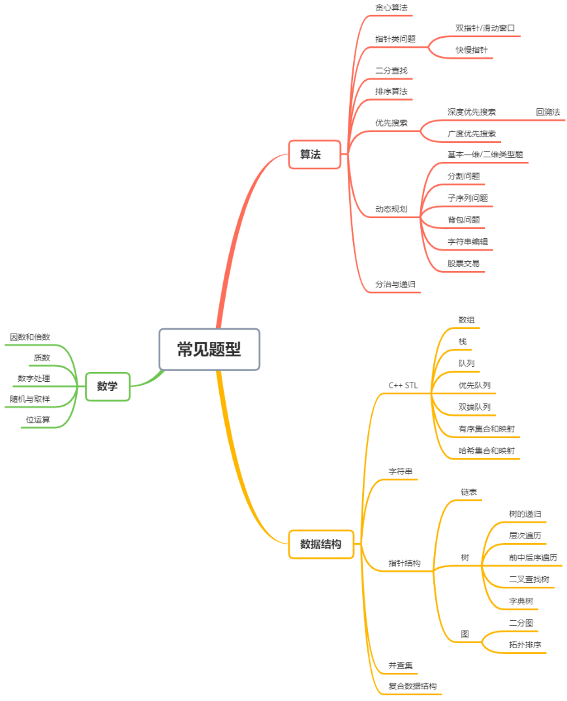
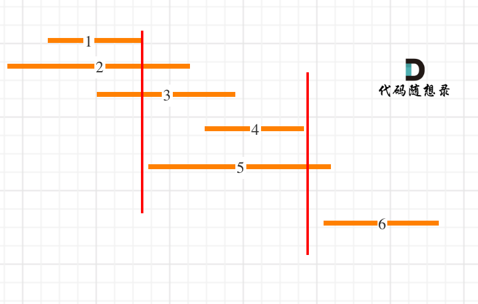
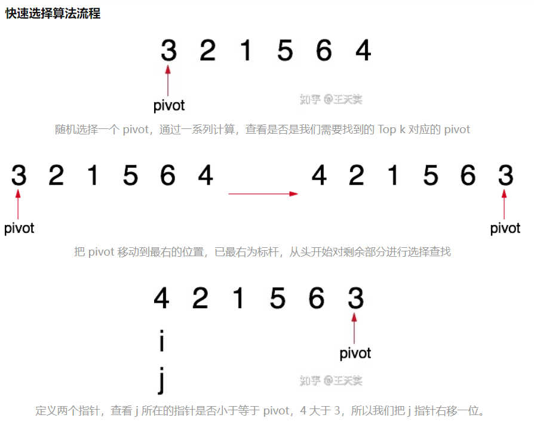
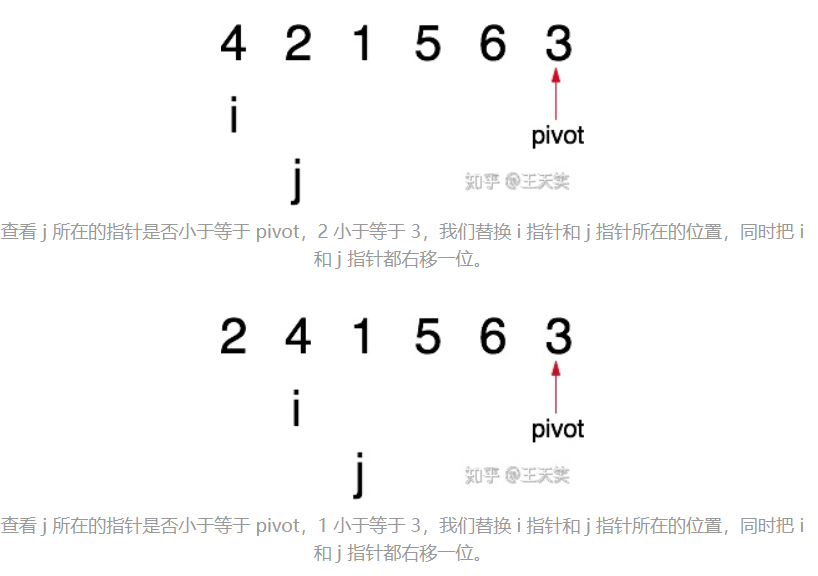
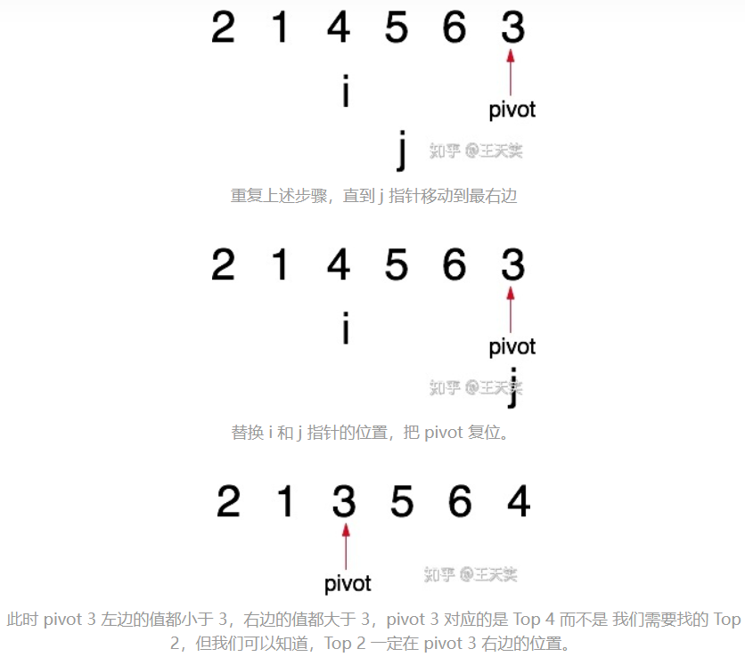
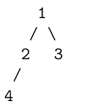

# leetcode C++

<center>author ln3</center>

## 前言

本书部分内容来源于 [leetcode101](https://github.com/changgyhub/leetcode_101) ，书中代码全部是AC的，仅供学习使用。

## 目录

[TOC]

<div style="page-break-after:always"></div>

## 题目分类



<div style="page-break-after:always"></div>

## 贪心算法

### 算法解释

**适用范围：**全局最优等价于全体局部最优

**使用方法：**保证每一步都是局部最优的，最后得到的结果即为全局最优结果

举一个最简单的例子：小明和小王喜欢吃苹果，小明可以吃五个，小王可以吃三个。已知苹果园里有吃不完的苹果，求小明和小王一共最多吃多少个苹果。在这个例子中，我们可以选用的贪心策略为，每个人吃自己能吃的最多数量的苹果，这在每个人身上都是局部最优的。又因为全局结果是局部结果的简单求和，且局部结果互不相干，因此局部最优的策略也同样是全局最优的策略。

### 分配问题

#### [分发饼干](https://leetcode.cn/problems/assign-cookies/)

**题目描述：**

假设你是一位很棒的家长，想要给你的孩子们一些小饼干。但是，每个孩子最多只能给一块饼干。对每个孩子 i，都有一个胃口值 g[i]，这是能让孩子们满足胃口的饼干的最小尺寸；并且每块饼干 j，都有一个尺寸 s[j] 。如果 s[j] >= g[i]，我们可以将这个饼干 j 分配给孩子 i ，这个孩子会得到满足。你的目标是尽可能满足越多数量的孩子，并输出这个最大数值。

**测试样例：**

示例 1:

> 输入: g = [1,2,3], s = [1,1]
> 输出: 1

示例 2:

> 输入: g = [1,2], s = [1,2,3]
> 输出: 2

**题解：**

两种角度，一，从小孩角度，先满足胃口小的，把大于且最接近的饼干分配给他；二，从饼干角度，先分配分量大的饼干给胃口小于且最接近的孩子。将两数组分别排序，遍历比较即可实现。

> 思考：为什么小孩要先满足胃口小的，饼干要先分配大的？试一试。

**代码：**

角度一：

```Cpp
int findContentChildren(vector<int>& children, vector<int>& cookies) {
    sort(children.begin(), children.end());
    sort(cookies.begin(), cookies.end());
    int child = 0, cookie = 0;
    while (child < children.size() && cookie < cookies.size()) {
    	if (children[child] <= cookies[cookie]) 
            child++;
    	cookie++;
    }
	return child;
}
```

角度二：

```Cpp
static bool cmp(int &a, int &b) {
        return a > b;
}
int findContentChildren(vector<int>& children, vector<int>& cookies) {
	sort(children.begin(), children.end(), cmp);
	sort(cookies.begin(), cookies.end(), cmp);
    int child = 0, cookie = 0;
    while (child < children.size() && cookie < cookies.size()) {
        if (cookies[cookie] >= children[child]) 
            cookie++;
        child++;
    }
    return cookie;
}
```

#### [分发糖果](https://leetcode.cn/problems/candy/)

**题目描述：**

n 个孩子站成一排。给你一个整数数组 ratings 表示每个孩子的评分。你需要按照以下要求，给这些孩子分发糖果：

- 每个孩子至少分配到 1 个糖果。
- 相邻两个孩子评分更高的孩子会获得更多的糖果。
- 请你给每个孩子分发糖果，计算并返回需要准备的最少糖果数目。

**测试样例：**

示例 1：

> 输入：ratings = [1,0,2]
> 输出：5

示例 2：

> 输入：ratings = [1,2,2]
> 输出：4

**题解：**

首先每个孩子分一个，再从左往右遍历一遍，保证每个孩子相对右边相邻孩子糖果数是正确的，再从右向左遍历一遍，保证每个孩子相对左边相邻孩子糖果数正确，最后求和即可。

**代码：**

```cpp
int candy(vector<int>& ratings) {
	int size = ratings.size();
	if (size < 2) {
		return size;
	}
	vector<int> num(size, 1);
	for (int i = 1; i < size; i++) {
		if (ratings[i] > ratings[i-1]) {
			num[i] = num[i-1] + 1;
		}
	}
	for (int i = size - 1; i > 0; i--) {
		if (ratings[i] < ratings[i-1] && num[i-1] <= num[i]) {
			num[i-1] = num[i] + 1;
		}
	}
	return accumulate(num.begin(), num.end(), 0);
}
```

### 区间问题

#### [无重叠区间](https://leetcode.cn/problems/non-overlapping-intervals/)

**题目描述：**

给定一个区间的集合 intervals，其中 intervals[i] = [starti, endi]。返回需要移除区间的最小数量，使剩余区间互不重叠。

**测试样例：**

示例 1:

> 输入: intervals = [[1,2],[2,3],[3,4],[1,3]]
> 输出: 1

示例 2:

> 输入: intervals = [ [1,2], [1,2], [1,2] ]
> 输出: 2

示例 3:

> 输入: intervals = [ [1,2], [2,3] ]
> 输出: 0

**题解：**

又是一个排序题目，两个角度：一，将区间右端升序排列，从左向右，优先保留右端较小且不重叠的区间；二，将区间左端降序排列，从左向右，优先保留左端较大且不重叠的区间。

如下图所示：



**代码：**

角度一：

```Cpp
int eraseOverlapIntervals(vector<vector<int>>& intervals) {
	if (intervals.empty()) {
		return 0;
	}
	int n = intervals.size();
	sort(intervals.begin(), intervals.end(), [](vector<int>& a, vector<int>& b){return a[1] < b[1];});
	int removed = 0, prev = intervals[0][1];
	for (int i = 1; i < n; i++) {
		if (intervals[i][0] < prev) {
			removed++;
		} 
		else {
			prev = intervals[i][1];
		}
	}
	return removed;
}
```

角度二：

```cpp
int eraseOverlapIntervals(vector<vector<int>>& intervals) {
	if (intervals.empty()) {
		return 0;
	}
	int n = intervals.size();
	sort(intervals.begin(), intervals.end(), [](vector<int>& a, vector<int>& b){return a[0] > b[0];});
	int removed = 0, prev = intervals[0][0];
	for (int i = 1; i < n; i++) {
		if (intervals[i][1] > prev) {
			removed++;
		} 
		else {
			prev = intervals[i][0];
		}
	}
	return removed;
}
```

### 练习

#### [种花问题](https://leetcode.cn/problems/can-place-flowers/)

**题目描述：**

假设有一个很长的花坛，一部分地块种植了花，另一部分却没有。可是，花不能种植在相邻的地块上，它们会争夺水源，两者都会死去。

给你一个整数数组  flowerbed 表示花坛，由若干 0 和 1 组成，其中 0 表示没种植花，1 表示种植了花。另有一个数 n ，能否在不打破种植规则的情况下种入 n 朵花？能则返回 true ，不能则返回 false。

**测试样例：**

示例 1：

> 输入：flowerbed = [1,0,0,0,1], n = 1
> 输出：true

示例 2：

> 输入：flowerbed = [1,0,0,0,1], n = 2
> 输出：false

**题解：**

问题可以简化为一个基本模型，两端有花，中间空缺，更复杂的情况可以通过切割得到多个简单情况，且互相独立。又因为基本模型中两端的花地位相同，所以直接从左向右遍历，能种则种，即可得到全局最优。

这里提供另一个想法，虽然与贪心算法无关，但很巧妙，把花坛两端加上0，就可以将两端的特殊情况化为一般，只要有连续的3片空地就能种一朵花。

**代码：**

```cpp
bool canPlaceFlowers(vector<int>& flowerbed, int n) {
	for (int i = 0; i < flowerbed.size(); i++) {
        if (flowerbed[i] == 0 
           && (i == 0 || flowerbed[i-1] == 0) 
           && (i == flowerbed.size() - 1 || flowerbed[i+1] == 0)) {
               n--;
               flowerbed[i] = 1;
           } 
    }
    return n <= 0;
}
```

> 注意：这里用了 || 符号的短路性，判断过程不会越界

#### [用最少数量的箭引爆气球](https://leetcode.cn/problems/minimum-number-of-arrows-to-burst-balloons/)

**题目描述：**

有一些球形气球贴在一堵用 XY 平面表示的墙面上。墙面上的气球记录在整数数组 points ，其中 points[i] = [xstart, xend] 表示水平直径在 xstart 和 xend 之间的气球。你不知道气球的确切 y 坐标。

一支弓箭可以沿着 x 轴从不同点完全垂直地射出。在坐标 x 处射出一支箭，若有一个气球的直径的开始和结束坐标为 xstart，xend， 且满足 xstart ≤ x ≤ xend，则该气球会被引爆。可以射出的弓箭的数量没有限制。弓箭一旦被射出之后，可以无限地前进。

给你一个数组 points，返回引爆所有气球所必须射出的最小弓箭数。

**测试样例：**

示例 1：

> 输入：points = [[10,16],[2,8],[1,6],[7,12]]
> 输出：2

示例 2：

> 输入：points = [[1,2],[3,4],[5,6],[7,8]]
> 输出：4

示例 3：

> 输入：points = [[1,2],[2,3],[3,4],[4,5]]
> 输出：2

**题解：**

这题和上面的无重叠区间很相像，本题要求最少的箭头数量，能一块扎爆的是有重叠区间的，所以在一些重叠的区间中留下一个就行，其他的移除，和例题本质上是一样的，目标都是把一组互不重叠的区间全部找出来，稍微修改一下例题的代码即可。

**代码：**

```cpp
int findMinArrowShots(vector<vector<int>>& points) {
    if (points.empty())
        return 0;
    sort(points.begin(), points.end(), 
         [](vector<int>& a, vector<int>& b){return a[1] < b[1];});
	int removed = 0, prev = points[0][1];
	for (int i = 1; i < points.size(); i++) {
		if (points[i][0] <= prev) {
			removed++;
		}
		else {
			prev = points[i][1];
		}
	}
	return points.size() - removed;
}
```

> 注意：本题中区间边界重合也算重合

#### [划分字母区间](https://leetcode.cn/problems/partition-labels/)

**题目描述：**

字符串 S 由小写字母组成。我们要把这个字符串划分为尽可能多的片段，同一字母最多出现在一个片段中。返回一个表示每个字符串片段的长度的列表。

**测试样例：**

> 输入：S = "ababcbacadefegdehijhklij"
> 输出：[9,7,8]

**题解：**

这题依然可以转化为区间问题，两次遍历得到每个字母的始末位置，然后合并区间即可。

**代码：**

```cpp
vector<int> partitionLabels(string s) {
	vector<int> last(26, 0);
	for (int i = 0; i < s.size(); i++) {
        last[s[i] - 'a'] = i;
    }
    vector<int> ans;
    int start = 0, end = 0;
    for (int i = 0; i < s.size(); i++) {
        if (last[s[i] - 'a'] > end)
            end = last[s[i] - 'a'];
        if (end == i) {
            ans.push_back(end - start + 1);
            start = end + 1;
        }
    }
    return ans;
}
```

#### [买卖股票的最佳时机II](https://leetcode.cn/problems/best-time-to-buy-and-sell-stock-ii/)

**题目描述：**

给你一个整数数组 prices ，其中 prices[i] 表示某支股票第 i 天的价格。

在每一天，你可以决定是否购买或出售股票。你在任何时候最多只能持有一股股票。你也可先购买，然后在同一天出售。返回你能获得的最大利润。

**测试样例：**

示例 1：

> 输入：prices = [7,1,5,3,6,4]
> 输出：7

示例 2：

> 输入：prices = [1,2,3,4,5]
> 输出：4

示例 3：

> 输入：prices = [7,6,4,3,1]
> 输出：0

**题解：**

题目只要求最大利润，所以直接贪心计算差价即可。

**代码：**

```cpp
int maxProfit(vector<int>& prices) {
	int ans = 0;
    for (int i = 0; i < prices.size() - 1; i++) {
        if (prices[i] < prices[i+1])
            ans += (prices[i+1] - prices[i]);
    }
    return ans;
}
```

#### \*[根据身高重建队列](https://leetcode.cn/problems/queue-reconstruction-by-height/)

**题目描述：**

假设有打乱顺序的一群人站成一个队列，数组 people 表示队列中一些人的属性（不一定按顺序）。每个 people[i] = [hi, ki] 表示第 i 个人的身高为 hi ，前面正好有 ki 个身高大于或等于 hi 的人。

请你重新构造并返回输入数组 people 所表示的队列。返回的队列应该格式化为数组 queue，其中 queue[j] = [hj, kj] 是队列中第 j 个人的属性（queue[0] 是排在队列前面的人）。

**测试样例：**

示例 1：

> 输入：people = [[7,0],[4,4],[7,1],[5,0],[6,1],[5,2]]
> 输出：[[5,0],[7,0],[5,2],[6,1],[4,4],[7,1]]

示例 2：

> 输入：people = [[6,0],[5,0],[4,0],[3,2],[2,2],[1,4]]
> 输出：[[4,0],[5,0],[2,2],[3,2],[1,4],[6,0]]

**题解：**

先排序，身高降序排列，然后 k 升序，先将最高的按 k 值升序放入队列中，然后插入个子矮的，也是按 k 值插入即可，不会影响前面已经插入好的。

**代码：**

```cpp
vector<vector<int>> reconstructQueue(vector<vector<int>>& people) {
	sort(people.begin(), people.end(), [](vector<int> &a, vector<int> &b){
        if (a[0] > b[0] || (a[0] == b[0] && a[1] < b[1]))
            return true;
        return false;
    });
    vector<vector<int>> ans;
    for (auto &n : people) {
        ans.insert(ans.begin() + n[1], n);
    }
    //for(int i = 0; i < people.size(); i++){  
        //res.insert(res.begin()+people[i][1], people[i]);
    //}与上面等价
    return ans;
}
```

#### [非递减数列](https://leetcode.cn/problems/non-decreasing-array/)

**题目描述：**

给你一个长度为 n 的整数数组 nums，请你判断在最多改变 1 个元素的情况下，该数组能否变成一个非递减数列。

我们是这样定义一个非递减数列的：对于数组中任意的 i (0<=i<=n-2)，总满足 nums[i] <= nums[i + 1]。

**测试样例：**

示例 1:

> 输入: nums = [4,2,3]
> 输出: true

示例 2:

> 输入: nums = [4,2,1]
> 输出: false

**题解：**

只要求出最少修改次数，然后与 1 比较即可，对于不符合条件的两个相邻的数，有两种方案，一，修改前面一个，二，修改后面一个，具体采用哪种方案要看修改后是否会影响前面已经符合的部分，比较这两个数的前面一个数和这两个数中后面一个数的大小即可做出判断。

> 注：应修改至恰好满足，即不符合的变成相等的，这样对其他部分影响小，修改次数也最少

**代码：**

```cpp
bool checkPossibility(vector<int>& nums) {
	int ans = 0;
    for (int i = 0; i < nums.size() - 1; i++) {
        if (nums[i] > nums[i+1]) {
            if (ans >= 1)
                return false;
            if (i == 0 || nums[i+1] >= nums[i-1])
                nums[i] = nums[i+1];
            else if (nums[i+1] < nums[i-1])
                nums[i+1] = nums[i];
            ans++;
        }
    }
    return true;
}
```

<div style="page-break-after:always"></div>

## 双指针

### 算法解释

双指针主要用于遍历数组，两个指针指向不同的元素，从而协同完成任务。也可以延伸到多个数组的多个指针。

若两个指针指向同一数组，遍历方向相同且不会相交，则也称为滑动窗口（两个指针包围的区域即为当前的窗口），经常用于区间搜索。

若两个指针指向同一数组，但是遍历方向相反，则可以用来进行搜索，待搜索的数组往往是
排好序的。

对于 C++ 语言，指针还可以玩出很多新的花样。一些常见的关于指针的操作如下：

#### 指针与常量

> int x;
> int * p1 = &x; // 指针可以被修改，值也可以被修改
> const int * p2 = &x; // 指针可以被修改，值不可以被修改（const int）
> int * const p3 = &x; // 指针不可以被修改（* const），值可以被修改
> const int * const p4 = &x; // 指针不可以被修改，值也不可以被修改

#### 指针函数与函数指针

> // addition是指针函数，一个返回类型是指针的函数
> int* addition(int a, int b) {
> 	int* sum = new int(a + b);
> 	return sum;
> }
> int subtraction(int a, int b) {
> 	return a - b;
> }
> int operation(int x, int y, int (\*func)(int, int)) {
> 	return (\*func)(x,y);
> }
>
> // minus是函数指针，指向函数的指针
> int (\*minus)(int, int) = subtraction;
> int* m = addition(1, 2);
> int n = operation(3, *m, minus);

### Two Sum

#### [两数之和II](https://leetcode.cn/problems/two-sum-ii-input-array-is-sorted/)

**题目描述：**

给你一个下标从 1 开始的整数数组 numbers，该数组已按非递减顺序排列，请你从数组中找出满足相加之和等于目标数 target 的两个数。如果设这两个数分别是 numbers[index1] 和 numbers[index2]，则 1 <= index1 < index2 <= numbers.length。

以长度为 2 的整数数组 [index1, index2] 的形式返回这两个整数的下标 index1 和index2。

你可以假设每个输入只对应唯一的答案，而且你不可以重复使用相同的元素。你所设计的解决方案必须只使用常量级的额外空间。

**测试样例：**


示例 1：

> 输入：numbers = [2,7,11,15], target = 9
> 输出：[1,2]

示例 2：

> 输入：numbers = [2,3,4], target = 6
> 输出：[1,3]

示例 3：

> 输入：numbers = [-1,0], target = -1
> 输出：[1,2]

**题解：**

采用方向相反的双指针遍历数组，因为已经排好序，所以如果两个数之和小于目标值，则左指针右移，若大于目标值，则右指针左移。

**代码：**

```cpp
vector<int> twoSum(vector<int>& numbers, int target) {
	int l = 0, r = numbers.size() - 1, sum;
	while (l < r) {
		sum = numbers[l] + numbers[r];
		if (sum == target) 
            break;
		if (sum < target) 
            l++;
		else 
           	r--;
	}
	return vector<int>{l + 1, r + 1};
}
```

### 归并有序数组

#### [合并两个有序数组](https://leetcode.cn/problems/merge-sorted-array/)

**题目描述：**

给你两个按非递减顺序排列的整数数组 nums1 和 nums2，另有两个整数 m 和 n，分别表示nums1 和 nums2 中的元素数目。

请你合并 nums2 到 nums1 中，使合并后的数组同样按非递减顺序排列。

注意：最终，合并后数组不应由函数返回，而是存储在数组 nums1 中。为了应对这种情况，nums1 的初始长度为 m + n，其中前 m 个元素表示应合并的元素，后 n 个元素为 0，应忽略。nums2 的长度为 n。

**测试样例：**

示例 1：

> 输入：nums1 = [1,2,3,0,0,0], m = 3, nums2 = [2,5,6], n = 3
> 输出：[1,2,2,3,5,6]

示例 2：

> 输入：nums1 = [1], m = 1, nums2 = [], n = 0
> 输出：[1]

示例 3：

> 输入：nums1 = [0], m = 0, nums2 = [1], n = 1
> 输出：[1]
> 注意：因为 m = 0 ，所以 nums1 中没有元素。nums1 中仅存的 0 仅仅是为了确保合并结果可以顺利存放到 nums1 中。

**题解：**

因为这两个数组已经排好序，我们可以把两个指针分别放在两个数组的末尾，即 nums1 的 m−1 位和 nums2 的 n−1 位。每次将较大的那个数字复制到 nums1 的后边，然后向前移动一位。
因为我们也要定位 nums1 的末尾，所以我们还需要第三个指针 pos，以便复制。

> 注意：如果 nums1 的数字已经复制完，不要忘记把 nums2 的数字继续复制；如果 nums2 的数字已经复制完，剩余 nums1 的数字不需要改变，因为它们已经被排好序。

**代码：**

```cpp
void merge(vector<int>& nums1, int m, vector<int>& nums2, int n) {
	int pos = m-- + n-- - 1;
	while (m >= 0 && n >= 0) {
		nums1[pos--] = nums1[m]>nums2[n] ? nums1[m--] : nums2[n--];
	}
	while (n >= 0) {
		nums1[pos--] = nums2[n--];
	}
}
```

### 快慢指针

#### [环形链表II](https://leetcode.cn/problems/linked-list-cycle-ii/)

**题目描述：**

给定一个链表的头节点 head，返回链表开始入环的第一个节点。如果链表无环，则返回 null。

如果链表中有某个节点，可以通过连续跟踪 next 指针再次到达，则链表中存在环。为了表示给定链表中的环，评测系统内部使用整数 pos 来表示链表尾连接到链表中的位置（索引从 0 开始）。如果 pos 是 -1，则在该链表中没有环。注意：pos 不作为参数进行传递，仅仅是为了标识链表的实际情况。

链表定义如下：

```cpp
struct ListNode {
    int val;
    ListNode *next;
    ListNode(int x) : val(x), next(NULL) {}
};
```

不允许修改链表。

**测试样例：**

示例：

> 
>
> 输入：head = [3,2,0,-4], pos = 1
> 输出：返回索引为 1 的链表节点

**题解：**

对于链表找环路的问题，有一个通用的解法——==快慢指针（Floyd 判圈法）==。给定两个指针，分别命名为 slow 和 fast，起始位置在链表的开头。每次 fast 前进两步，slow 前进一步。如果 fast 可以走到尽头，那么说明没有环路；如果 fast 可以无限走下去，那么说明一定有环路，且一定存在一个时刻 slow 和 fast 相遇。当 slow 和 fast 第一次相遇时，我们将 fast 重新移动到链表开头，并让 slow 和 fast 每次都前进一步。当 slow 和 fast 第二次相遇时，相遇的节点即为环路的开始点。

**代码：**

```cpp
ListNode *detectCycle(ListNode *head) {
	ListNode *slow = head, *fast = head;
	do {
		if (!fast || !fast->next) 
            return NULL;
		fast = fast->next->next;
		slow = slow->next;
	} while (fast != slow);
	fast = head;
	while (fast != slow){
		slow = slow->next;
		fast = fast->next;
	}
	return fast;
}
```

### 滑动窗口

#### [最小覆盖子串](https://leetcode.cn/problems/minimum-window-substring/)

**题目描述：**

给你一个字符串 s、一个字符串 t。返回 s 中涵盖 t 所有字符的最小子串。如果 s 中不存在涵盖 t 所有字符的子串，则返回空字符串 ""。s,t只由英文字母组成。

> 注意：对于 t 中重复字符，我们寻找的子字符串中该字符数量必须不少于 t 中该字符数量。如果 s 中存在这样的子串，我们保证它是唯一的答案。

**测试样例：**

示例 1：

> 输入：s = "ADOBECODEBANC", t = "ABC"
> 输出："BANC"

示例 2：

> 输入：s = "a", t = "a"
> 输出："a"

示例 3:

> 输入: s = "a", t = "aa"
> 输出: ""

**题解：**

本题使用滑动窗口求解，即两个指针 l 和 r 都是从最左端向最右端移动，且 l 的位置一定在 r 的左边或重合。先统计 t 中字符数量，滑动窗口至包含所有字符，l 左移，得到最短子串。

**代码：**

```cpp
string minWindow(string S, string T) {
    vector<int> chars(128, 0);
    vector<bool> flag(128, false);
    for (char t : T) {
        flag[t] = true;
        chars[t]++;
    }
    int cnt = 0, l = 0, min_l = 0, min_size = S.size() + 1;
    for (int r = 0; r < S.size(); r++) {
        if (flag[S[r]]) {
            if (--chars[S[r]] >= 0) {
                cnt++;
            }
            while (cnt == T.size()) {
                if (r - l - 1 < min_size) {
                    min_l = l;
                    min_size = r - l + 1;   
                }
                if (flag[S[l]] && ++chars[S[l]] > 0) {
                    cnt--;
                }
                l++;
            }
        }
    }
    return min_size>S.size() ? "" : S.substr(min_l, min_size);
}
```

### 练习

#### [平方数之和](https://leetcode.cn/problems/sum-of-square-numbers/)

**题目描述：**

给定一个非负整数 c ，你要判断是否存在两个整数 a 和 b，使得 a^2^ + b^2^ = c 。

**测试样例：**

示例 1：

> 输入：c = 5
> 输出：true

示例 2：

> 输入：c = 3
> 输出：false

**题解：**

双指针，一个指向0，另一个指向根号c取整，左指针向右移或者右指针向左移，就可以避免双重循环解决问题。

**代码：**

```cpp
bool judgeSquareSum(int c) {
    long l = 0, r = sqrt(c) + 1;
    long ans = 0;
    while(l <= r) {
        ans = l * l + r * r;
        if (ans == c)
            return true;
        if (ans < c)
            l++;
        else
            r--;
    }
    return false;
}
```

#### [验证回文字符串II](https://leetcode.cn/problems/valid-palindrome-ii/)

**题目描述：**

给定一个非空字符串 s，最多删除一个字符。判断是否能成为回文字符串。

**测试样例：**

示例 1:

> 输入: s = "aba"
> 输出: true

示例 2:

> 输入: s = "abca"
> 输出: true

示例 3:

> 输入: s = "abc"
> 输出: false

**题解：**

双指针，一个在开头，一个在末尾，相向移动，不符合的字符记录下来即可。

**代码：**

```cpp
bool checkPalindrome(const string &s, int low , int high)
{
    for(int i = low, j = high; i < j; i++,j--) {
        if(s[i] != s[j]) 
            return false;
    }
    return true;
}
bool validPalindrome(string s) {
    int l = 0;
    int r = s.size() - 1;
    while(l < r) {
        if(s[l] == s[r]) {
            l++;
            r--;
        }
        else {
            return checkPalindrome(s, l+1, r) || checkPalindrome(s, l, r-1);
        }
    }
    return true;
}
```

#### [删除字母匹配字符串](https://leetcode.cn/problems/longest-word-in-dictionary-through-deleting/)

**题目描述：**

给你一个字符串 s 和一个字符串数组 dictionary，找出并返回 dictionary 中最长的字符串，该字符串可以通过删除 s 中的某些字符得到。均只由小写英文字母组成。

如果答案不止一个，返回长度最长且字母序最小的字符串。如果答案不存在，则返回空字符串。

**测试样例：**

示例 1：

> 输入：s = "abpcplea", dictionary = ["ale","apple","monkey","plea"]
> 输出："apple"

示例 2：

> 输入：s = "abpcplea", dictionary = ["a","b","c"]
> 输出："a"

**题解：**

双指针，一个用于遍历 s，另一个遍历 d 中的字符串，记录满足题目要求的字符串即可。

**代码：**

```cpp
string findLongestWord(string s, vector<string>& dictionary) {
    string ans = "";
    for (string d : dictionary) {
        int m = 0, n = 0;
        if (ans.size() < d.size() 
            || (ans.size() == d.size() && ans.compare(d) > 0)) {
            while (m < s.size() && n < d.size()) {
                if (s[m] == d[n]) 
                    n++;
                m++;
            }
            if (n == d.size()) {
                ans = d;
            }
        }
    }
    return ans;
}
```

#### *[至多包含 k 个不同字符的最长子串](https://leetcode.cn/problems/longest-substring-with-at-most-k-distinct-characters/)

**题目描述：**

给定一个字符串 s，找出至多包含 k 个不同字符的最长子串 T 的长度。

**测试样例：**

示例 1：

> 输入：s = "eceba", k = 2
> 输出：3

示例 2：

> 输入：s = "aa", k = 1
> 输出：2

**题解：**

滑动窗口。

**代码：**

```cpp
int lengthOfLongestSubstringKDistinct(string s, int k) {
    unordered_map<char,int> m;
    int maxlen = 0;
    for(int i = 0, j = 0; i < s.size(); ++i) {
        if(m.size() <= k)
            m[s[i]]++;
        while(m.size() > k) {
            if(--m[s[j]] == 0)
                m.erase(s[j]);
            j++;
        }
        maxlen = max(maxlen, i-j+1);
    }
    return maxlen;
}
```

> 因为这题是付费的，所以我并不确定是否完全AC，仅供参考

<div style="page-break-after:always"></div>

## 二分查找

### 算法解释

二分查找也常被称为二分法或者折半查找，每次查找时通过将待查找区间分成两部分并只取一部分继续查找，将查找的复杂度大大减少。对于一个长度为 O(n) 的数组，二分查找的时间复杂度为 O(log n)。二分查找适用对象必须是排好序的数组。

具体到代码上，二分查找时区间的左右端取开区间还是闭区间在绝大多数时候都可以，因此有些初学者会容易搞不清楚如何定义区间开闭性。这里我提供两个小诀窍，第一是尝试熟练使用一种写法，比如左闭右开（满足 C++、Python 等语言的习惯）或左闭右闭（便于处理边界条件），
尽量只保持这一种写法；第二是在做题时思考如果最后区间只剩下一个数或者两个数，自己的写
法是否会陷入死循环，如果某种写法无法跳出死循环，则考虑尝试另一种写法。

二分查找也可以看作双指针的一种特殊情况，但我们一般会将二者区分。双指针类型的题，
指针通常是一步一步移动的，而在二分查找里，指针每次移动半个区间长度。

### 求开方

#### [x 的平方根](https://leetcode.cn/problems/sqrtx/)

**题目描述：**

给你一个非负整数 x ，计算并返回 x 的算术平方根。由于返回类型是整数，结果只保留整数部分，小数部分将被舍去。

注意：不允许使用任何内置指数函数和算符，例如 pow(x, 0.5) 或者 x ** 0.5。

**测试样例：**

示例 1：

> 输入：x = 4
> 输出：2

示例 2：

> 输入：x = 8
> 输出：2

**题解：**

在 [0, x] 区间二分查找。另外还有一个更快的牛顿迭代法 $x_{n+1}=x_n-\frac{f(x_n)}{f^{'}(x_n)}$

**代码：**

二分查找：

```cpp
int mySqrt(int a) 
{
    if (a == 0) 
        return a;
    int l = 1, r = a, mid, sqrt;
    while (l <= r) 
    {
    	mid = (l + r) / 2;
    	sqrt = a / mid;
    	if (sqrt == mid) 
    		return mid;
    	else if (mid > sqrt)
    		r = mid - 1;
		else
    		l = mid + 1;
    }
    return r;
}
```

牛顿迭代法：

```cpp
int mySqrt(int a) {
	long x = a;
	while (x * x > a)
		x = (x + a / x) / 2;
	return x;
}
```

### 查找区间

#### [查找元素始末位置](https://leetcode.cn/problems/find-first-and-last-position-of-element-in-sorted-array/)

**题目描述：**

给你一个按照非递减顺序排列的整数数组 nums，和一个目标值 target。请你找出给定目标值在数组中的开始位置和结束位置。如果数组中不存在目标值 target，返回 [-1, -1]。

你必须设计并实现时间复杂度为 O(log n) 的算法解决此问题。

**测试样例：**

示例 1：

> 输入：nums = [5,7,7,8,8,10], target = 8
> 输出：[3,4]

示例 2：

> 输入：nums = [5,7,7,8,8,10], target = 6
> 输出：[-1,-1]

示例 3：

> 输入：nums = [], target = 0
> 输出：[-1,-1]

**题解：**

二分查找定位到目标值后向前向后扩大区间即可。

**代码：**

```cpp
vector<int> range(vector<int>& nums, int mid, int target) {
    int l = mid, r = mid;
    while (l >= 0 && nums[l] == target) 
        l--;
    while (r < nums.size() && nums[r] == target)
        r++;
    return vector<int>{l+1, r-1};
}
vector<int> searchRange(vector<int>& nums, int target) {
    if (nums.empty())
        return vector<int> {-1, -1};
    int l = 0, r = nums.size() - 1, mid;
    while (l <= r) {
        mid = (l + r) / 2;
        if (nums[mid] == target)
            return range(nums, mid, target);
        else if (nums[mid] < target)
            l = mid + 1;
        else 
            r = mid - 1;
    }
    return vector<int> {-1, -1};
}
```

优化后（寻找上下边界也使用二分查找）：

```cpp
vector<int> searchRange(vector<int>& nums, int target) {
	if (nums.empty()) 
        return vector<int>{-1, -1};
	int lower = lower_bound(nums, target);
	int upper = upper_bound(nums, target) - 1; 
	if (lower == nums.size() || nums[lower] != target) {
		return vector<int>{-1, -1};
	}
	return vector<int>{lower, upper};
}
int lower_bound(vector<int> &nums, int target) {
	int l = 0, r = nums.size(), mid;
	while (l < r) {
		mid = (l + r) / 2;
		if (nums[mid] >= target)
			r = mid; 
		else
			l = mid + 1;
	}
	return l;
}
int upper_bound(vector<int> &nums, int target) {
	int l = 0, r = nums.size(), mid;
	while (l < r) {
		mid = (l + r) / 2;
		if (nums[mid] > target)
			r = mid;
		else
			l = mid + 1;
	}
	return l;
}
```

### 旋转数组查找数字

#### [搜索旋转排序数组II](https://leetcode.cn/problems/search-in-rotated-sorted-array-ii/)

**题目描述：**

已知存在一个按非降序排列的整数数组 nums，数组中的值不必互不相同。在传递给函数之前，nums 在预先未知的某个下标 k（0 <= k < nums.length）上进行了旋转，使数组变为了[nums[k], nums[k+1], ..., nums[n-1], nums[0], nums[1], ..., nums[k-1]]（下标 从 0 开始 计数）。例如，[0,1,2,4,4,4,5,6,6,7] 在下标 5 处经旋转后可能变为 [4,5,6,6,7,0,1,2,4,4]。

给你旋转后的数组 nums 和一个整数 target，请你编写一个函数来判断给定的目标值是否存在于数组中。如果 nums 中存在这个目标值 target，则返回 true，否则返回 false。

你必须尽可能减少整个操作步骤。

**测试样例：**

示例 1：

> 输入：nums = [2,5,6,0,0,1,2], target = 0
> 输出：true

示例 2：

> 输入：nums = [2,5,6,0,0,1,2], target = 3
> 输出：false

**题解：**

其实数组即使被旋转过一次，也并不影响二分查找的使用，如果中点值小于右端点，则右半区间为排好序的；若中点值等于右端点，不能确定，尝试右端点左移重新取中点；若中点值大于右端点，则左半区间为排好序的。继续二分查找即可。

**代码：**

```cpp
bool search(vector<int>& nums, int target) {
    int l = 0, r = nums.size() - 1, mid;
    while (l <= r) {
        mid = (l + r) / 2;
        if (nums[mid] == target)
            return true;
        if (nums[mid] < nums[r]) {
            if (nums[mid] <= target && target <= nums[r]) 
                l = mid + 1;
            else
                r = mid - 1;
        }
        else if (nums[mid] == nums[r])
            r--;
        else {
            if (nums[l] <= target && target <= nums[mid])
            	r = mid - 1;
            else
                l = mid + 1;
        }
    }
    return false;
}
```

### 练习

#### [寻找旋转排序数组的最小值II](https://leetcode.cn/problems/find-minimum-in-rotated-sorted-array-ii/)

**题目描述：**

已知一个长度为 n 的数组，预先按照升序排列，经由 1 到 n 次旋转后，得到输入数组。例如，原数组 nums = [0,1,4,4,5,6,7] 在变化后可能得到：

- 若旋转 4 次，则可以得到 [4,5,6,7,0,1,4]
- 若旋转 7 次，则可以得到 [0,1,4,4,5,6,7]

注意，数组 [a[0], a[1], a[2], ..., a[n-1]] 旋转一次的结果为数组 [a[n-1], a[0], a[1], a[2], ..., a[n-2]]。

给你一个可能存在重复元素值的数组 nums，它原来是一个升序排列的数组，并按上述情形进行了多次旋转。请你找出并返回数组中的最小元素。

你必须尽可能减少整个过程的操作步骤。

**测试样例：**

示例 1：

> 输入：nums = [1,3,5]
> 输出：1

示例 2：

> 输入：nums = [2,2,2,0,1]
> 输出：0

**题解：**

别看题目旋转多少次，实际上是上一题的不同表述，同样是一直二分查找至最小值。

**代码：**

```cpp
int findMin(vector<int>& nums) {
    int l = 0, r = nums.size() - 1, mid;
    while (l < r) {
        mid = (l + r) / 2;
        if (nums[mid] < nums[r])
            r = mid;
        else if (nums[mid] == nums[r]) {
            r--;
        }
        else 
            l = mid + 1;
    }
    return nums[l];
}
```

#### [有序数组中的单一元素](https://leetcode.cn/problems/single-element-in-a-sorted-array/)

**题目描述：**

给你一个仅由整数组成的有序数组，其中每个元素都会出现两次，唯有一个数只会出现一次。请你找出并返回只出现一次的那个数。

你设计的解决方案必须满足 O(log n) 时间复杂度和 O(1) 空间复杂度。

**测试样例：**

示例 1:

> 输入: nums = [1,1,2,3,3,4,4,8,8]
> 输出: 2

示例 2:

> 输入: nums =  [3,3,7,7,10,11,11]
> 输出: 10

**题解：**

二分查找，根据中点值及其相邻的左右值，以及左右区间的奇偶性判断在哪一半区间。

**代码：**

```cpp
int singleNonDuplicate(vector<int>& nums) {
    int l = 0, r = nums.size() - 1, mid;
    while (l < r) {
        mid = (l + r) / 2;
        if (nums[mid] == nums[mid - 1]) {
            if (mid % 2 == 0)
                r = mid - 2;
            else
                l = mid + 1;
        }
        else if (nums[mid] == nums[mid + 1]) {
            if (mid % 2 == 0) 
                l = mid + 2;
            else
                r = mid - 1;
        }
        else 
            return nums[mid];
    }
    return nums[l];
}
```

#### *[寻找两个正序数组的中位数](https://leetcode.cn/problems/median-of-two-sorted-arrays/)

**题目描述：**

给定两个大小分别为 m 和 n 的正序（从小到大）数组 nums1 和 nums2。请你找出并返回这两个正序数组的中位数。

算法的时间复杂度应该为 O(log (m+n))。

**测试样例：**

示例 1：

> 输入：nums1 = [1,3], nums2 = [2]
> 输出：2.00000

示例 2：

> 输入：nums1 = [1,2], nums2 = [3,4]
> 输出：2.50000

**题解：**

根据中位数的定义，当 m+n 是奇数时，中位数是两个有序数组中的第 (m+n)/2 个元素，当 m+n 是偶数时，中位数是两个有序数组中的第 (m+n)/2 个元素和第 (m+n)/2+1 个元素的平均值。因此，这道题可以转化成寻找两个有序数组中的第 k 小的数，其中 k 为 (m+n)/2 或 (m+n)/2+1。

假设两个有序数组分别是 A 和 B。要找到第 k 个元素，我们可以比较 A[k/2-1] 和 B[k/2-1]，有三种情况：

- A[k/2-1] < B[k/2-1]，则可以排除 A[0]~A[k/2-1]
- A[k/2-1] > B[k/2-1]，同理
- A[k/2-1] = B[k/2-1]，可以合并进 1 中

有以下三种情况需要特殊处理：

- 如果 A[k/2-1] 或者 B[k/2-1] 越界，那么我们可以选取对应数组中的最后一个元素。在这种情况下，我们必须根据排除数的个数减少 k 的值，而不能直接将 k 减去 k/2。
- 如果一个数组为空，说明该数组中的所有元素都被排除，我们可以直接返回另一个数组中第 k小的元素。
- 如果 k=1，我们只要返回两个数组首元素的最小值即可。

**代码：**

```cpp
int getKthElement(const vector<int>& nums1, const vector<int>& nums2, int k) {
    int m = nums1.size();
    int n = nums2.size();
    int index1 = 0, index2 = 0;
    while (true) {
        if (index1 == m)
            return nums2[index2 + k - 1];
        if (index2 == n)
            return nums1[index1 + k - 1];
        if (k == 1)
            return min(nums1[index1], nums2[index2]);
        int newIndex1 = min(index1 + k / 2 - 1, m - 1);
        int newIndex2 = min(index2 + k / 2 - 1, n - 1);
        int pivot1 = nums1[newIndex1];
        int pivot2 = nums2[newIndex2];
        if (pivot1 <= pivot2) {
            k -= newIndex1 - index1 + 1;
            index1 = newIndex1 + 1;
        }
        else {
            k -= newIndex2 - index2 + 1;
            index2 = newIndex2 + 1;
        }
    }
}
double findMedianSortedArrays(vector<int>& nums1, vector<int>& nums2) {
    int totalLength = nums1.size() + nums2.size();
    if (totalLength % 2 == 1)
        return getKthElement(nums1, nums2, (totalLength + 1) / 2);
    else
        return (getKthElement(nums1, nums2, totalLength / 2) + getKthElement(nums1, nums2, totalLength / 2 + 1)) / 2.0;
}
```

<div style="page-break-after:always"></div>

## 排序算法

### 常用排序算法

以下是一些最基本的排序算法。虽然在 C++ 里可以通过 std::sort() 快速排序，而且刷题时很少需要自己手写排序算法，但是熟习各种排序算法可以加深自己对算法的基本理解，以及解出由这些排序算法引申出来的题目。

#### 快速排序

采用==左闭右开==的二分写法，代码模板如下：

```cpp
void quick_sort(vector<int> &nums, int l, int r) {
    //特殊情况，没有数或只有一个数，无需排序，直接返回
    if (l + 1 >= r)
       	return;
    //取区间左端点值为排序对象，目标是比它大的都在右边，比它小的都在左边
    int first = l, last = r - 1, key = nums[first];
    while (first < last) {
        //寻找比key小的，往前调
        while(first < last && nums[last] >= key)
            last--;
        nums[first] = nums[last];//因为nums[first]的值在key中，不会丢失
        //比key大的，往后调
        while (first < last && nums[first] <= key)
            first++;
        nums[last] = nums[first];
    }
    nums[first] = key;	//key来到了属于它的位置
    //继续排左半区间和右半区间
    quick_sort(nums, l, first);
    quick_sort(nums, first + 1, r);
}
```

#### 归并排序

归并排序主要是采用分而治之的思想，将数组不断分解成多个小数组，然后从排序好的小数组中按大小挑出数填充结果数组。

```cpp
void merge_sort(vector<int> &nums, int l, int r, vector<int> &temp) {
	if (l + 1 >= r)
		return;
	int m = (l + r) / 2;
    //分解
	merge_sort(nums, l, m, temp);
	merge_sort(nums, m, r, temp);
    //归并原理
	int p = l, q = m, i = l;
    //分别从两个小数组开头开始，先挑小的放进结果数组
	while (p < m || q < r) {
        if (q >= r || (p < m && nums[p] <= nums[q]))
            temp[i++] = nums[p++];
        else
            temp[i++] = nums[q++];
	}
    //临时的数组赋回原数组
	for (i = l; i < r; i++)
        nums[i] = temp[i];
}
```

#### 插入排序

先排好小的元素。

```cpp
void insertion_sort(vector<int> &nums, int n) {
	for (int i = 0; i < n; i++) {
		for (int j = i; j > 0 && nums[j] < nums[j-1]; j--)
			swap(nums[j], nums[j-1]);
	}
}
```

#### 冒泡排序

先排好大的元素。

```cpp
void bubble_sort(vector<int> &nums, int n) {
    for (int i = 0; i < n-1; i++) {
        for (int j = 0; j < n-1-i; j++) {
            if (a[j] < a[j+1])
            	swap(nums[j], nums[j+1]);
        }
    }
}
```

#### 选择排序

选定第一个元素为最小元，然后向后比较找真正的最小元，与之交换。

```cpp
void selection_sort(vector<int> &nums, int n) {
    int min;
    for (int i = 0; i < n-1; i++) {
        min = i;
        for (int j = i+1; j < n; j++) {
            if (nums[j] < nums[min])
                min = j;
        }
        swap(nums[min], nums[i]);
	}
}
```

### 快速选择

#### [数组中第 k 大的元素](https://leetcode.cn/problems/kth-largest-element-in-an-array/)

**题目描述：**

给定整数数组 nums 和整数 k，请返回数组中第 k 大的元素。

请注意，你需要找的是数组排序后的第 k 个最大的元素，而不是第 k 个不同的元素。

**测试样例：**

示例 1:

> 输入: [3,2,1,5,6,4] 和 k = 2
> 输出: 5

示例 2:

> 输入: [3,2,3,1,2,4,5,5,6] 和 k = 4
> 输出: 4

**题解：**

快速选择一般用于求解 k-th Element 问题，可以在 O(n) 时间复杂度，O(1) 空间复杂度完成求解工作。快速选择的实现和快速排序相似，首先选定数组第一个值为基准值，将小于它的放在左边，大于它的放在右边，然后根据情况判断继续搜索左区间还是有区间。







因为上面的图是从网上找的，所以下面代码有些许差别，但原理一样，只是图示中两个指针同向移动，下面代码中相向移动。

**代码：**

```cpp
int findKthLargest(vector<int>& nums, int k) {
    int l = 0, r = nums.size() - 1, target = nums.size() - k;
    while (l < r) {
        int mid = quickSelection(nums, l, r);
        if (mid == target)
            return nums[mid];
        if (mid < target)
            l = mid + 1;
        else
            r = mid - 1;
    }
    return nums[l];
}
// 辅函数 - 快速选择，目标是把数组按大小切成两半，返回的是分界点
int quickSelection(vector<int>& nums, int l, int r) {
    int i = l + 1, j = r;
    while (true) {
        while (i < r && nums[i] <= nums[l])
            i++;
        while (l < j && nums[j] >= nums[l])
            j--;
        if (i >= j)
            break;
        swap(nums[i], nums[j]);
    }
    swap(nums[l], nums[j]);
    return j;
}
```

### 桶排序

#### [前 k 个高频元素](https://leetcode.cn/problems/top-k-frequent-elements/)

**题目描述：**

给你一个整数数组 nums 和一个整数 k ，请你返回其中出现频率前 k 高的元素。你可以按任意顺序返回答案。

**测试样例：**

示例 1:

> 输入: nums = [1,1,1,2,2,3], k = 2
> 输出: [1,2]

示例 2:

> 输入: nums = [1], k = 1
> 输出: [1]

**题解：**

顾名思义，桶排序的意思是为每个值设立一个桶，桶内记录这个值出现的次数（或其它属性），然后对桶进行排序。针对样例1来说，我们先通过桶排序得到四个桶 [1,2,3,4]，它们的值分别为 [4,2,1,1]，表示每个数字出现的次数。

紧接着，我们对桶的频次进行排序，前 k 大个桶即是前 k 个频繁的数。这里我们可以使用各种
排序算法，甚至可以再进行一次桶排序，把每个旧桶根据频次放在不同的新桶内。针对样例来说，因为目前最大的频次是 4，我们建立 [1,2,3,4] 四个新桶，它们分别放入的旧桶为 [[3,4],[2],[],[1]]，表示不同数字出现的频率。最后，我们从后往前遍历，直到找到 k 个旧桶。

**代码：**

```cpp
vector<int> topKFrequent(vector<int>& nums, int k) {
    unordered_map<int, int> counts;
    int max_count = 0;
    for (const int & num : nums) {
        counts[num]++;
        max_count = max(max_count, counts[num]);
    }
    vector<vector<int>> buckets(max_count + 1);
    for (const auto & p : counts)
        buckets[p.second].push_back(p.first);
    vector<int> ans;
    for (int i = max_count; i >= 0; i--) {
        for (const int & num : buckets[i])
            ans.push_back(num);
        if (ans.size() == k)
            break;
    }
    return ans;
}
```

### 练习

#### [根据字符出现频率排序](https://leetcode.cn/problems/sort-characters-by-frequency/)

**题目描述：**

给定一个字符串 s，根据字符出现的频率对其进行降序排序。一个字符出现的频率是它出现在字符串中的次数。

返回已排序的字符串。如果有多个答案，返回其中任何一个。

**测试样例：**

示例 1:

> 输入: s = "tree"
> 输出: "eert"

示例 2:

> 输入: s = "cccaaa"
> 输出: "cccaaa"

示例 3:

> 输入: s = "Aabb"
> 输出: "bbAa"

**题解：**

即桶排序。

**代码：**

```cpp
string frequencySort(string s) {
    unordered_map<char, int> counts;
    int max_count = 0;
    for (const char & a : s) {
        counts[a]++;
        max_count = max(max_count, counts[a]);
    }
    vector<vector<char>> buckets(max_count + 1);
    for (const auto & p : counts)
        buckets[p.second].push_back(p.first);
    string ans;
    for (int i = max_count; i >= 0; i--) {
        for (const int & a : buckets[i]) {
            for (int j = 0; j < i; j++) 
                ans.push_back(a);
        }
    }
    return ans;
}
```

#### [颜色分类](https://leetcode.cn/problems/sort-colors/)

**题目描述：**

给定一个包含红色、白色和蓝色共 n 个元素的数组 nums，原地对它们进行排序，使得相同颜色的元素相邻，并按照红色、白色、蓝色顺序排列。我们使用整数 0、 1 和 2 分别表示红色、白色和蓝色。

必须在不使用库的sort函数的情况下解决这个问题。

**测试样例：**

示例 1：

> 输入：nums = [2,0,2,1,1,0]
> 输出：[0,0,1,1,2,2]

示例 2：

> 输入：nums = [2,0,1]
> 输出：[0,1,2]

**题解：**

桶排序。

**代码：**

```cpp
void sortColors(vector<int>& nums) {
    unordered_map<int, int> counts;
    int max_count = 0;
    for (const int & num : nums)
        counts[num]++;
    int i = 0;
    for (i = 0; i < counts[0]; i++)
        nums[i] = 0;
    for ( ; i < counts[1] + counts[0]; i++)
        nums[i] = 1;
    for ( ; i < counts[2] + counts[1] + counts[0]; i++)
        nums[i] = 2;
    return;
}
```

<div style="page-break-after:always"></div>

## 一切皆可搜索

### 算法解释

搜索算法是利用计算机的高性能来有目的的穷举一个问题解空间的部分或所有的可能情况，从而求出问题的解的一种方法。

现阶段一般有枚举算法、深度优先搜索、广度优先搜索、A*算法、回溯算法、蒙特卡洛树搜索、散列函数等算法。

在大规模实验环境中，通常通过在搜索前，根据条件降低搜索规模；根据问题的约束条件进行剪枝；利用搜索过程中的中间解，避免重复计算这几种方法进行优化。

### 深度优先搜索

深度优先搜索（depth-first seach，DFS）在搜索到一个新的节点时，立即对该新节点进行遍历；因此遍历需要用先入后出的栈来实现，也可以通过与栈等价的递归来实现。对于树结构而言，由于总是对新节点调用遍历，因此看起来是向着“深”的方向前进。

考虑如下一颗简单的树。我们从 1 号节点开始遍历，假如遍历顺序是从左子节点到右子节点，那么按照优先向着“深”的方向前进的策略，假如我们使用递归实现，我们的遍历过程为 1（起始节点）->2（遍历更深一层的左子节点）->4（遍历更深一层的左子节点）->2（无子节点，返回父结点）->1（子节点均已完成遍历，返回父结点）->3（遍历更深一层的右子节点）->1（无子节点，返回父结点）->结束程序（子节点均已完成遍历）。如果我们使用栈实现，我们的栈顶元素的变化过程为 1->2->4->3。


深度优先搜索也可以用来检测环路：记录每个遍历过的节点的父节点，若一个节点被再次遍历且父节点不同，则说明有环。我们也可以用之后会讲到的拓扑排序判断是否有环路，若最后存在入度不为零的点，则说明有环。

有时我们可能会需要对已经搜索过的节点进行标记，以防止在遍历时重复搜索某个节点，这种做法叫做状态记录或记忆化（memoization)。

#### [岛屿的最大面积](https://leetcode.cn/problems/max-area-of-island/)

**题目描述：**

给你一个大小为 m x n 的二进制矩阵 grid。

岛屿是由一些相邻的 1 (代表土地) 构成的组合，这里的「相邻」要求两个 1 必须在水平或者竖直的四个方向上相邻。你可以假设 grid 的四个边缘都被 0（代表水）包围着。

岛屿的面积是岛上值为 1 的单元格的数目。计算并返回 grid 中最大的岛屿面积。如果没有岛屿，则返回面积为 0。

**测试样例：**

示例 1：

> 输入:
> [[1,0,1,1,0,1,0,1],
> [1,0,1,1,0,1,1,1],
> [0,0,0,0,0,0,0,1]]
> 输出: 6

示例 2：

> 输入：grid = [[0,0,0,0,0,0,0,0]]
> 输出：0

**题解：**

此题是十分标准的搜索题，我们可以拿来练手深度优先搜索。一般来说，深度优先搜索类型的题可以分为主函数和辅函数，主函数用于遍历所有的搜索位置，判断是否可以开始搜索，如果可以即在辅函数进行搜索。辅函数则负责深度优先搜索的递归调用。

当然，我们也可以使用栈（stack）实现深度优先搜索，但因为栈与递归的调用原理相同，而递归相对便于实现，因此刷题时笔者推荐使用递归式写法，同时也方便进行回溯（见下节）。不过在实际工程上，直接使用栈可能才是最好的选择，一是因为便于理解，二是更不易出现递归栈满的情况。

**代码：**

##### 1.使用栈：

```cpp
vector<int> direction{-1, 0, 1, 0, -1};
int maxAreaOfIsland(vector<vector<int>>& grid) {
    int m = grid.size(), n = m ? grid[0].size() : 0;
    int local_area, area = 0, x, y;
    for (int i = 0; i < m; i++) {
        for (int j = 0; j < n; j++) {
            if (grid[i][j]) {
                local_area = 1;
                grid[i][j] = 0;
                stack<pair<int, int>> island;
                island.push({i, j});
                while (!island.empty()) {
                    auto [r, c] = island.top();
                    island.pop();
                    for (int k = 0; k < 4; k++) {
                        x = r + direction[k];
                        y = c + direction[k+1];
                        if (x >= 0 && x < m
                            && y >= 0 && y < n && grid[x][y] == 1) {
                            grid[x][y] = 0;
                            local_area++;
                            island.push({x, y});
                        }
                    }
                }
                area = max(area, local_area);
            }
        }
    }
    return area;
}
```

> 注意：这里我们使用了一个小技巧，对于四个方向的遍历，可以创造一个数组 [-1, 0, 1, 0, -1]，每相邻两位即为上下左右四个方向之一。

##### 2.使用递归：

在辅函数里，一个一定要注意的点是辅函数内递归搜索时，边界条件的判定。边界判定一般
有两种写法，一种是先判定是否越界，只有在合法的情况下才进行下一步搜索（即判断放在调用递归函数前）；另一种是不管三七二十一先进行下一步搜索，待下一步搜索开始时再判断是否合法（即判断放在辅函数第一行）。

第一种：

```cpp
vector<int> direction{-1, 0, 1, 0, -1};
// 主函数
int maxAreaOfIsland(vector<vector<int>>& grid) {
    if (grid.empty() || grid[0].empty()) 
        return 0;
    int max_area = 0;
    for (int i = 0; i < grid.size(); i++) {
        for (int j = 0; j < grid[0].size(); j++) {
            if (grid[i][j] == 1)
                max_area = max(max_area, dfs(grid, i, j));
        }
    }
    return max_area;
}
// 辅函数
int dfs(vector<vector<int>>& grid, int r, int c) {
    if (grid[r][c] == 0) 
        return 0;
    grid[r][c] = 0;
    int x, y, area = 1;
    for (int i = 0; i < 4; i++) {
        x = r + direction[i];
        y = c + direction[i+1];
        if (x >= 0 && x < grid.size() && y >= 0 && y < grid[0].size()) 
            area += dfs(grid, x, y);
    }
    return area;
}
```

第二种：

```cpp
vector<int> direction{-1, 0, 1, 0, -1};
// 主函数
int maxAreaOfIsland(vector<vector<int>>& grid) {
    if (grid.empty() || grid[0].empty()) 
        return 0;
    int max_area = 0;
    for (int i = 0; i < grid.size(); i++) {
        for (int j = 0; j < grid[0].size(); j++) {
            max_area = max(max_area, dfs(grid, i, j));
        }
    }
    return max_area;
}
// 辅函数
int dfs(vector<vector<int>>& grid, int r, int c) {
    if (r < 0 || r >= grid.size()
        || c < 0 || c >= grid[0].size() || grid[r][c] == 0)
        return 0;
    grid[r][c] = 0;
    return 1 + dfs(grid, r + 1, c) + dfs(grid, r - 1, c)
        + dfs(grid, r, c + 1) + dfs(grid, r, c - 1);
}
```

#### [省份数量](https://leetcode.cn/problems/number-of-provinces/)

**题目描述：**

有 n 个城市，其中一些彼此相连，另一些没有相连。如果城市 a 与城市 b 直接相连，且城市 b 与城市 c 直接相连，那么城市 a 与城市 c 间接相连。省份是一组直接或间接相连的城市，组内不含其他没有相连的城市。

给你一个 n x n 的矩阵 isConnected ，其中 isConnected\[i\]\[j\] = 1 表示第 i 个城市和第 j 个城市直接相连，而 isConnected\[i\]\[j\] = 0 表示二者不直接相连。

返回矩阵中省份的数量。

**测试样例：**

示例 1：

> 输入：isConnected = 
> [[1,1,0],
> [1,1,0],
> [0,0,1]]
> 输出：2

示例 2：

> 输入：isConnected = 
> [[1,0,0],
> [0,1,0],
> [0,0,1]]
> 输出：3

**题解：**

实际上与上一题是一样的，上题中矩阵每个元素都可看做一个结点，上下左右相邻即有关系；本题中每一行或列为一个结点，元素为 1 即有关系。这里我们采用第一种递归写法。

**代码：**

```cpp
// 主函数
int findCircleNum(vector<vector<int>>& friends) {
    int n = friends.size(), count = 0;
    vector<bool> visited(n, false);
    for (int i = 0; i < n; i++) {
        if (!visited[i]) {
            dfs(friends, i, visited);
            count++;
        }
    }
    return count;
}
// 辅函数
void dfs(vector<vector<int>>& friends, int i, vector<bool>& visited) {
    visited[i] = true;
    for (int k = 0; k < friends.size(); k++) {
        if (friends[i][k] == 1 && !visited[k])
            dfs(friends, k, visited);
    }
}
```

#### [太平洋大西洋水流问题](https://leetcode.cn/problems/pacific-atlantic-water-flow/)

**题目描述：**

有一个 m × n 的矩形岛屿，与太平洋和大西洋相邻。“太平洋”处于大陆的左边界和上边界，而“大西洋”处于大陆的右边界和下边界。

这个岛被分割成一个由若干方形单元格组成的网格。给定一个 m x n 的整数矩阵 heights，heights\[r\]\[c\] 表示坐标 (r, c) 上单元格高于海平面的高度。

岛上雨水较多，如果相邻单元格的高度小于或等于当前单元格的高度，雨水可以直接向北、南、东、西流向相邻单元格。水可以从海洋附近的任何单元格流入海洋。

返回网格坐标 result 的 2D 列表 ，其中 result[i] = [ri, ci] 表示雨水从单元格 (ri, ci) 流动既可流向太平洋也可流向大西洋。

**测试样例：**

示例 1：

> 输入: heights = 
> [[1,2,2,3,5],
> [3,2,3,4,4],
> [2,4,5,3,1],
> [6,7,1,4,5],
> [5,1,1,2,4]]
> 输出: [[0,4],[1,3],[1,4],[2,2],[3,0],[3,1],[4,0]]

示例 2：

> 输入: heights = 
> [[2,1],
> [1,2]]
> 输出: [[0,0],[0,1],[1,0],[1,1]]

**题解：**

虽然题目要求的是满足向下流能到达两个大洋的位置，如果我们对所有的位置进行搜索，那么在不剪枝的情况下复杂度会很高。因此我们可以反过来想，从两个大洋开始向上流，这样我们只需要对矩形四条边进行搜索。搜索完成后，只需遍历一遍矩阵，满足条件的位置即为两个大洋向上流都能到达的位置。

**代码：**

```cpp
vector<int> direction{-1, 0, 1, 0, -1};
// 主函数
vector<vector<int>> pacificAtlantic(vector<vector<int>>& matrix) {
    if (matrix.empty() || matrix[0].empty())
        return {};
    vector<vector<int>> ans;
    int m = matrix.size(), n = matrix[0].size();
    vector<vector<bool>> can_reach_p(m, vector<bool>(n, false));
    vector<vector<bool>> can_reach_a(m, vector<bool>(n, false));
    for (int i = 0; i < m; i++) {
        dfs(matrix, can_reach_p, i, 0);
        dfs(matrix, can_reach_a, i, n - 1);
    }
    for (int i = 0; i < n; i++) {
        dfs(matrix, can_reach_p, 0, i);
        dfs(matrix, can_reach_a, m - 1, i);
    }
    for (int i = 0; i < m; i++) {
        for (int j = 0; j < n; j++) {
            if (can_reach_p[i][j] && can_reach_a[i][j])
                ans.push_back(vector<int>{i, j});
        }
    }
    return ans;
}
// 辅函数
void dfs(const vector<vector<int>>& matrix, vector<vector<bool>>& can_reach,
         int r, int c) {
    if (can_reach[r][c])
        return;
    can_reach[r][c] = true;
    int x, y;
    for (int i = 0; i < 4; i++) {
        x = r + direction[i];
        y = c + direction[i+1];
        if (x >= 0 && x < matrix.size() 
            && y >= 0 && y < matrix[0].size() && matrix[r][c] <= matrix[x][y])
            dfs(matrix, can_reach, x, y);
    }
}
```

### 回溯法

回溯法（backtracking）是优先搜索的一种特殊情况，又称为试探法，常用于需要记录节点状态的深度优先搜索。通常来说，排列、组合、选择类问题使用回溯法比较方便。

顾名思义，回溯法的核心是回溯。在搜索到某一节点的时候，如果我们发现目前的节点（及其子节点）并不是需求目标时，我们回退到原来的节点继续搜索，并且把在目前节点修改的状态还原。这样的好处是我们可以始终只对图的总状态进行修改，而非每次遍历时新建一个图来储存状态。在具体的写法上，它与普通的深度优先搜索一样，都有 [修改当前节点状态]→[递归子节点]的步骤，只是多了回溯的步骤，变成[修改当前节点状态]→[递归子节点]→[回改当前节点状态]。

两个小诀窍，一是按引用传状态，二是所有的状态修改在递归完成后回改。

回溯法修改一般有两种情况，一种是修改最后一位输出，比如排列组合；一种是修改访问标
记，比如矩阵里搜字符串。

#### [全排列](https://leetcode.cn/problems/permutations/)

**题目描述：**

给定一个不含重复数字的数组 nums ，返回其所有可能的全排列。你可以按任意顺序返回答案。

**测试样例：**

示例 1：

> 输入：nums = [1,2,3]
> 输出：[[1,2,3],[1,3,2],[2,1,3],[2,3,1],[3,1,2],[3,2,1]]

示例 2：

> 输入：nums = [0,1]
> 输出：[[0,1],[1,0]]

示例 3：

> 输入：nums = [1]
> 输出：[[1]]

**题解：**


**代码：**

```cpp
vector<vector<int>> permute(vector<int>& nums) {
    
}
```

### 广度优先搜索

### 练习
